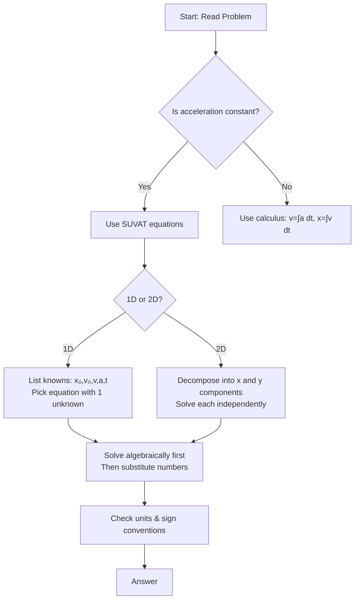
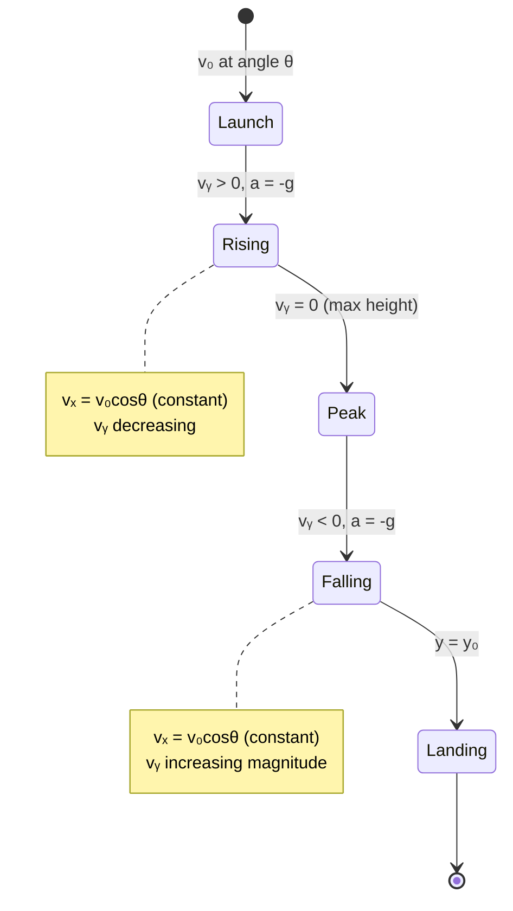

# Unit 01: Kinematics (1D & 2D, Projectile Motion)
**AP Physics 1 | Georgia Standards of Excellence**  
**College Board CED Topic:** KIN-1 through KIN-5

---

## PART A: CHAPTER BLUEPRINT & CONCEPTS

### Sub-Chapter 1.1 — Position, Displacement, and Distance

**Core Concepts:**
- **Position (x):** Location of an object relative to a chosen origin; vector quantity; SI unit: meters (m)
- **Displacement (Δx):** Change in position; Δx = x_f − x_i; vector (has direction)
- **Distance (d):** Total path length traveled; scalar (always positive)

**Mathematical Relationships:**
```
Δx = x_f − x_i          [meters, m]
d = |Σ path segments|    [meters, m]
```

**Key Distinctions:**
- A car driving 5 km north then 5 km south → distance = 10 km, displacement = 0
- Displacement can be negative; distance cannot

**Variable Definitions:**
| Symbol | Quantity | SI Unit |
|--------|----------|---------|
| x | position | m |
| x_i | initial position | m |
| x_f | final position | m |
| Δx | displacement | m |
| d | distance | m |

---

### Sub-Chapter 1.2 — Velocity and Speed

**Core Concepts:**
- **Average velocity:** v_avg = Δx / Δt; vector
- **Average speed:** s_avg = d / Δt; scalar
- **Instantaneous velocity:** v = dx/dt (limit as Δt → 0); slope of x-t graph
- **Instantaneous speed:** magnitude of instantaneous velocity

**Mathematical Relationships:**
```
v_avg = Δx / Δt = (x_f − x_i) / (t_f − t_i)     [m/s]
s_avg = total distance / total time                 [m/s]
v(t) = dx/dt    (calculus form)                     [m/s]
```

**Graph Interpretation:**
- Slope of position-time (x-t) graph = instantaneous velocity
- Flat line on x-t → object at rest
- Straight line on x-t → constant velocity
- Curved line on x-t → changing velocity (acceleration present)

---

### Sub-Chapter 1.3 — Acceleration

**Core Concepts:**
- **Average acceleration:** a_avg = Δv / Δt; vector
- **Instantaneous acceleration:** a = dv/dt = d²x/dt²
- Positive acceleration ≠ speeding up (depends on direction of velocity)
- Object slows down when velocity and acceleration have opposite signs

**Mathematical Relationships:**
```
a_avg = Δv / Δt = (v_f − v_i) / (t_f − t_i)     [m/s²]
a(t) = dv/dt = d²x/dt²    (calculus form)          [m/s²]
```

**Graph Interpretation:**
- Slope of velocity-time (v-t) graph = instantaneous acceleration
- Area under v-t graph = displacement
- Flat line on v-t → constant velocity (zero acceleration)
- Straight line on v-t → constant acceleration

---

### Sub-Chapter 1.4 — Kinematic Equations (Constant Acceleration)

**Core Concepts:**
The "Big Four" SUVAT equations — valid ONLY when acceleration is constant:

```
(1)  v = v₀ + at
(2)  x = x₀ + v₀t + ½at²
(3)  v² = v₀² + 2a(Δx)
(4)  x = x₀ + ½(v₀ + v)t
```

**Variable Definitions:**
| Symbol | Quantity | SI Unit |
|--------|----------|---------|
| x₀ | initial position | m |
| x | final position | m |
| v₀ | initial velocity | m/s |
| v | final velocity | m/s |
| a | acceleration (constant) | m/s² |
| t | time elapsed | s |

**Strategy for Problem Solving:**
1. Identify known and unknown variables
2. Choose equation that contains the unknown and all knowns
3. Solve algebraically before substituting numbers
4. Check units throughout

**Free Fall Special Case:**
- a = −g = −9.8 m/s² (taking up as positive)
- g = 9.8 m/s² ≈ 10 m/s² (approximate)
- At peak of trajectory: v = 0 (but a ≠ 0!)

---

### Sub-Chapter 1.5 — Two-Dimensional Kinematics & Projectile Motion

**Core Concepts:**
- 2D motion is decomposed into independent x and y components
- Projectile motion: horizontal (constant velocity) + vertical (free fall)
- Launch angle θ determines initial components

**Mathematical Relationships:**
```
COMPONENT DECOMPOSITION:
  v₀ₓ = v₀ cos θ          [m/s]
  v₀ᵧ = v₀ sin θ          [m/s]

HORIZONTAL (no acceleration):
  x = v₀ₓ · t             [m]
  vₓ = v₀ₓ = constant     [m/s]

VERTICAL (free fall):
  y = v₀ᵧt − ½gt²         [m]
  vᵧ = v₀ᵧ − gt           [m/s]
  vᵧ² = v₀ᵧ² − 2g(Δy)    [m/s]²

RANGE (level ground, launch from y=0):
  R = v₀² sin(2θ) / g     [m]

TIME OF FLIGHT (level ground):
  T = 2v₀ sin θ / g       [s]

MAX HEIGHT:
  H = v₀² sin²θ / (2g)   [m]
```

---

## PART B: DIAGRAM SYSTEM

### Diagram 1.1 — Position-Time Graph (x-t)

```
x (m)
│     /‾‾‾‾‾‾\
│    /   C    \
│   / B        \
│  /            \  D (slope=0, at rest)
│ / A            ────────────
│/
└──────────────────── t (s)
  0   1   2   3   4

Segment A: positive slope → moving in +x direction
Segment B: increasing slope → accelerating
Segment C: decreasing slope → decelerating
Segment D: zero slope → stationary
```

### Diagram 1.2 — Velocity-Time Graph (v-t)

```
v (m/s)
│    ╔═══════╗     ← constant velocity (a=0)
│    ║       ║
│   /║       ║\
│  / ║       ║ \   ← decelerating
│ /  ║       ║  \
│/   ║       ║   \  ← v=0 (momentarily stopped)
├────║───────║────\──── t (s)
│    t₁      t₂    t₃
│
│  Area above axis = + displacement
│  Area below axis = − displacement
│  Slope = acceleration
```

### Diagram 1.3 — Projectile Motion Trajectory

```
y (m)
│         * (peak: vₓ=v₀cosθ, vᵧ=0)
│       *   *
│      *     *
│     *       *
│    *         *
│   *           *
│  *             *
│ *               *
│* θ               *
└────────────────────── x (m)
  Launch              Landing
  v₀ at angle θ       Range R = v₀²sin(2θ)/g

Velocity vectors at key points:
  Launch:  →  (vₓ) +  ↑  (vᵧ) = diagonal up-right
  Peak:    →  (vₓ) +  ·  (vᵧ=0) = horizontal only
  Landing: →  (vₓ) +  ↓  (vᵧ) = diagonal down-right
```

### Diagram 1.4 — Mermaid Flowchart: Kinematic Problem Strategy



### Diagram 1.5 — Mermaid State: Projectile Motion Phases



### Diagram 1.6 — Free Fall Symmetry

```
       ↑ y
       │
  H ───┤─────────────● (peak: v=0)
       │           ↗   ↘
       │         ↗       ↘
       │       ↗           ↘
  y₀──┤─────●               ●──── 
       │  launch           land
       │  v=v₀↑           v=v₀↓
       │
  Key: Time up = Time down
       Speed at same height: equal
       Acceleration = 9.8 m/s² down ALWAYS
```

---

## PART C: WORKED EXAMPLES (20 Questions)

---

### Example 1.1 — Displacement vs. Distance
**Type:** Qualitative Reasoning

**Question:** A jogger runs 400 m north, then 150 m south. Find (a) total distance and (b) displacement.

**Solution:**
```
(a) Distance = sum of all path lengths
    d = 400 m + 150 m = 550 m

(b) Displacement = final position − initial position
    Take north as positive (+)
    Δx = (+400 m) + (−150 m) = +250 m (north)

Answer: distance = 550 m; displacement = 250 m north
```

---

### Example 1.2 — Average Velocity Calculation
**Type:** Algebraic Calculation

**Question:** A car travels from x₁ = 10 m to x₂ = 85 m in 5.0 s. What is the average velocity?

**Solution:**
```
v_avg = Δx / Δt
v_avg = (x₂ − x₁) / (t₂ − t₁)
v_avg = (85 m − 10 m) / (5.0 s − 0 s)
v_avg = 75 m / 5.0 s
v_avg = 15 m/s (in +x direction)
```

---

### Example 1.3 — Kinematic Equation: Finding Final Velocity
**Type:** Algebraic Calculation

**Question:** A car starts from rest and accelerates at 3.0 m/s² for 8.0 s. What is its final velocity?

**Solution:**
```
Known: v₀ = 0, a = 3.0 m/s², t = 8.0 s
Unknown: v

Use: v = v₀ + at
     v = 0 + (3.0 m/s²)(8.0 s)
     v = 24 m/s
```

---

### Example 1.4 — Stopping Distance
**Type:** Algebraic Calculation

**Question:** A car moving at 30 m/s brakes with deceleration 6.0 m/s². How far does it travel before stopping?

**Solution:**
```
Known: v₀ = 30 m/s, v = 0, a = −6.0 m/s²
Unknown: Δx

Use: v² = v₀² + 2aΔx
     0 = (30)² + 2(−6.0)(Δx)
     0 = 900 − 12Δx
     12Δx = 900
     Δx = 75 m
```

---

### Example 1.5 — Time to Reach Maximum Height
**Type:** Algebraic Calculation

**Question:** A ball is thrown upward at 20 m/s from ground level. Find (a) time to reach max height, (b) max height, (c) total air time.

**Solution:**
```
Take up as positive. a = −9.8 m/s²

(a) At max height, v = 0
    v = v₀ + at
    0 = 20 + (−9.8)t
    t = 20/9.8 = 2.04 s

(b) H = v₀t + ½at²
    H = 20(2.04) + ½(−9.8)(2.04)²
    H = 40.8 − 20.4 = 20.4 m

    Check with: v² = v₀² + 2aΔy
    0 = 400 + 2(−9.8)H
    H = 400/19.6 = 20.4 m ✓

(c) By symmetry: total time = 2 × t_up = 2 × 2.04 = 4.08 s
```

---

### Example 1.6 — Graph Interpretation: Displacement from v-t
**Type:** Graph Interpretation

**Question:** A v-t graph shows velocity constant at 4 m/s from t=0 to t=3 s, then linearly decreasing to 0 at t=5 s. Find total displacement.

**Solution:**
```
Displacement = area under v-t graph

Rectangle (0 to 3 s):
  A₁ = base × height = 3 s × 4 m/s = 12 m

Triangle (3 to 5 s):
  A₂ = ½ × base × height = ½ × 2 s × 4 m/s = 4 m

Total displacement = A₁ + A₂ = 12 + 4 = 16 m
```

---

### Example 1.7 — Calculus: Velocity from Position Function
**Type:** Calculus Derivation

**Question:** The position of a particle is given by x(t) = 3t³ − 5t² + 2t − 1 (meters). Find (a) velocity at t=2 s, (b) acceleration at t=2 s.

**Solution:**
```
(a) v(t) = dx/dt = d/dt[3t³ − 5t² + 2t − 1]
           = 9t² − 10t + 2

    v(2) = 9(4) − 10(2) + 2 = 36 − 20 + 2 = 18 m/s

(b) a(t) = dv/dt = d/dt[9t² − 10t + 2]
           = 18t − 10

    a(2) = 18(2) − 10 = 36 − 10 = 26 m/s²
```

---

### Example 1.8 — Calculus: Position from Acceleration
**Type:** Calculus Derivation

**Question:** A particle starts at x=2 m with v₀=3 m/s and has acceleration a(t) = 6t m/s². Find x(t).

**Solution:**
```
Step 1: Integrate acceleration to get velocity
  v(t) = ∫a dt = ∫6t dt = 3t² + C₁
  Apply initial condition: v(0) = 3 m/s
  3 = 3(0)² + C₁  →  C₁ = 3
  v(t) = 3t² + 3

Step 2: Integrate velocity to get position
  x(t) = ∫v dt = ∫(3t² + 3) dt = t³ + 3t + C₂
  Apply initial condition: x(0) = 2 m
  2 = 0 + 0 + C₂  →  C₂ = 2
  x(t) = t³ + 3t + 2
```

---

### Example 1.9 — Projectile: Range Calculation
**Type:** Algebraic Calculation

**Question:** A ball is launched at 25 m/s at 35° above horizontal from ground level. Find (a) horizontal range, (b) max height. (g = 9.8 m/s²)

**Solution:**
```
Step 1: Decompose initial velocity
  v₀ₓ = 25 cos35° = 25(0.819) = 20.5 m/s
  v₀ᵧ = 25 sin35° = 25(0.574) = 14.3 m/s

(a) Time of flight:
    vᵧ = v₀ᵧ − gt = 0 at peak
    t_peak = 14.3/9.8 = 1.46 s
    T_total = 2(1.46) = 2.92 s

    Range R = v₀ₓ × T = 20.5 × 2.92 = 59.8 m

    Check with formula: R = v₀²sin(2θ)/g
    R = (25)²sin(70°)/9.8 = 625(0.940)/9.8 = 60.0 m ✓

(b) Max height:
    H = v₀ᵧ²/(2g) = (14.3)²/(2×9.8) = 204.5/19.6 = 10.4 m
```

---

### Example 1.10 — Projectile: Cliff Launch
**Type:** Algebraic Calculation

**Question:** A projectile is launched horizontally at 15 m/s from a cliff 45 m high. Find (a) time to hit ground, (b) horizontal distance, (c) speed just before impact.

**Solution:**
```
Setup: v₀ₓ = 15 m/s, v₀ᵧ = 0 (horizontal launch)
       y₀ = 45 m, y = 0 (taking down as positive for convenience)

(a) Vertical: y = ½gt²
    45 = ½(9.8)t²
    t² = 90/9.8 = 9.18
    t = 3.03 s

(b) Horizontal: x = v₀ₓ · t = 15 × 3.03 = 45.5 m

(c) At impact:
    vₓ = 15 m/s (unchanged)
    vᵧ = gt = 9.8 × 3.03 = 29.7 m/s (downward)
    
    v = √(vₓ² + vᵧ²) = √(225 + 882) = √1107 = 33.3 m/s
```

---

### Example 1.11 — Relative Motion
**Type:** Algebraic Calculation

**Question:** Train A moves east at 60 m/s. Train B moves west at 40 m/s. They are 500 m apart. When do they meet?

**Solution:**
```
Take east as positive.
v_A = +60 m/s, v_B = −40 m/s

Relative velocity of approach = 60 + 40 = 100 m/s
(they move toward each other)

Time to meet: t = separation / relative speed
t = 500 m / 100 m/s = 5.0 s

Position of A: x_A = 60(5) = 300 m from A's start
Position of B: x_B = 500 − 40(5) = 500 − 200 = 300 m ✓
```

---

### Example 1.12 — Acceleration from Graph
**Type:** Graph Interpretation

**Question:** A v-t graph shows v = 2 m/s at t=1 s and v = 14 m/s at t=4 s. Find acceleration and displacement from t=1 to t=4 s.

**Solution:**
```
Acceleration = slope of v-t graph
a = Δv/Δt = (14 − 2)/(4 − 1) = 12/3 = 4 m/s²

Displacement = area under v-t graph (trapezoid):
Δx = ½(v₁ + v₂) × Δt = ½(2 + 14) × 3 = ½ × 16 × 3 = 24 m

Verify with equation: Δx = v₀t + ½at²
Δx = 2(3) + ½(4)(9) = 6 + 18 = 24 m ✓
```

---

### Example 1.13 — Two Objects Meeting
**Type:** Algebraic Calculation

**Question:** Object A starts at x=0 and moves at constant 5 m/s. Object B starts at x=60 m and moves at −3 m/s (toward A). When and where do they meet?

**Solution:**
```
Position equations:
  x_A(t) = 0 + 5t = 5t
  x_B(t) = 60 + (−3)t = 60 − 3t

Set equal to find meeting time:
  5t = 60 − 3t
  8t = 60
  t = 7.5 s

Meeting position:
  x = 5(7.5) = 37.5 m from origin
  Check: x_B = 60 − 3(7.5) = 60 − 22.5 = 37.5 m ✓
```

---

### Example 1.14 — Free Fall with Initial Downward Velocity
**Type:** Algebraic Calculation

**Question:** An object is thrown downward at 8 m/s from 50 m height. Find (a) time to hit ground, (b) impact speed.

**Solution:**
```
Take downward as positive. a = +9.8 m/s², v₀ = +8 m/s

(a) y = v₀t + ½at²
    50 = 8t + ½(9.8)t²
    4.9t² + 8t − 50 = 0
    
    Quadratic formula: t = [−8 ± √(64 + 4×4.9×50)] / (2×4.9)
    t = [−8 ± √(64 + 980)] / 9.8
    t = [−8 ± √1044] / 9.8
    t = [−8 ± 32.3] / 9.8
    
    Taking positive root: t = (−8 + 32.3)/9.8 = 24.3/9.8 = 2.48 s

(b) v = v₀ + at = 8 + 9.8(2.48) = 8 + 24.3 = 32.3 m/s
```

---

### Example 1.15 — Projectile: Angle for Maximum Range
**Type:** Qualitative Reasoning + Algebraic

**Question:** Prove that maximum range occurs at θ = 45°. For v₀ = 20 m/s, calculate range at 30°, 45°, and 60°.

**Solution:**
```
Range formula: R = v₀²sin(2θ)/g

For maximum R: sin(2θ) must equal 1
sin(2θ) = 1  →  2θ = 90°  →  θ = 45° ✓

Calculations (v₀=20, g=9.8):
  R_max = (20)²/9.8 = 400/9.8 = 40.8 m (at θ=45°)

  θ=30°: R = (400)sin(60°)/9.8 = 400(0.866)/9.8 = 35.3 m
  θ=45°: R = (400)sin(90°)/9.8 = 400(1.00)/9.8 = 40.8 m ✓
  θ=60°: R = (400)sin(120°)/9.8 = 400(0.866)/9.8 = 35.3 m

Note: 30° and 60° give same range (complementary angles property)
```

---

### Example 1.16 — Non-Uniform Acceleration (AP-C Level)
**Type:** Calculus Derivation

**Question:** A particle has acceleration a(t) = (4 − 2t) m/s². At t=0: v₀=0, x₀=0. Find: (a) when it stops, (b) max displacement.

**Solution:**
```
(a) v(t) = ∫a dt = ∫(4 − 2t) dt = 4t − t² + C
    v(0) = 0  →  C = 0
    v(t) = 4t − t²

    Stops when v = 0:
    4t − t² = 0  →  t(4 − t) = 0
    t = 0 (start) or t = 4 s

(b) x(t) = ∫v dt = ∫(4t − t²) dt = 2t² − t³/3 + C
    x(0) = 0  →  C = 0
    x(t) = 2t² − t³/3

    Max displacement at t = 4 s:
    x(4) = 2(16) − (64)/3 = 32 − 21.3 = 10.7 m
```

---

### Example 1.17 — Projectile: Hitting a Moving Target (FRQ Style)
**Type:** Algebraic Calculation (Multi-part)

**Question:** A cannon fires at 50 m/s at 37° above horizontal (sin37°=0.6, cos37°=0.8). A target is 120 m away horizontally at ground level. (a) Does the projectile hit the target? (b) If not, what angle is needed?

**Solution:**
```
(a) Check if range = 120 m
    R = v₀²sin(2θ)/g = (2500)sin(74°)/9.8
    R = 2500(0.961)/9.8 = 245 m ≠ 120 m
    Does NOT hit at 37°.

(b) Need: R = 120 m
    120 = (2500)sin(2θ)/9.8
    sin(2θ) = 120(9.8)/2500 = 1176/2500 = 0.470
    2θ = 28.0° or 152°
    θ = 14.0° or 76.0°
    
    Two angles work (complementary angle property).
    Use θ = 14.0° for low trajectory or 76.0° for high trajectory.
```

---

### Example 1.18 — Instantaneous vs. Average Velocity
**Type:** Qualitative Reasoning

**Question:** Position is x(t) = t² − 4t + 3 (meters). (a) Find avg velocity 0→3 s. (b) Find instantaneous velocity at t=1, t=2, t=3 s. (c) When is the object momentarily at rest?

**Solution:**
```
(a) x(0) = 0 − 0 + 3 = 3 m
    x(3) = 9 − 12 + 3 = 0 m
    v_avg = (0 − 3)/3 = −1 m/s

(b) v(t) = dx/dt = 2t − 4
    v(1) = 2(1) − 4 = −2 m/s
    v(2) = 2(2) − 4 = 0 m/s
    v(3) = 2(3) − 4 = +2 m/s

(c) At rest: v(t) = 0
    2t − 4 = 0  →  t = 2 s
    Position: x(2) = 4 − 8 + 3 = −1 m
```

---

### Example 1.19 — Vector Addition of Velocities
**Type:** Algebraic Calculation

**Question:** A boat heads east at 4 m/s. River current flows north at 3 m/s. Find (a) resultant velocity, (b) angle from east, (c) time to cross 80 m wide river.

**Solution:**
```
(a) v = √(vₓ² + vᵧ²) = √(16 + 9) = √25 = 5 m/s

(b) θ = arctan(vᵧ/vₓ) = arctan(3/4) = 36.9° north of east

(c) To cross 80 m wide river (crossing in x-direction):
    Time depends only on component perpendicular to shore.
    
    If river flows north and boat heads east:
    The east component (4 m/s) carries boat across 80 m river
    t = 80/4 = 20 s
    
    Boat drifts north: d = vₙ × t = 3 × 20 = 60 m downstream
```

---

### Example 1.20 — AP FRQ: Complete Projectile Analysis
**Type:** Free Response Question (Multi-part)

**Question:** A ball is launched from the edge of a table (height H = 1.2 m) with initial horizontal velocity v₀. It lands 2.4 m from the base of the table.
(a) Find the time of flight.
(b) Find v₀.
(c) Find the velocity (magnitude and direction) just before impact.
(d) Sketch the trajectory labeling key quantities.

**Solution:**
```
(a) Vertical drop: H = ½gt²
    1.2 = ½(9.8)t²
    t² = 2.4/9.8 = 0.245
    t = 0.495 s ≈ 0.50 s

(b) Horizontal: x = v₀t
    2.4 = v₀(0.495)
    v₀ = 2.4/0.495 = 4.85 m/s

(c) At impact:
    vₓ = v₀ = 4.85 m/s (unchanged)
    vᵧ = gt = 9.8(0.495) = 4.85 m/s (downward)
    
    |v| = √(4.85² + 4.85²) = 4.85√2 = 6.86 m/s
    θ = arctan(vᵧ/vₓ) = arctan(1) = 45° below horizontal

(d) Sketch description:
    - Horizontal launch arrow v₀ at table edge
    - Parabolic curve downward to landing point
    - Label: H = 1.2 m (vertical), R = 2.4 m (horizontal)
    - At impact: velocity vector at 45° below horizontal
```

---

## PART D: 50-QUESTION TEST BANK

### Multiple Choice Questions (MCQ) 1–50

**1.** A car travels 60 km east then 80 km north. What is the magnitude of the displacement?
- A) 20 km  B) 100 km  C) 140 km  D) 72 km
**Answer: B**

**2.** Which quantity is a scalar?
- A) Velocity  B) Acceleration  C) Speed  D) Displacement
**Answer: C**

**3.** A ball is thrown upward. At the highest point, which is true?
- A) v=0, a=0  B) v=0, a=9.8 m/s² down  C) v=0, a=0  D) v≠0, a=0
**Answer: B**

**4.** The slope of a position-time graph represents:
- A) Acceleration  B) Speed  C) Displacement  D) Velocity
**Answer: D**

**5.** An object starts from rest and accelerates uniformly at 4 m/s² for 5 s. What is the final velocity?
- A) 0.8 m/s  B) 9 m/s  C) 20 m/s  D) 25 m/s
**Answer: C**

**6.** A car decelerates from 30 m/s to rest in 6 s. What is the magnitude of deceleration?
- A) 180 m/s²  B) 36 m/s²  C) 5 m/s²  D) 0.2 m/s²
**Answer: C**

**7.** A projectile is launched at 45° with speed 20 m/s. Its range on level ground is: (g=10 m/s²)
- A) 20 m  B) 40 m  C) 80 m  D) 10 m
**Answer: B** [R = 400sin(90°)/10 = 40 m]

**8.** The area under a velocity-time graph represents:
- A) Force  B) Acceleration  C) Speed  D) Displacement
**Answer: D**

**9.** An object is in free fall. After 3 seconds, its speed is approximately:
- A) 3 m/s  B) 9.8 m/s  C) 29.4 m/s  D) 44.1 m/s
**Answer: C** [v = gt = 9.8×3 = 29.4 m/s]

**10.** Two objects are thrown from the same height simultaneously — one horizontally, one dropped vertically. Which hits the ground first?
- A) Horizontal throw  B) Dropped object  C) They land at the same time  D) Depends on mass
**Answer: C**

**11.** x(t) = 5t² − 3t. The velocity at t = 2 s is:
- A) 7 m/s  B) 10 m/s  C) 17 m/s  D) 14 m/s
**Answer: C** [v = 10t − 3 = 20 − 3 = 17 m/s]

**12.** A runner completes a 400 m circular track. Displacement is:
- A) 400 m  B) 200 m  C) 0 m  D) 800 m
**Answer: C**

**13.** An object has constant velocity. Its acceleration is:
- A) 9.8 m/s²  B) Increasing  C) Zero  D) Negative
**Answer: C**

**14.** At what angle does a projectile have maximum range?
- A) 30°  B) 60°  C) 45°  D) 90°
**Answer: C**

**15.** A car travels 100 km in 2 hours, then 60 km in 1 hour. Average speed is:
- A) 53.3 km/h  B) 80 km/h  C) 160 km/h  D) 50 km/h
**Answer: A** [Total: 160 km / 3 h = 53.3 km/h]

**16.** An object moves with x(t) = 3t³. What is the acceleration at t = 2 s?
- A) 24 m/s²  B) 36 m/s²  C) 12 m/s²  D) 18 m/s²
**Answer: B** [v=9t², a=18t, a(2)=36 m/s²]

**17.** A ball is thrown upward at 15 m/s. How long until it returns to launch height? (g=10 m/s²)
- A) 1.5 s  B) 3.0 s  C) 0.75 s  D) 6.0 s
**Answer: B** [T=2v₀/g=30/10=3 s]

**18.** Horizontal component of projectile velocity:
- A) Increases during flight  B) Decreases during flight  C) Is zero at peak  D) Remains constant
**Answer: D**

**19.** A car starts at x=5 m with v₀=2 m/s and a=3 m/s². Position at t=4 s is:
- A) 21 m  B) 37 m  C) 29 m  D) 45 m
**Answer: C** [x = 5 + 2(4) + ½(3)(16) = 5+8+24 = 37 m]
**Correction: Answer B** [5 + 8 + 24 = 37 m → Answer B]

**20.** An object dropped from 80 m takes how long to fall? (g=10 m/s²)
- A) 2 s  B) 4 s  C) 8 s  D) 16 s
**Answer: B** [t=√(2h/g)=√16=4 s]

**21.** The velocity of an object is negative. This means:
- A) It is decelerating  B) It is moving in the negative direction  C) Its speed is negative  D) It is accelerating
**Answer: B**

**22.** Which v-t graph shape shows uniform (constant) acceleration?
- A) Curved upward  B) Horizontal line  C) Straight line with nonzero slope  D) Parabola
**Answer: C**

**23.** A bullet is fired horizontally at 300 m/s from 1.25 m height. Time to hit ground? (g=10 m/s²)
- A) 0.25 s  B) 0.50 s  C) 1.0 s  D) 2.0 s
**Answer: B** [t=√(2×1.25/10)=√0.25=0.5 s]

**24.** Same bullet: horizontal range is:
- A) 75 m  B) 100 m  C) 150 m  D) 200 m
**Answer: C** [x=300×0.5=150 m]

**25.** Complementary launch angles (like 30° and 60°) produce:
- A) Different ranges  B) Same range  C) Same max height  D) Same time of flight
**Answer: B**

**26.** An object starts from rest, reaches v=20 m/s in t=5 s. Displacement?
- A) 4 m  B) 25 m  C) 50 m  D) 100 m
**Answer: C** [Δx=½(0+20)(5)=50 m]

**27.** Which equation does NOT assume constant acceleration?
- A) v=v₀+at  B) x=v₀t+½at²  C) v(t)=dx/dt  D) v²=v₀²+2aΔx
**Answer: C**

**28.** A stone is dropped. After 4 s, how far has it fallen? (g=9.8 m/s²)
- A) 39.2 m  B) 78.4 m  C) 19.6 m  D) 156.8 m
**Answer: B** [h=½(9.8)(16)=78.4 m]

**29.** A boat's velocity is 5 m/s east. River flows 5 m/s north. Resultant speed?
- A) 0 m/s  B) 5 m/s  C) 5√2 m/s  D) 10 m/s
**Answer: C** [v=√(25+25)=5√2≈7.07 m/s]

**30.** An object moves from x=10 m to x=−5 m. Displacement is:
- A) +15 m  B) −15 m  C) +5 m  D) −5 m
**Answer: B** [Δx = −5 − 10 = −15 m]

**31.** If acceleration is zero, velocity must be:
- A) Zero  B) Maximum  C) Constant  D) Negative
**Answer: C**

**32.** A projectile's vertical velocity at launch angle θ=0° (horizontal launch) is:
- A) v₀  B) v₀sinθ = v₀  C) Zero  D) g
**Answer: C**

**33.** Maximum height of projectile v₀=30 m/s at θ=90° (straight up): (g=10 m/s²)
- A) 30 m  B) 45 m  C) 90 m  D) 45 m
**Answer: B** [H=v₀²/2g=900/20=45 m]

**34.** Two cars, A at 20 m/s and B at 30 m/s, travel in the same direction. Speed of A relative to B:
- A) 50 m/s  B) 10 m/s  C) −10 m/s (B is faster)  D) 25 m/s
**Answer: C** [v_A relative to B = 20−30=−10 m/s]

**35.** Instantaneous acceleration equals zero means:
- A) Object is at rest  B) Velocity is maximum or minimum  C) Position is constant  D) Object moves in a circle
**Answer: B**

**36.** A ball is thrown upward. During upward travel:
- A) Acceleration is upward  B) Acceleration is zero  C) Acceleration is 9.8 m/s² downward  D) Velocity is constant
**Answer: C**

**37.** Object moves: 3 m east, then 4 m north. The displacement magnitude is:
- A) 1 m  B) 7 m  C) 5 m  D) 12 m
**Answer: C** [√(9+16)=5 m]

**38.** Which kinematic equation is used when TIME is not known?
- A) v=v₀+at  B) x=v₀t+½at²  C) v²=v₀²+2aΔx  D) x=½(v+v₀)t
**Answer: C**

**39.** A car accelerates at 2 m/s² from 10 m/s for 5 s. Distance covered:
- A) 25 m  B) 50 m  C) 75 m  D) 100 m
**Answer: C** [Δx=10(5)+½(2)(25)=50+25=75 m]

**40.** Position graph shows a straight horizontal line. The velocity is:
- A) Constant and nonzero  B) Zero  C) Increasing  D) Decreasing
**Answer: B** [Horizontal x-t line means x is not changing → v=0]

**41.** Velocity graph shows line crossing x-axis. This means:
- A) Acceleration is zero  B) Object changes direction  C) Speed is increasing  D) Displacement is zero
**Answer: B**

**42.** An object thrown horizontally and one in free fall are both released from same height. The one thrown horizontally:
- A) Hits the ground later  B) Has a greater final speed  C) Hits the ground at the same time  D) Has the same final speed
**Answer: C**

**43.** A cart moves at 3 m/s and decelerates at 1.5 m/s². Time to stop:
- A) 1 s  B) 2 s  C) 3 s  D) 4.5 s
**Answer: B** [t=v₀/a=3/1.5=2 s]

**44.** The acceleration due to gravity near Earth's surface is approximately:
- A) 8.9 m/s²  B) 10 m/s²  C) 9.8 m/s²  D) Both B and C (approximate vs. precise)
**Answer: D**

**45.** Projectile launched at 60° has range R on flat ground. Same speed at 30° has range:
- A) 2R  B) R/2  C) R  D) R√3
**Answer: C** [Complementary angles → same range]

**46.** Object's position: x(t) = 2 + 3t − 5t². When does it stop momentarily?
- A) t=0.3 s  B) t=0.6 s  C) t=1.0 s  D) t=0.5 s
**Answer: A** [v=3−10t=0 → t=0.3 s]

**47.** Acceleration is the derivative of:
- A) Position  B) Displacement  C) Velocity  D) Speed
**Answer: C**

**48.** A car's speedometer reads 60 mph. This is:
- A) Instantaneous velocity  B) Average velocity  C) Instantaneous speed  D) Average speed
**Answer: C**

**49.** Object thrown upward from 20 m height at 10 m/s. Max height above ground? (g=10 m/s²)
- A) 10 m  B) 25 m  C) 30 m  D) 25 m
**Answer: B** [H_add = v₀²/2g = 100/20 = 5 m above launch. Total: 20+5=25 m]

**50.** Which graph accurately represents uniform acceleration starting from rest?
- A) x-t: straight line through origin  B) v-t: curved line  C) x-t: parabola  D) a-t: parabola
**Answer: C**

---

### Free Response Questions (FRQ) 1–10

---

**FRQ 1 — Experimental Design: Measuring g**

A student wants to measure g using a ball drop and stopwatch.

(a) Describe the experimental setup. What measurements are taken?
(b) Write the equation relating h, g, and t for a ball dropped from rest.
(c) The student measures h=2.00 m and t=0.638 s. Calculate g.
(d) Identify two sources of error and their effect on the measured g.
(e) How could the student improve accuracy?

**Answer Key:**
```
(a) Drop ball from measured height h, measure time t to reach ground.
    Measurements: height with meter stick, time with stopwatch (or photogate).

(b) h = ½gt²  →  g = 2h/t²

(c) g = 2(2.00)/(0.638)² = 4.00/0.407 = 9.83 m/s²

(d) Sources:
    - Human reaction time: makes t larger → calculated g smaller than actual
    - Air resistance: makes t larger → calculated g smaller than actual

(e) Use photogate timers for precise measurement; average many trials;
    use longer drop heights to reduce reaction time error percentage.
```

---

**FRQ 2 — Kinematics Graph Analysis**

A particle moves along the x-axis. Its x-t graph shows:
- Segment 1 (0→2 s): starts at x=0, curves up to x=8 m
- Segment 2 (2→5 s): straight line from x=8 to x=−4 m
- Segment 3 (5→7 s): horizontal line at x=−4 m

(a) During which segment is acceleration nonzero?
(b) Find average velocity during Segment 2.
(c) At what time is the object nearest to origin after t=2 s?
(d) Sketch the corresponding v-t graph.

**Answer Key:**
```
(a) Segment 1 (curved x-t → changing slope → nonzero acceleration)

(b) v_avg = Δx/Δt = (−4 − 8)/(5 − 2) = −12/3 = −4 m/s

(c) During Segment 2: x crosses zero when
    x(t) = 8 + (−4)(t − 2) = 8 − 4t + 8 = 16 − 4t = 0
    t = 4 s
    At t=5 s: x=−4 m, so nearest to origin at t=4 s (x=0)

(d) v-t sketch:
    Segment 1: positive, increasing from 0 (positive acceleration)
    Segment 2: constant −4 m/s (straight horizontal line at v=−4)
    Segment 3: v = 0 (horizontal line at v=0)
```

---

**FRQ 3 — Projectile Motion: Complete Analysis**

A ball is kicked from ground level at v₀=18 m/s at 53° above horizontal (sin53°=0.80, cos53°=0.60, g=10 m/s²).

(a) Find initial velocity components.
(b) Find maximum height.
(c) Find total time of flight.
(d) Find horizontal range.
(e) Find velocity (magnitude and direction) at t=1.0 s.
(f) At what two times is the ball at height 5 m?

**Answer Key:**
```
(a) v₀ₓ = 18(0.60) = 10.8 m/s
    v₀ᵧ = 18(0.80) = 14.4 m/s

(b) H = v₀ᵧ²/2g = (14.4)²/20 = 207.36/20 = 10.37 m

(c) T = 2v₀ᵧ/g = 2(14.4)/10 = 2.88 s

(d) R = v₀ₓ × T = 10.8 × 2.88 = 31.1 m

(e) At t=1.0 s:
    vₓ = 10.8 m/s (constant)
    vᵧ = 14.4 − 10(1.0) = 4.4 m/s (upward)
    |v| = √(10.8² + 4.4²) = √(116.6 + 19.4) = √136 = 11.7 m/s
    θ = arctan(4.4/10.8) = 22.2° above horizontal

(f) 5 = 14.4t − 5t²
    5t² − 14.4t + 5 = 0
    t = [14.4 ± √(207.4 − 100)]/10 = [14.4 ± √107.4]/10
    t = [14.4 ± 10.36]/10
    t₁ = 0.404 s (going up)
    t₂ = 2.48 s (coming down)
```

---

**FRQ 4 — Relative Motion**

A passenger walks forward at 1.5 m/s relative to a train car. The train moves east at 25 m/s relative to the ground. A bird flies west at 10 m/s relative to ground.

(a) Find passenger's velocity relative to ground.
(b) Find passenger's velocity relative to the bird.
(c) Find the train's velocity relative to the bird.
(d) How long does it take the bird to fly 500 m relative to the ground?

**Answer Key:**
```
(a) v_passenger/ground = v_passenger/train + v_train/ground
    = +1.5 + 25 = 26.5 m/s east

(b) v_passenger/bird = v_passenger/ground − v_bird/ground
    = 26.5 − (−10) = 36.5 m/s east

(c) v_train/bird = 25 − (−10) = 35 m/s east

(d) t = 500/10 = 50 s
```

---

**FRQ 5 — Multi-Object Problem**

Object A: starts at x=0 with v=8 m/s, a=0.
Object B: starts at x=−30 m with v=0, a=3 m/s².

(a) Write position equations for A and B.
(b) Find when they are at the same position.
(c) Find their velocities at that time.
(d) Sketch x-t graph for both from t=0 to t=6 s.

**Answer Key:**
```
(a) x_A = 8t
    x_B = −30 + ½(3)t² = −30 + 1.5t²

(b) Set equal: 8t = −30 + 1.5t²
    1.5t² − 8t − 30 = 0
    t = [8 ± √(64 + 180)]/3 = [8 ± √244]/3
    t = [8 ± 15.62]/3
    Take positive: t = (8 + 15.62)/3 = 7.87 s

(c) v_A = 8 m/s (constant)
    v_B = 3(7.87) = 23.6 m/s

(d) x_A: straight line from (0,0) to (6,48)
    x_B: parabola starting at (0,−30) curving upward
    They haven't met yet at t=6 s (meet at t=7.87 s)
```

---

**FRQ 6 — Cliff Projectile Analysis**

A cliff is 60 m high. A ball is launched horizontally from the top.

(a) Derive an expression for time to hit ground.
(b) Derive an expression for horizontal range in terms of v₀ and H.
(c) If v₀=15 m/s, find range and impact speed. (g=9.8 m/s²)
(d) What angle does velocity make with horizontal at impact?

**Answer Key:**
```
(a) H = ½gt²  →  t = √(2H/g)

(b) R = v₀t = v₀√(2H/g)

(c) t = √(2×60/9.8) = √12.24 = 3.50 s
    R = 15 × 3.50 = 52.5 m
    
    vₓ = 15 m/s
    vᵧ = 9.8(3.50) = 34.3 m/s
    v = √(15² + 34.3²) = √(225 + 1176) = √1401 = 37.4 m/s

(d) θ = arctan(34.3/15) = arctan(2.29) = 66.4° below horizontal
```

---

**FRQ 7 — Non-Constant Acceleration**

A particle's velocity is v(t) = 6t² − 4t + 2 m/s. At t=0, x=5 m.

(a) Find acceleration at t=3 s.
(b) Find position at t=2 s.
(c) Find when acceleration equals zero.
(d) Explain the physical significance of a=0 in terms of the v-t graph.

**Answer Key:**
```
(a) a(t) = dv/dt = 12t − 4
    a(3) = 12(3) − 4 = 36 − 4 = 32 m/s²

(b) x(t) = x₀ + ∫₀ᵗ v dt = 5 + ∫₀² (6t² − 4t + 2) dt
    = 5 + [2t³ − 2t² + 2t]₀²
    = 5 + [16 − 8 + 4 − 0]
    = 5 + 12 = 17 m

(c) 12t − 4 = 0  →  t = 1/3 s

(d) a=0 means the v-t graph has zero slope at that instant —
    it's a local minimum or maximum of velocity.
    At t=1/3 s, velocity = 6(1/9) − 4(1/3) + 2 = 2/3 − 4/3 + 2 = 4/3 m/s
    This is the minimum velocity of the particle.
```

---

**FRQ 8 — Experimental: Measuring Projectile Range**

A student launches steel balls horizontally from a ramp at varying heights h above the launch point. The ball lands at horizontal distance d from the base of a table of height H.

(a) What two measurements must be made for each trial?
(b) Explain which variable determines time of flight.
(c) Derive d as a function of v₀ and H.
(d) If H=0.80 m and the student measures d=1.20 m, find v₀.
(e) The student graphs d vs v₀. What shape is expected and why?

**Answer Key:**
```
(a) Horizontal distance d from base of table, and launch speed v₀
    (measured using other kinematics or energy method)

(b) Table height H determines time of flight: t = √(2H/g)
    (independent of v₀ — vertical and horizontal motions independent)

(c) t = √(2H/g)
    d = v₀t = v₀√(2H/g)

(d) v₀ = d/√(2H/g) = 1.20/√(1.60/9.8) = 1.20/√0.163 = 1.20/0.404 = 2.97 m/s

(e) d = v₀ × constant, so d vs v₀ is a straight line through origin.
    Slope = √(2H/g) = constant depending on table height.
```

---

**FRQ 9 — Multi-part: Vertical Throw Analysis**

A ball is thrown upward at v₀=15 m/s from a building roof 30 m high. (g=9.8 m/s²)

(a) Find max height above ground.
(b) Find time to reach max height.
(c) Find total time to hit ground.
(d) Find speed when it passes the rooftop level on the way down.
(e) Find speed at ground impact.

**Answer Key:**
```
(a) H_max = 30 + v₀²/2g = 30 + (225/19.6) = 30 + 11.48 = 41.5 m

(b) t_peak = v₀/g = 15/9.8 = 1.53 s

(c) Total fall from peak to ground:
    h_total = 41.5 m from ground
    h = ½gt² → t_fall = √(2×41.5/9.8) = √8.47 = 2.91 s
    Total time = t_up + t_fall = 1.53 + 2.91 = 4.44 s
    
    OR: −30 = 15t − 4.9t²
    4.9t² − 15t − 30 = 0
    t = [15 ± √(225 + 588)]/9.8 = [15 ± 28.5]/9.8
    t = 43.5/9.8 = 4.44 s ✓

(d) At roof level (y = 30 m, same height as launch):
    v² = v₀² = 225 → v = 15 m/s (downward by symmetry)

(e) v = √(v₀² + 2g×30) = √(225 + 588) = √813 = 28.5 m/s
```

---

**FRQ 10 — Synthesis: Chase Problem**

A police car at rest begins pursuit when a speeder passes at 30 m/s. The police car accelerates at 4 m/s².

(a) Write equations for position of each vehicle.
(b) How long until police car catches the speeder?
(c) How far from the starting point?
(d) What is the police car's speed when it catches the speeder?
(e) At what time does the police car match the speeder's speed?

**Answer Key:**
```
(a) x_speeder = 30t
    x_police = ½(4)t² = 2t²

(b) Set equal: 2t² = 30t
    2t² − 30t = 0
    2t(t − 15) = 0
    t = 0 (start) or t = 15 s

(c) x = 30(15) = 450 m

(d) v_police = at = 4(15) = 60 m/s

(e) Police matches speeder's speed when v_police = 30 m/s
    4t = 30  →  t = 7.5 s
    (At this point police is still behind; hasn't caught up yet)
    Position check: x_police(7.5) = 2(56.25) = 112.5 m
                    x_speeder(7.5) = 30(7.5) = 225 m → 112.5 m behind
```

---

## ANSWER KEY MATRIX

### MCQ Answer Key
| Q | A | Q | A | Q | A | Q | A | Q | A |
|---|---|---|---|---|---|---|---|---|---|
| 1 | B | 11 | C | 21 | B | 31 | C | 41 | B |
| 2 | C | 12 | C | 22 | C | 32 | C | 42 | C |
| 3 | B | 13 | C | 23 | B | 33 | B | 43 | B |
| 4 | D | 14 | C | 24 | C | 34 | C | 44 | D |
| 5 | C | 15 | A | 25 | B | 35 | B | 45 | C |
| 6 | C | 16 | B | 26 | C | 36 | C | 46 | A |
| 7 | B | 17 | B | 27 | C | 37 | C | 47 | C |
| 8 | D | 18 | D | 28 | B | 38 | C | 48 | C |
| 9 | C | 19 | B | 29 | C | 39 | C | 49 | B |
| 10 | C | 20 | B | 30 | B | 40 | B | 50 | C |

### FRQ Key Expressions
| FRQ | Key Answers |
|-----|------------|
| 1 | g = 2h/t² = 9.83 m/s² |
| 2 | v_avg = −4 m/s; object at origin at t=4 s |
| 3 | R=31.1 m; H=10.37 m; T=2.88 s |
| 4 | v_pass/ground=26.5 m/s east; v_pass/bird=36.5 m/s |
| 5 | Meet at t=7.87 s, x=63 m |
| 6 | R=52.5 m; v_impact=37.4 m/s; θ=66.4° |
| 7 | a(3)=32 m/s²; x(2)=17 m; a=0 at t=1/3 s |
| 8 | v₀=2.97 m/s; d vs v₀ is linear |
| 9 | H=41.5 m; t_peak=1.53 s; v_impact=28.5 m/s |
| 10 | t=15 s; d=450 m; v_police=60 m/s |
