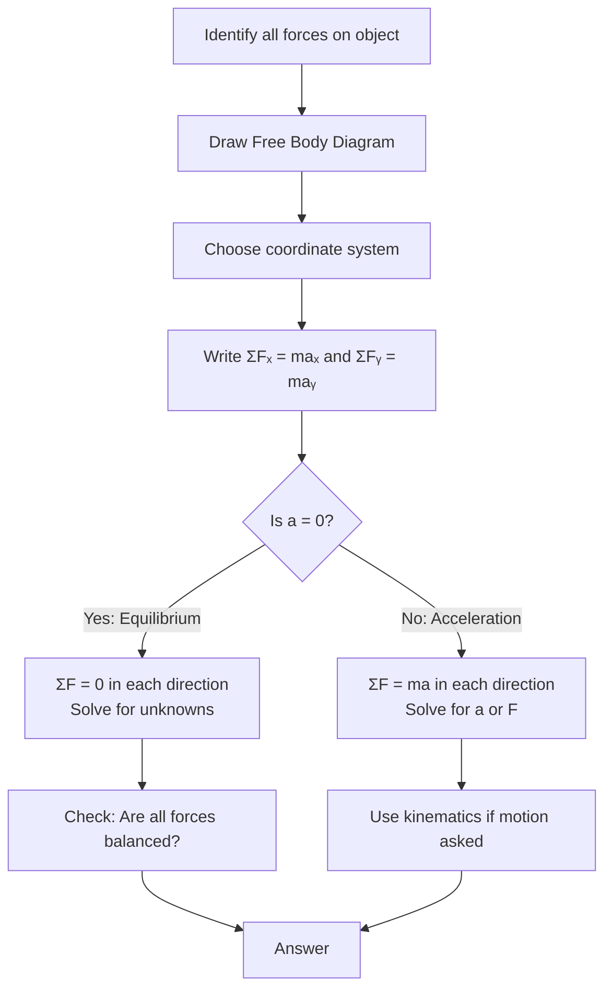

# Unit 02: Force & Translational Dynamics
**AP Physics 1 | Georgia Standards of Excellence**  
**College Board CED Topic:** DYN-1 through DYN-5

---

## PART A: CHAPTER BLUEPRINT & CONCEPTS

### Sub-Chapter 2.1 — Forces and Newton's First Law

**Core Concepts:**
- **Force:** A push or pull; vector quantity; causes acceleration
- **Net Force (ΣF):** Vector sum of all forces on an object
- **Newton's 1st Law (Law of Inertia):** An object remains at rest or in constant velocity unless acted on by a net external force
- **Inertia:** Resistance to change in motion; proportional to mass
- **Equilibrium:** ΣF = 0 (object at rest or constant velocity)

**Mathematical Relationships:**
```
ΣF = 0  →  equilibrium (v = constant or v = 0)
ΣF ≠ 0  →  acceleration occurs
```

**Variable Definitions:**
| Symbol | Quantity | SI Unit |
|--------|----------|---------|
| F | force | N (Newton = kg·m/s²) |
| ΣF | net force | N |
| m | mass | kg |
| a | acceleration | m/s² |

---

### Sub-Chapter 2.2 — Newton's Second Law

**Core Concepts:**
- **Newton's 2nd Law:** Net force equals mass times acceleration
- Applies to each direction independently
- Heavier objects require more force for same acceleration
- Direction of acceleration = direction of net force

**Mathematical Relationships:**
```
ΣF = ma           [Newtons, N]
ΣFₓ = maₓ        [x-component]
ΣFᵧ = maᵧ        [y-component]

Rearrangements:
  a = ΣF/m        [m/s²]
  m = ΣF/a        [kg]
```

**Weight vs. Mass:**
```
Weight (W) = mg   [Newtons]
g = 9.8 m/s² (acceleration due to gravity near Earth's surface)
Mass: invariant (doesn't change with location)
Weight: varies with local g
```

---

### Sub-Chapter 2.3 — Newton's Third Law

**Core Concepts:**
- For every action force, there is an equal and opposite reaction force
- Forces always come in pairs acting on DIFFERENT objects
- Third-law pairs: same magnitude, opposite direction, same type of force
- Third-law pairs NEVER cancel (they act on different objects)

**Key Examples:**
```
Book on table:
  - Earth pulls book down (gravity)
  - Book pulls Earth up (reaction) → 3rd Law pair
  
  - Table pushes book up (normal)
  - Book pushes table down (reaction) → 3rd Law pair
  
Note: Weight and Normal are NOT 3rd Law pairs
      (they're both on the same object: the book)
```

---

### Sub-Chapter 2.4 — Common Forces

**Normal Force (N):**
```
Perpendicular to contact surface
Flat surface: N = mg (if no other vertical forces)
Inclined plane: N = mg cosθ
Pushed down with force F: N = mg + F sinθ
Pulled up at angle: N = mg − F sinθ
```

**Friction:**
```
Static friction: fₛ ≤ μₛN  (prevents motion, up to max)
Kinetic friction: fₖ = μₖN  (opposes sliding, constant)
Always: μₛ > μₖ
Direction: always opposes relative motion or tendency of motion
```

**Tension (T):**
```
Force in ropes, strings, cables
Massless rope: tension same throughout
Pulls in direction away from object
```

**Spring Force (Hooke's Law):**
```
F_spring = −kx   [Newtons]
k = spring constant [N/m]
x = displacement from equilibrium [m]
```

---

### Sub-Chapter 2.5 — Dynamics on Inclined Planes & Atwood Machines

**Inclined Plane (angle θ):**
```
Coordinate system: x along incline, y perpendicular

Forces:
  Weight component along incline: W∥ = mg sinθ (down the incline)
  Weight component perpendicular: W⊥ = mg cosθ (into surface)
  Normal force: N = mg cosθ
  Kinetic friction: fₖ = μₖN = μₖmg cosθ (up the incline if sliding down)

Net force along incline (object sliding down):
  ΣF = mg sinθ − μₖmg cosθ = ma
  a = g(sinθ − μₖ cosθ)
```

**Atwood Machine (two masses over frictionless pulley):**
```
m₁ > m₂ → m₁ accelerates down, m₂ accelerates up

ΣF system = (m₁ − m₂)g = (m₁ + m₂)a
a = (m₁ − m₂)g / (m₁ + m₂)
T = 2m₁m₂g / (m₁ + m₂)
```

---

## PART B: DIAGRAM SYSTEM

### Diagram 2.1 — Free Body Diagram: Block on Flat Surface

```
          ↑ N (Normal force)
          │
          │
    ←fₖ──┤──→ F_applied
   (friction)│
          │
          ↓ W = mg (Weight)
    
  ┌─────────────────────────────┐
  │ FBD Rules:                  │
  │ 1. Draw object as a point   │
  │ 2. Draw ALL forces on object│
  │ 3. Label each force         │
  │ 4. Set up coordinate axes   │
  └─────────────────────────────┘
```

### Diagram 2.2 — Free Body Diagram: Inclined Plane

```
         ↑ N (⊥ to incline)
         │ 
    fₖ ←─┤         (incline surface)
         │       ╱
    ─────┤─────╱─────
         │   ╱  θ
   mg∥→  │ ╱
  (down  ↓╱  → mg cosθ (into surface)
  incline)   ↓ mg (total weight, vertical)

Axes: x = along incline (down = +)
      y = perpendicular to incline

ΣFₓ: mg sinθ − fₖ = ma
ΣFᵧ: N − mg cosθ = 0 → N = mg cosθ
```

### Diagram 2.3 — Atwood Machine

```
      ┌──────┐
      │Pulley│ (frictionless, massless)
      └──┬───┘
         │
    ┌────┴────┐
    │         │
    ↑T        ↑T  ← Same tension (massless rope)
    │         │
  ┌─┴─┐     ┌─┴─┐
  │ m₁│     │ m₂│   m₁ > m₂
  └───┘     └───┘
    ↓          ↑
   m₁g       m₂g

m₁ side: m₁g − T = m₁a  →  m₁ accelerates DOWN
m₂ side: T − m₂g = m₂a  →  m₂ accelerates UP

Solution:
  a = (m₁−m₂)g/(m₁+m₂)
  T = 2m₁m₂g/(m₁+m₂)
```

### Diagram 2.4 — Mermaid: Newton's Laws Decision Tree



### Diagram 2.5 — Third Law Pairs Visualization

```
        EARTH                    BALL
   ┌────────────┐          ┌────────────┐
   │            │          │            │
   │  F_on_E    │←────────→│  F_on_B    │
   │  (ball pulls│  3rd Law │  (Earth    │
   │  Earth up)  │   pair   │  pulls ball│
   │             │          │  down)     │
   └────────────┘          └────────────┘
   
   F_on_E = −F_on_B (equal magnitude, opposite direction)
   BOTH are gravitational forces
   Act on DIFFERENT objects → NOT same force system
```

---

## PART C: WORKED EXAMPLES (20 Questions)

### Example 2.1 — Finding Net Force
**Type:** Algebraic Calculation

**Question:** Three forces act on a 5 kg box: 30 N east, 10 N west, 20 N north. Find (a) net force, (b) acceleration magnitude.

**Solution:**
```
(a) ΣFₓ = 30 − 10 = 20 N east
    ΣFᵧ = 20 N north
    ΣF = √(20² + 20²) = √800 = 28.3 N at 45° north of east

(b) a = ΣF/m = 28.3/5 = 5.66 m/s²
```

---

### Example 2.2 — Normal Force on Flat Surface
**Type:** Algebraic Calculation

**Question:** A 60 kg person stands in an elevator. Find normal force when elevator (a) at rest, (b) accelerating up at 2 m/s², (c) accelerating down at 3 m/s².

**Solution:**
```
(a) ΣFᵧ = 0: N − mg = 0 → N = mg = 60(9.8) = 588 N

(b) ΣFᵧ = maᵧ (up positive): N − mg = ma
    N = m(g + a) = 60(9.8 + 2) = 60(11.8) = 708 N

(c) N − mg = m(−a): N = m(g − a) = 60(9.8 − 3) = 60(6.8) = 408 N

Note: Feel heavier when accelerating up; lighter when accelerating down
```

---

### Example 2.3 — Friction on Flat Surface
**Type:** Algebraic Calculation

**Question:** A 10 kg box (μₛ=0.50, μₖ=0.35) is pushed with 40 N. Does it move? If so, find acceleration.

**Solution:**
```
Normal force: N = mg = 10(9.8) = 98 N
Max static friction: fₛ_max = μₛN = 0.50(98) = 49 N

Applied force = 40 N < fₛ_max = 49 N
→ Box does NOT move (static friction = 40 N, no acceleration)

If pushed with 60 N (> 49 N):
Box moves. Kinetic friction: fₖ = μₖN = 0.35(98) = 34.3 N
ΣF = 60 − 34.3 = 25.7 N
a = F/m = 25.7/10 = 2.57 m/s²
```

---

### Example 2.4 — Inclined Plane: No Friction
**Type:** Algebraic Calculation

**Question:** A 5 kg block slides down a frictionless 30° incline. Find acceleration and normal force.

**Solution:**
```
Coordinate system: x = down incline (+), y = ⊥ to incline (+away from surface)

ΣFᵧ = 0: N − mg cos30° = 0
  N = 5(9.8)(cos30°) = 49(0.866) = 42.4 N

ΣFₓ = maₓ: mg sin30° = ma
  a = g sin30° = 9.8(0.5) = 4.9 m/s² (down the incline)
```

---

### Example 2.5 — Inclined Plane with Friction
**Type:** Algebraic Calculation

**Question:** An 8 kg block on a 37° incline has μₖ = 0.25. (sin37°=0.6, cos37°=0.8) Find acceleration when sliding down.

**Solution:**
```
N = mg cos37° = 8(9.8)(0.8) = 62.7 N
fₖ = μₖN = 0.25(62.7) = 15.7 N (up the incline, opposing motion)
W∥ = mg sin37° = 8(9.8)(0.6) = 47.0 N (down the incline)

ΣFₓ: mg sin37° − fₖ = ma
47.0 − 15.7 = 8a
31.3 = 8a
a = 3.91 m/s² (down the incline)
```

---

### Example 2.6 — Atwood Machine
**Type:** Algebraic Calculation

**Question:** Two masses m₁=8 kg and m₂=3 kg hang over a frictionless pulley. Find acceleration and tension.

**Solution:**
```
a = (m₁ − m₂)g/(m₁ + m₂) = (8−3)(9.8)/(8+3) = 5(9.8)/11 = 4.45 m/s²

T = 2m₁m₂g/(m₁+m₂) = 2(8)(3)(9.8)/11 = 470.4/11 = 42.8 N

Verify with individual equations:
  m₁: m₁g − T = m₁a → 78.4 − T = 8(4.45) = 35.6 → T = 42.8 N ✓
  m₂: T − m₂g = m₂a → T − 29.4 = 3(4.45) = 13.4 → T = 42.8 N ✓
```

---

### Example 2.7 — Connected Objects (Horizontal)
**Type:** Algebraic Calculation

**Question:** A 3 kg box (A) is connected by string to a 5 kg box (B) on a frictionless surface. Force F=24 N pulls B. Find (a) acceleration of system, (b) tension in string.

**Solution:**
```
(a) Treat as system: ΣF = (m_A + m_B)a
    24 = (3 + 5)a = 8a
    a = 3 m/s²

(b) Tension acts only on box A:
    T = m_A × a = 3 × 3 = 9 N

    Verify for B: F − T = m_B × a
    24 − 9 = 5(3) = 15 ✓
```

---

### Example 2.8 — Static Equilibrium
**Type:** Algebraic Calculation

**Question:** A 5 kg sign is suspended from two wires making 30° and 60° with horizontal. Find tension in each wire.

**Solution:**
```
Weight: W = 5(9.8) = 49 N

Equilibrium conditions:
ΣFₓ = 0: T₂cos60° − T₁cos30° = 0     → T₂(0.5) = T₁(0.866)
ΣFᵧ = 0: T₁sin30° + T₂sin60° = W     → 0.5T₁ + 0.866T₂ = 49

From first equation: T₂ = 1.732T₁
Substitute: 0.5T₁ + 0.866(1.732T₁) = 49
            0.5T₁ + 1.5T₁ = 49
            2T₁ = 49
            T₁ = 24.5 N
            T₂ = 1.732(24.5) = 42.4 N
```

---

### Example 2.9 — Third Law Application
**Type:** Qualitative Reasoning

**Question:** A horse pulls a cart with force F. The cart pulls back on the horse with equal force F (Newton's 3rd Law). So why does the cart accelerate?

**Solution:**
```
The 3rd law pair forces DO cancel in total — but they act on DIFFERENT objects:
- Force from horse on cart → accelerates the CART
- Force from cart on horse → this is just ONE force on the horse

The horse also has external friction from the ground (forward push).
Net force on horse = ground friction − cart's pull on horse ≠ 0

Net force on CART = horse's pull on cart − any friction on cart ≠ 0

Key insight: Newton's 3rd law pairs cannot cancel each other
because they act on different objects. Each object has its own FBD.
```

---

### Example 2.10 — Finding Coefficient of Friction
**Type:** Algebraic Calculation

**Question:** A 20 kg block slides across a floor and decelerates from 8 m/s to rest in 4 m. Find (a) deceleration, (b) friction force, (c) coefficient of kinetic friction.

**Solution:**
```
(a) v² = v₀² + 2aΔx
    0 = 64 + 2a(4)
    a = −8 m/s² (deceleration of 8 m/s²)

(b) fₖ = ma = 20(8) = 160 N

(c) N = mg = 20(9.8) = 196 N
    μₖ = fₖ/N = 160/196 = 0.816
```

---

### Example 2.11 — Tension in Hanging System
**Type:** Algebraic Calculation

**Question:** Three blocks hang vertically: A (2 kg) below B (3 kg) below C (4 kg) from a ceiling. Find tension in each rope segment.

**Solution:**
```
Rope below C holds A and B:
  T₁ = (m_A + m_B)g = (2+3)(9.8) = 49 N

Rope below ceiling holds all three... wait, re-read:
  C hangs from ceiling, B hangs from C, A hangs from B

Rope 1 (A to B): T₁ = m_A × g = 2(9.8) = 19.6 N
Rope 2 (B to C): T₂ = (m_A + m_B)g = 5(9.8) = 49 N
Rope 3 (C to ceiling): T₃ = (m_A + m_B + m_C)g = 9(9.8) = 88.2 N
```

---

### Example 2.12 — Apparent Weight in Circular Motion
**Type:** Algebraic Calculation

**Question:** A 70 kg person rides at top and bottom of a Ferris wheel (radius 10 m, speed 6 m/s). Find apparent weight at each position. (g=9.8 m/s²)

**Solution:**
```
Centripetal acceleration: aₒ = v²/r = 36/10 = 3.6 m/s²

At TOP (centripetal direction = downward):
  mg − N = maₒ
  N = m(g − aₒ) = 70(9.8 − 3.6) = 70(6.2) = 434 N

At BOTTOM (centripetal direction = upward):
  N − mg = maₒ
  N = m(g + aₒ) = 70(9.8 + 3.6) = 70(13.4) = 938 N
```

---

### Example 2.13 — Pulley with Friction
**Type:** Algebraic Calculation

**Question:** Mass A (4 kg) sits on surface (μₖ=0.30) and is connected by rope over pulley to hanging mass B (3 kg). Find acceleration.

**Solution:**
```
N_A = m_A × g = 4(9.8) = 39.2 N
fₖ = μₖN_A = 0.30(39.2) = 11.76 N

For system (B falls, A slides):
  Net force = m_B × g − fₖ = 3(9.8) − 11.76 = 29.4 − 11.76 = 17.64 N
  Total mass = m_A + m_B = 7 kg
  a = 17.64/7 = 2.52 m/s²

Check with individual equations:
  B: m_B g − T = m_B a → 29.4 − T = 3(2.52) = 7.56 → T = 21.84 N
  A: T − fₖ = m_A a → 21.84 − 11.76 = 10.08 = 4(2.52) ✓
```

---

### Example 2.14 — Force at Angle
**Type:** Algebraic Calculation

**Question:** A 15 kg crate is pulled at 30° above horizontal with 80 N. μₖ=0.20. Find acceleration.

**Solution:**
```
Horizontal: Fₓ = 80 cos30° = 80(0.866) = 69.3 N
Vertical: Fᵧ = 80 sin30° = 80(0.5) = 40 N (upward)

Normal force (vertical equilibrium):
N + Fᵧ − mg = 0
N = mg − Fᵧ = 15(9.8) − 40 = 147 − 40 = 107 N

Kinetic friction: fₖ = μₖN = 0.20(107) = 21.4 N

Newton's 2nd (horizontal): Fₓ − fₖ = ma
69.3 − 21.4 = 15a
47.9 = 15a
a = 3.19 m/s²
```

---

### Example 2.15 — Minimum Force to Prevent Sliding
**Type:** Algebraic Calculation

**Question:** A 2 kg block sits on a 40° incline. What minimum force parallel to incline (up) prevents sliding? (μₛ=0.35)

**Solution:**
```
N = mg cos40° = 2(9.8)(0.766) = 15.0 N
Max static friction: fₛ = μₛN = 0.35(15.0) = 5.25 N (up the incline)
Weight component: W∥ = mg sin40° = 2(9.8)(0.643) = 12.6 N (down)

At minimum force F (up incline) to prevent sliding down:
F + fₛ = W∥ (friction also acts up when trying to prevent sliding down)
F = W∥ − fₛ = 12.6 − 5.25 = 7.35 N
```

---

### Example 2.16 — Newton's 3rd Law: Recoil
**Type:** Qualitative Reasoning + Calculation

**Question:** A 75 kg person on ice skates pushes off a 100 kg wall. The wall pushes them back with 300 N for 0.5 s. Find (a) acceleration of person, (b) final velocity of person.

**Solution:**
```
(a) By Newton's 3rd Law, person experiences 300 N force.
    a = F/m = 300/75 = 4 m/s²

(b) v = v₀ + at = 0 + 4(0.5) = 2 m/s (away from wall)

Note: Wall doesn't move (attached to Earth, effectively infinite mass)
      If wall were a free-standing block of 100 kg:
      a_wall = 300/100 = 3 m/s² (equal and opposite force)
```

---

### Example 2.17 — Spring Force and Equilibrium
**Type:** Algebraic Calculation

**Question:** A spring (k=200 N/m) is attached to ceiling. A 500 g mass hangs from it. (a) How far does spring stretch? (b) What additional mass makes it stretch 8 cm total?

**Solution:**
```
(a) At equilibrium: F_spring = weight
    kx = mg
    200x = 0.5(9.8) = 4.9 N
    x = 4.9/200 = 0.0245 m = 2.45 cm

(b) For total stretch x = 0.08 m:
    kx = Mg
    200(0.08) = Mg
    16 = Mg
    M = 16/9.8 = 1.633 kg
    Additional mass = 1.633 − 0.5 = 1.133 kg
```

---

### Example 2.18 — Two-Block Push
**Type:** Algebraic Calculation

**Question:** Force F=30 N pushes two blocks (m₁=4 kg, m₂=6 kg) on frictionless floor. Find (a) acceleration, (b) contact force between blocks.

**Solution:**
```
(a) F = (m₁ + m₂)a
    30 = (4+6)a = 10a
    a = 3 m/s²

(b) Contact force on m₂ from m₁:
    F_contact = m₂ × a = 6 × 3 = 18 N

    Check on m₁: F − F_contact = m₁ × a
    30 − 18 = 12 = 4(3) ✓
```

---

### Example 2.19 — Calculus: Variable Force
**Type:** Calculus Derivation (AP-C Level)

**Question:** A force F(t) = (6t − 4) N acts on a 2 kg object. At t=0, v=3 m/s. Find v(t) and v at t=3 s.

**Solution:**
```
F = ma → a(t) = F(t)/m = (6t−4)/2 = 3t − 2

v(t) = v₀ + ∫₀ᵗ a dt = 3 + ∫₀ᵗ (3t−2) dt
     = 3 + [3t²/2 − 2t]₀ᵗ
     = 3 + 3t²/2 − 2t
     = 3t²/2 − 2t + 3

v(3) = 3(9)/2 − 2(3) + 3 = 13.5 − 6 + 3 = 10.5 m/s
```

---

### Example 2.20 — AP FRQ: Inclined Plane System
**Type:** Free Response Question

**Question:** Block A (m_A=3 kg) sits on a 30° frictionless incline. It is connected by massless string over a frictionless pulley to hanging Block B (m_B=2 kg).

(a) Draw FBDs for each block.
(b) Determine which block accelerates down/up.
(c) Find acceleration of system.
(d) Find tension in string.
(e) If μₖ=0.20 is added to incline, find new acceleration.

**Solution:**
```
(a) FBD Block A (on incline):
    - Weight mg_A down
    - Normal N perpendicular to incline  
    - Tension T up the incline
    
    FBD Block B (hanging):
    - Weight mg_B down
    - Tension T upward

(b) Compare forces:
    Tendency of A to slide down: m_A g sin30° = 3(9.8)(0.5) = 14.7 N
    Weight of B: m_B g = 2(9.8) = 19.6 N
    B is heavier → B descends, A moves UP the incline

(c) For B (down): m_B g − T = m_B a
    For A (up incline): T − m_A g sin30° = m_A a
    
    Add: m_B g − m_A g sin30° = (m_A + m_B)a
    19.6 − 14.7 = 5a
    4.9 = 5a
    a = 0.98 m/s²

(d) T = m_A(a + g sin30°) = 3(0.98 + 4.9) = 3(5.88) = 17.6 N
    Check: T = m_B(g − a) = 2(9.8 − 0.98) = 2(8.82) = 17.6 N ✓

(e) With friction (A now moving UP, friction acts DOWN incline):
    N = m_A g cos30° = 3(9.8)(0.866) = 25.5 N
    fₖ = μₖN = 0.20(25.5) = 5.10 N (DOWN incline, opposing upward motion)
    
    m_B g − T = m_B a
    T − m_A g sin30° − fₖ = m_A a
    
    Add: m_B g − m_A g sin30° − fₖ = (m_A + m_B)a
    19.6 − 14.7 − 5.10 = 5a
    −0.2 = 5a
    a = −0.04 m/s² 
    
    Negative means our assumed direction was wrong — 
    actually A slides DOWN and B goes UP, OR system is in static equilibrium.
    Check static: net tendency = −0.2 N → static friction can hold this → EQUILIBRIUM
```

---

## PART D: 50-QUESTION TEST BANK

**1.** Newton's First Law applies when:
- A) Net force is maximum  B) Net force equals zero  C) Acceleration is greatest  D) Mass is zero
**Answer: B**

**2.** A 4 kg mass accelerates at 5 m/s². Net force is:
- A) 0.8 N  B) 9 N  C) 20 N  D) 1.25 N
**Answer: C**

**3.** Weight of a 70 kg person on Earth (g=9.8 m/s²):
- A) 70 N  B) 7.1 N  C) 686 N  D) 6.86 N
**Answer: C**

**4.** Newton's 3rd Law force pairs:
- A) Always cancel  B) Act on same object  C) Act on different objects  D) Are unequal
**Answer: C**

**5.** Kinetic friction force equals:
- A) μₛN  B) μₖN  C) μₖmg sinθ  D) μₛmg
**Answer: B**

**6.** On a frictionless surface, if net force doubles (same mass), acceleration:
- A) Halves  B) Doubles  C) Quadruples  D) Stays same
**Answer: B**

**7.** A box is in equilibrium on an incline. The net force is:
- A) mg sinθ  B) mg cosθ  C) Zero  D) μmg cosθ
**Answer: C**

**8.** The normal force on a flat surface equals mg when:
- A) Object accelerates  B) Only vertical forces present (no acceleration)  C) Friction acts  D) Always
**Answer: B**

**9.** Static friction is:
- A) Always equal to μₛN  B) Less than or equal to μₛN  C) Greater than kinetic friction in magnitude but not direction  D) Both B and C
**Answer: D**

**10.** A 10 kg block on frictionless 45° incline accelerates at:
- A) 4.9 m/s²  B) 6.93 m/s²  C) 9.8 m/s²  D) 0
**Answer: B** [a=g sin45°=9.8×0.707=6.93 m/s²]

**11.** Atwood: m₁=5 kg, m₂=3 kg. Acceleration:
- A) 2.45 m/s²  B) 4.9 m/s²  C) 1.23 m/s²  D) 9.8 m/s²
**Answer: A** [(5−3)(9.8)/(5+3)=19.6/8=2.45]

**12.** Inertia is best defined as:
- A) The force of gravity  B) Resistance to change in velocity  C) Weight divided by g  D) Net force needed
**Answer: B**

**13.** A car slows down while moving east. Friction acts:
- A) West (opposing motion)  B) East  C) Downward  D) There is no friction
**Answer: A**

**14.** Two blocks (2 kg, 3 kg) pushed by 25 N on frictionless surface. Acceleration:
- A) 12.5 m/s²  B) 5 m/s²  C) 8.33 m/s²  D) 2 m/s²
**Answer: B** [a=25/(2+3)=5 m/s²]

**15.** Contact force between 2 kg block (behind) and 3 kg block (front) in above problem:
- A) 25 N  B) 10 N  C) 15 N  D) 5 N
**Answer: C** [F_contact=3×5=15 N]

**16.** A rope supports 3 equal masses. Top rope tension vs bottom rope tension:
- A) Equal  B) Top is 3× bottom  C) Bottom is larger  D) Depends on material
**Answer: B**

**17.** On an incline, normal force equals:
- A) mg  B) mg sinθ  C) mg cosθ  D) mg tanθ
**Answer: C**

**18.** μₛ is always _____ μₖ:
- A) Less than  B) Equal to  C) Greater than or equal  D) Unrelated to
**Answer: C**

**19.** A 50 N force accelerates a 10 kg box at 3 m/s² on a rough surface. Friction force is:
- A) 50 N  B) 30 N  C) 20 N  D) 10 N
**Answer: C** [fₖ = F − ma = 50 − 10(3) = 20 N]

**20.** When a person pushes down on a scale in an elevator, the scale reads MORE than their weight when elevator:
- A) Moves at constant speed upward  B) Accelerates downward  C) Accelerates upward  D) Is in free fall
**Answer: C**

**21.** For Atwood machine, tension T is:
- A) Greater than both m₁g and m₂g  B) Between m₁g and m₂g  C) Equal to (m₁+m₂)g  D) Zero
**Answer: B**

**22.** A block is pushed up an incline with constant velocity. Net force is:
- A) mg sinθ up  B) mg sinθ down  C) Zero  D) μmg cosθ
**Answer: C**

**23.** Mass is:
- A) The same as weight  B) A scalar measuring amount of matter  C) Measured in Newtons  D) Different on Moon vs Earth
**Answer: B**

**24.** If g on Moon = g_Earth/6, weight of 60 kg person on Moon:
- A) 10 N  B) 60 N  C) 98 N  D) 360 N
**Answer: C** [W=mg=60(9.8/6)=98 N]

**25.** Direction of kinetic friction is:
- A) Same as motion  B) Perpendicular to motion  C) Opposite to motion  D) Downward always
**Answer: C**

**26.** A 3 kg block hangs from a string inside an elevator. String tension = 35.4 N. Elevator acceleration:
- A) 2 m/s² upward  B) 2 m/s² downward  C) 9.8 m/s² downward  D) At rest
**Answer: A** [T=m(g+a)→35.4=3(9.8+a)→a=2 m/s²]

**27.** Two equal masses connected by rope over pulley (Atwood). If equal, acceleration is:
- A) g  B) 0  C) g/2  D) 2g
**Answer: B**

**28.** Free body diagram shows ALL forces acting on:
- A) Every object in system  B) Only the heaviest object  C) One specific object of interest  D) All objects in contact
**Answer: C**

**29.** Net force is zero on object moving at 30 m/s. Object will:
- A) Stop  B) Speed up  C) Slow down  D) Maintain 30 m/s
**Answer: D**

**30.** Coefficient of friction has units:
- A) N  B) kg  C) Dimensionless  D) m/s²
**Answer: C**

**31.** A 100 N push on 20 kg box for 5 s (frictionless). Final speed from rest:
- A) 5 m/s  B) 10 m/s  C) 25 m/s  D) 50 m/s
**Answer: C** [a=5 m/s². v=at=25 m/s]

**32.** Action-reaction pairs involve forces of:
- A) Same type (e.g., both gravitational)  B) Different types  C) Any type  D) Only contact forces
**Answer: A**

**33.** Maximum deceleration of a 1500 kg car (μₛ=0.8):
- A) 7.84 m/s²  B) 9.8 m/s²  C) 4.9 m/s²  D) 0.8 m/s²
**Answer: A** [a_max=μₛg=0.8×9.8=7.84]

**34.** Normal force on object on frictionless 0° (flat) surface being pulled at angle 20° above horizontal:
- A) Greater than mg  B) Equal to mg  C) Less than mg  D) Zero
**Answer: C** [Upward component of pull reduces N]

**35.** A 5 kg block: applied force 40 N up incline (30°, frictionless). Acceleration:
- A) 3.1 m/s²  B) 5.1 m/s²  C) 8.0 m/s²  D) 3.0 m/s²
**Answer: A** [ΣF=40−5(9.8)(0.5)=40−24.5=15.5 N. a=15.5/5=3.1 m/s²]

**36.** Net force on object in circular motion:
- A) Is zero  B) Points outward (centrifugal)  C) Points inward (centripetal)  D) Is tangential
**Answer: C**

**37.** Spring constant k has SI units:
- A) N  B) N/m  C) m/N  D) kg/s
**Answer: B**

**38.** An object rests on a surface. Identify the 3rd Law partner to the normal force:
- A) Weight of object  B) Friction  C) Force object exerts on surface  D) Applied force
**Answer: C**

**39.** Two forces act: 10 N at 0° and 10 N at 90°. Net force magnitude:
- A) 0 N  B) 10 N  C) 14.1 N  D) 20 N
**Answer: C** [√(100+100)=10√2=14.1 N]

**40.** F=ma is valid in:
- A) Accelerating reference frames  B) Inertial reference frames  C) Free fall only  D) All frames
**Answer: B**

**41.** A 20 kg hanging mass stretches a spring 5 cm. Spring constant k:
- A) 4 N/m  B) 400 N/m  C) 3920 N/m  D) 2 N/m
**Answer: C** [k=mg/x=20(9.8)/0.05=3920 N/m]

**42.** Net force on a 3 kg book resting on a table:
- A) 29.4 N up  B) 29.4 N down  C) Zero  D) 9.8 N up
**Answer: C**

**43.** Tension in string connecting two identical masses (m each) on frictionless surface with F applied:
- A) F  B) F/2  C) F/4  D) 2F
**Answer: B**

**44.** An object on a scale weighs 500 N at rest. In free-falling elevator, scale reads:
- A) 500 N  B) >500 N  C) 0 N  D) 250 N
**Answer: C**

**45.** Friction force on stationary object pushed by force less than maximum static friction:
- A) μₛN  B) Equal and opposite to applied force  C) Zero  D) μₖN
**Answer: B**

**46.** A 6 kg block on rough (μₖ=0.4) floor is pulled at 20° above horizontal with 30 N. Normal force:
- A) 58.8 N  B) 48.6 N  C) 68.8 N  D) 38.8 N
**Answer: B** [N=mg−Fsinθ=6(9.8)−30sin20°=58.8−10.26=48.5 N]

**47.** Which scenario represents Newton's 1st Law?
- A) Car accelerates from stop  B) Rocket launches  C) Satellite in circular orbit  D) Box sitting at rest
**Answer: D**

**48.** Force needed to slide a 30 kg box at constant velocity (μₖ=0.25):
- A) 7.5 N  B) 73.5 N  C) 300 N  D) 30 N
**Answer: B** [F=μₖmg=0.25(30)(9.8)=73.5 N]

**49.** A 1 kg ball falls in air with drag. Net downward force is 7 N. Drag force is:
- A) 2.8 N  B) 7 N  C) 9.8 N  D) 16.8 N
**Answer: A** [ΣF=mg−drag=9.8−drag=7 → drag=2.8 N]

**50.** Three boxes on frictionless surface, total mass 12 kg, F=36 N applied to leftmost. Force between middle and right box (each 4 kg):
- A) 12 N  B) 24 N  C) 36 N  D) 9 N
**Answer: A** [a=36/12=3 m/s². Force on rightmost: F=4×3=12 N]

---

### Free Response Questions (FRQ) 1–10

**FRQ 1 — Experimental Design: Measuring Friction**

A student places a block on an inclined board and measures the angle at which it just starts to slide.

(a) What angle measurement gives μₛ? Derive the relationship.
(b) If critical angle = 32°, calculate μₛ.
(c) The student tilts faster and measures sliding angle = 28°. Calculate μₖ.
(d) Explain why μₛ > μₖ conceptually.

**Answer:**
```
(a) At critical angle: mg sinθ = μₛ mg cosθ → μₛ = tanθ
(b) μₛ = tan32° = 0.625
(c) μₖ = tan28° = 0.532
(d) Static friction must be broken (molecular bonds stronger when stationary);
    kinetic friction: sliding surfaces have less contact time → lower coefficient
```

---

**FRQ 2 — Inclined Plane with Connected Mass**

Block A (5 kg) on 37° incline (μₖ=0.20) connects via string over pulley to hanging Block B.

(a) Find minimum mass of B to start A moving UP the incline.
(b) If m_B = 4 kg, find acceleration direction and magnitude.
(c) Find tension in string for part (b).

**Answer:**
```
(a) For A to just start moving up:
    T = m_A g sin37° + μₛ m_A g cos37°
    For minimum: T = m_B g
    m_B g = 5(9.8)(0.6) + 0.20(5)(9.8)(0.8) = 29.4 + 7.84 = 37.24 N
    m_B = 3.80 kg

(b) With m_B=4: 
    Tendency force of B down = 4(9.8)=39.2 N
    Resistance of A = 29.4+7.84=37.24 N (sin+kinetic friction)
    Net = 39.2−37.24 = 1.96 N → A moves UP
    a = 1.96/(5+4) = 0.218 m/s²

(c) T = m_B(g−a) = 4(9.8−0.218) = 38.3 N
```

---

**FRQ 3 — Newton's Laws: Acceleration Analysis**

A 10 kg sled is pulled by rope at 25° above horizontal with force 60 N on a surface with μₖ=0.15.

(a) Draw complete FBD.
(b) Calculate normal force.
(c) Calculate kinetic friction.
(d) Calculate acceleration.
(e) If rope is cut, calculate deceleration due to friction.

**Answer:**
```
(a) FBD: Weight mg down, Normal N up, Applied F at 25° above horizontal, Friction fₖ backward

(b) N = mg − F sin25° = 10(9.8) − 60(0.423) = 98 − 25.4 = 72.6 N

(c) fₖ = μₖN = 0.15(72.6) = 10.9 N

(d) ΣFₓ = F cos25° − fₖ = 60(0.906) − 10.9 = 54.4 − 10.9 = 43.5 N
    a = 43.5/10 = 4.35 m/s²

(e) After rope cut: fₖ = μₖmg = 0.15(10)(9.8) = 14.7 N (larger, full weight now)
    a = −fₖ/m = −14.7/10 = −1.47 m/s²
```

---

**FRQ 4 — Elevator Problem**

A person (mass 65 kg) stands on a scale in an elevator.

(a) Scale reading at rest.
(b) Scale reading: accelerating up at 1.5 m/s².
(c) Scale reading: accelerating down at 2.0 m/s².
(d) Velocity at which person feels 80% of normal weight.
(e) At what acceleration does the person feel "weightless"?

**Answer:**
```
(a) N = mg = 65(9.8) = 637 N
(b) N = m(g+a) = 65(11.3) = 734.5 N
(c) N = m(g−a) = 65(7.8) = 507 N
(d) 0.80 × 637 = 509.6 N = m(g−a) → a = 9.8−509.6/65 = 1.96 m/s² downward
    (The velocity doesn't matter; only acceleration affects scale reading)
(e) N=0: m(g−a)=0 → a=g=9.8 m/s² downward (free fall)
```

---

**FRQ 5 — Multi-Block System**

Three blocks on frictionless table: A (2 kg), B (3 kg), C (5 kg) in line, pushed by F=30 N.

(a) System acceleration.
(b) Force between A and B.
(c) Force between B and C.
(d) Redesign: F pushes from C's side. Do answers change? Explain.

**Answer:**
```
(a) a = F/total mass = 30/10 = 3 m/s²

(b) F pushes A. Force on B from A = mass of (B+C) × a = 8 × 3 = 24 N

(c) Force on C from B = mass of C × a = 5 × 3 = 15 N

(d) Same acceleration (system unchanged).
    Force between B and C: now force on A+B from C = 5×3=15 N... 
    Actually: F_AC = (m_A+m_B) × a = 5×3=15 N
    Force between A and B: F_AB = m_A × a = 2×3 = 6 N
    The contact forces are different! Largest contact force is always at the pushed end.
```

---

**FRQ 6 — Modified Atwood with Friction**

Mass A (6 kg) on rough surface (μₖ=0.3) connected to hanging Mass B (4 kg).

(a) Find acceleration if B descends.
(b) Find tension.
(c) Find minimum mass of B to start motion (μₛ=0.4).
(d) If system starts from rest, find speed after 2 m descent.

**Answer:**
```
(a) N = m_A g = 6(9.8) = 58.8 N; fₖ = 0.3(58.8) = 17.64 N
    Net force = m_B g − fₖ = 4(9.8) − 17.64 = 39.2 − 17.64 = 21.56 N
    a = 21.56/(6+4) = 2.156 m/s²

(b) T = m_A(a+μₖg) = 6(2.156+2.94) = 6(5.096) = 30.6 N
    Check: T = m_B(g−a) = 4(9.8−2.156) = 4(7.64) = 30.6 N ✓

(c) m_B g = μₛ m_A g → m_B = μₛ m_A = 0.4(6) = 2.4 kg

(d) v² = 2ad = 2(2.156)(2) = 8.624 → v = 2.94 m/s
```

---

**FRQ 7 — Friction Investigation**

A student slides blocks of different masses across a surface, measuring acceleration with different forces.

| Mass (kg) | Applied Force (N) | Acceleration (m/s²) |
|-----------|------------------|---------------------|
| 2 | 10 | 3.0 |
| 2 | 15 | 5.5 |
| 4 | 10 | 0.5 |
| 4 | 20 | 3.0 |

(a) Find μₖ from the 2 kg trials.
(b) Find μₖ from the 4 kg trials.
(c) Are they consistent? What does this tell you about friction?
(d) Predict acceleration for 3 kg block with 18 N applied force.

**Answer:**
```
(a) From 2 kg, F=10 N, a=3 m/s²:
    fₖ = F − ma = 10 − 2(3) = 4 N
    μₖ = fₖ/(mg) = 4/(2×9.8) = 0.204
    
    From 2 kg, F=15 N, a=5.5 m/s²:
    fₖ = 15 − 2(5.5) = 4 N → μₖ = 0.204 ✓

(b) From 4 kg, F=10 N, a=0.5 m/s²:
    fₖ = 10 − 4(0.5) = 8 N
    μₖ = 8/(4×9.8) = 0.204

(c) Consistent! μₖ ≈ 0.204 regardless of mass or force.
    This confirms friction depends on μ and N only, not area or applied force.

(d) fₖ = μₖmg = 0.204(3)(9.8) = 5.99 N
    a = (F−fₖ)/m = (18−5.99)/3 = 12.01/3 = 4.0 m/s²
```

---

**FRQ 8 — Qualitative Dynamics Reasoning**

A book (B) sits on top of a table (T) which sits on the floor (F).

(a) Identify all Newton's 3rd Law pairs.
(b) What forces act on the table?
(c) The table is accelerated upward at 2 m/s². How do forces on the book change?
(d) At what acceleration would the book and table separate?

**Answer:**
```
(a) 3rd Law pairs:
    - Earth pulls book down ↔ Book pulls Earth up (gravitational)
    - Table pushes book up ↔ Book pushes table down (normal contact)
    - Earth pulls table down ↔ Table pulls Earth up (gravitational)
    - Floor pushes table up ↔ Table pushes floor down (normal contact)

(b) Forces on table:
    - Weight of table (mg_T) down
    - Normal from floor (N_floor) up
    - Weight of book pressing down (reaction to table's normal on book)

(c) Book accelerates up at 2 m/s²:
    N_table_on_book = m_book(g+a) = m_book(11.8 m/s²) > m_book(g)
    Normal force on book INCREASES.

(d) Book separates when N = 0:
    m_book(g+a) = 0 → impossible for upward acceleration.
    Separation if table accelerates DOWNWARD faster than g:
    a_down > g → free fall or beyond
```

---

**FRQ 9 — Variable Mass System**

A rocket of initial mass M₀ = 500 kg burns fuel at rate ṁ = 5 kg/s producing thrust F_thrust = 8000 N. (AP-C level)

(a) Initial acceleration of rocket.
(b) Mass after 30 s.
(c) Acceleration after 30 s.
(d) Write equation for acceleration as function of time.

**Answer:**
```
(a) Net force = Thrust − Weight = 8000 − 500(9.8) = 8000 − 4900 = 3100 N
    a₀ = F/M₀ = 3100/500 = 6.2 m/s²

(b) M(30) = 500 − 5(30) = 500 − 150 = 350 kg

(c) Net force = 8000 − 350(9.8) = 8000 − 3430 = 4570 N
    a(30) = 4570/350 = 13.1 m/s²

(d) M(t) = 500 − 5t
    a(t) = [8000 − (500−5t)(9.8)] / (500−5t)
    a(t) = 8000/(500−5t) − 9.8
```

---

**FRQ 10 — Synthesis: Two-Object System with Friction**

Block P (3 kg) sits on top of Block Q (5 kg) on a smooth floor. Between P and Q: μₛ=0.4, μₖ=0.3.

(a) Find max force F (applied to Q) so P doesn't slip on Q.
(b) If F=40 N, find acceleration of each block.
(c) Find friction force on P from Q when F=40 N.
(d) Find friction force on Q from P when F=40 N.

**Answer:**
```
(a) Max friction on P from Q: fₛ_max = μₛ m_P g = 0.4(3)(9.8) = 11.76 N
    Max acceleration of P: a_max = fₛ_max/m_P = 11.76/3 = 3.92 m/s²
    For system to move together: a = F/(m_P+m_Q) ≤ 3.92 m/s²
    F_max = 3.92 × 8 = 31.4 N

(b) F=40 N > 31.4 N → blocks slip.
    Friction between P and Q = μₖ m_P g = 0.3(3)(9.8) = 8.82 N
    
    P: fₖ = m_P a_P → a_P = 8.82/3 = 2.94 m/s²
    Q: F − fₖ = m_Q a_Q → a_Q = (40−8.82)/5 = 31.18/5 = 6.24 m/s²

(c) Friction on P from Q = 8.82 N forward (kinetic, Q slides forward relative to P)

(d) By Newton's 3rd Law: friction on Q from P = 8.82 N backward
    (P slides backward relative to Q, so P's friction on Q is backward)
```

---

## ANSWER KEY MATRIX

### MCQ Answer Key
| Q | A | Q | A | Q | A | Q | A | Q | A |
|---|---|---|---|---|---|---|---|---|---|
| 1 | B | 11 | A | 21 | B | 31 | C | 41 | C |
| 2 | C | 12 | B | 22 | C | 32 | A | 42 | C |
| 3 | C | 13 | A | 23 | B | 33 | A | 43 | B |
| 4 | C | 14 | B | 24 | C | 34 | C | 44 | C |
| 5 | B | 15 | C | 25 | C | 35 | A | 45 | B |
| 6 | B | 16 | B | 26 | A | 36 | C | 46 | B |
| 7 | C | 17 | C | 27 | B | 37 | B | 47 | D |
| 8 | B | 18 | C | 28 | C | 38 | C | 48 | B |
| 9 | D | 19 | C | 29 | D | 39 | C | 49 | A |
| 10 | B | 20 | C | 30 | C | 40 | B | 50 | A |

### FRQ Key Expressions
| FRQ | Key Answers |
|-----|------------|
| 1 | μₛ=tanθ=0.625; μₖ=0.532 |
| 2 | min m_B=3.80 kg; a=0.218 m/s² |
| 3 | N=72.6 N; a=4.35 m/s² |
| 4 | 637 N; 734.5 N; 507 N; a=9.8 m/s² for weightlessness |
| 5 | a=3 m/s²; F_AB=24 N; F_BC=15 N |
| 6 | a=2.156 m/s²; T=30.6 N; min m_B=2.4 kg |
| 7 | μₖ=0.204; consistent; a(3kg,18N)=4.0 m/s² |
| 8 | 4 pairs identified; N increases with upward accel |
| 9 | a₀=6.2 m/s²; a(30)=13.1 m/s²; a(t)=8000/(500−5t)−9.8 |
| 10 | F_max=31.4 N; a_P=2.94, a_Q=6.24 m/s²; f=8.82 N |
