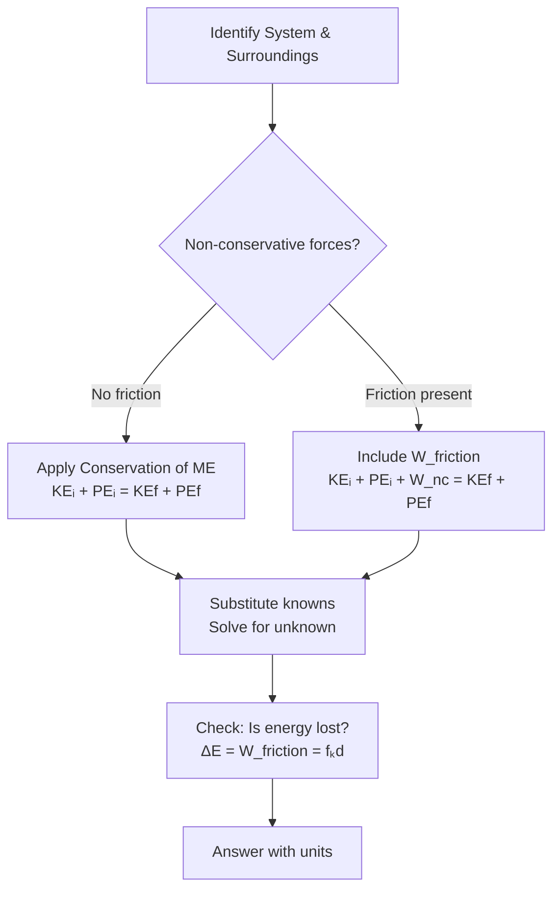

# Unit 03: Work, Energy, and Power
**AP Physics 1 | Georgia Standards of Excellence**

---

## PART A: CHAPTER BLUEPRINT & CONCEPTS

### Sub-Chapter 3.1 — Work

**Mathematical Relationships:**
```
W = F·d·cosθ          [Joules, J = N·m]
W = ΔKE               (Work-Energy Theorem)
W_net = ΔKE = ½mv² − ½mv₀²

Variable Definitions:
  W = work done [J]
  F = applied force [N]
  d = displacement magnitude [m]
  θ = angle between F and displacement
  
Calculus form: W = ∫F·dx
```

**Key Rules:**
- Force perpendicular to displacement → W = 0
- Work can be negative (force opposes motion)
- Only the component of force along displacement does work

### Sub-Chapter 3.2 — Kinetic and Potential Energy

```
Kinetic Energy:    KE = ½mv²                  [J]
Gravitational PE:  PE_grav = mgh               [J]
Spring PE:         PE_spring = ½kx²            [J]
Total Mechanical:  E_mech = KE + PE            [J]

Conservation of Energy (no friction):
  KE_i + PE_i = KE_f + PE_f
  ½mv₀² + mgh₀ = ½mv² + mgh

With non-conservative forces (friction):
  W_nc = ΔE_mech = (KE_f + PE_f) − (KE_i + PE_i)
  W_friction = −fₖd  (always negative)
```

### Sub-Chapter 3.3 — Power

```
Average Power:        P_avg = W/Δt = ΔE/Δt     [Watts, W = J/s]
Instantaneous Power:  P = Fv·cosθ              [W]
Power from velocity:  P = Fv  (when F ∥ v)     [W]

1 horsepower = 746 W
1 kWh = 3.6 × 10⁶ J
```

### Sub-Chapter 3.4 — Energy Conservation & LOL Diagrams

**LOL (Energy Bar Chart) Method:**
```
L (initial) | O (transfer) | L (final)

Example: Ball falling off cliff (no air resistance)
Initial: [====] KE  [========] PE_grav  [ ] PE_spring
Transfer: None (conservative)
Final:   [============] KE  [  ] PE_grav  [ ] PE_spring

All PE converts to KE: mgh = ½mv²
```

### Sub-Chapter 3.5 — Non-Conservative Forces

```
Friction does negative work: W_f = −μₖmgd

Energy dissipated by friction = fₖ × d = μₖmgd

Work done by all forces = ΔKE (Work-Energy Theorem)
W_applied + W_friction + W_gravity = ΔKE
```

---

## PART B: DIAGRAM SYSTEM

### Diagram 3.1 — Energy Conservation: Roller Coaster

```
    h₁                    h₃
    ●                     ●
   / \                   / \
  /   \    h₂           /   \
 /     \   ●           /     \
/       \ / \         /
          ────────────

At h₁: E = mgh₁ (all PE, v=0)
At h₂: E = mgh₂ + ½mv₂² (mixed)
At ground: E = ½mv_max² (all KE)

h₁ must be highest for roller coaster to complete!
Energy: E₁ = E₂ = E₃ (no friction)
```

### Diagram 3.2 — Work-Energy Theorem Visual

```
Force (N)
│    ┌──────────────┐
│    │   W = F×d    │
│    │ (area under  │
│    │  F-x graph)  │
│    └──────────────┘
└──────────────────── displacement (m)
     x₁             x₂

Variable force: W = area under F(x) vs x curve = ∫F dx
```

### Diagram 3.3 — Mermaid: Energy Problem Strategy



---

## PART C: WORKED EXAMPLES (20 Questions)

### Example 3.1 — Work by a Constant Force
**Type:** Algebraic Calculation

**Question:** A 50 N force at 37° above horizontal pushes a box 8 m. Find work done.

**Solution:**
```
W = Fd cosθ = 50(8)(cos37°) = 50(8)(0.8) = 320 J
```

### Example 3.2 — Work-Energy Theorem
**Type:** Algebraic Calculation

**Question:** A 4 kg box starts at rest. Net force 20 N acts over 5 m. Find final speed.

**Solution:**
```
W_net = F·d = 20(5) = 100 J
W_net = ΔKE = ½mv² − 0
100 = ½(4)v²
v² = 50
v = 7.07 m/s
```

### Example 3.3 — Energy Conservation: Falling
**Type:** Algebraic Calculation

**Question:** Ball dropped from 20 m. Find speed at 5 m above ground.

**Solution:**
```
E conserved: mgh₁ = mgh₂ + ½mv²
g(20) = g(5) + ½v²
9.8(15) = ½v²
v² = 294
v = 17.1 m/s
```

### Example 3.4 — Spring Energy
**Type:** Algebraic Calculation

**Question:** Spring (k=500 N/m) compressed 0.2 m launches 0.5 kg ball horizontally. Find launch speed.

**Solution:**
```
PE_spring = ½kx² = ½(500)(0.04) = 10 J
½mv² = 10
v² = 40
v = 6.32 m/s
```

### Example 3.5 — Power Calculation
**Type:** Algebraic Calculation

**Question:** A 70 kg person climbs 20 m stairs in 30 s. Find average power output.

**Solution:**
```
W = mgh = 70(9.8)(20) = 13720 J
P = W/t = 13720/30 = 457 W (about 0.61 hp)
```

### Example 3.6 — Friction and Energy Loss
**Type:** Algebraic Calculation

**Question:** A 3 kg block slides 4 m down a 30° incline with μₖ=0.20. Find (a) work by gravity, (b) work by friction, (c) final KE if starting from rest.

**Solution:**
```
Height fallen: h = 4 sin30° = 2 m
(a) W_gravity = mgh = 3(9.8)(2) = 58.8 J

(b) N = mg cos30° = 3(9.8)(0.866) = 25.5 N
    fₖ = μₖN = 0.20(25.5) = 5.1 N
    W_friction = −fₖd = −5.1(4) = −20.4 J

(c) KE_f = W_net = W_gravity + W_friction = 58.8 − 20.4 = 38.4 J
    Check: ½mv² = 38.4 → v = √(25.6) = 5.06 m/s
```

### Example 3.7 — Energy at Multiple Points
**Type:** Algebraic Calculation

**Question:** A 2 kg ball is thrown upward at 15 m/s from ground. Find KE and PE at h=5 m. (No friction)

**Solution:**
```
Initial KE = ½(2)(225) = 225 J
Initial PE = 0

At h=5 m (conservation):
PE = mgh = 2(9.8)(5) = 98 J
KE = 225 − 98 = 127 J
v = √(2×127/2) = √127 = 11.3 m/s
```

### Example 3.8 — Power from Force and Velocity
**Type:** Algebraic Calculation

**Question:** A car engine applies 3000 N at 25 m/s. What is the power output in watts and horsepower?

**Solution:**
```
P = Fv = 3000 × 25 = 75,000 W = 75 kW
hp = 75000/746 = 100.5 hp
```

### Example 3.9 — Variable Force Work (AP-C)
**Type:** Calculus Derivation

**Question:** F(x) = (3x² + 2x) N. Find work from x=0 to x=3 m.

**Solution:**
```
W = ∫₀³ (3x² + 2x) dx = [x³ + x²]₀³ = (27 + 9) − 0 = 36 J
```

### Example 3.10 — Conservation with Spring
**Type:** Algebraic Calculation

**Question:** A 1 kg block compresses spring (k=800 N/m) by 0.15 m. Spring releases block on frictionless floor. Find max speed.

**Solution:**
```
½kx² = ½mv²
½(800)(0.0225) = ½(1)v²
9 = ½v²
v = √18 = 4.24 m/s
```

### Example 3.11 — Roller Coaster Loop
**Type:** Algebraic Calculation

**Question:** A car at top of 40 m high hill enters a loop of radius 12 m. What is minimum speed at loop top? Height of loop top = 24 m.

**Solution:**
```
At loop top: minimum speed when N=0 → v_top = √(gr) = √(9.8×12) = 10.8 m/s

Energy conservation (hill top to loop top):
½mv₀² + mgh₁ = ½mv_top² + mgh₂
v₀² + 2g(h₁) = v_top² + 2g(h₂)
v₀² = v_top² + 2g(h₂ − h₁) = 116.6 + 2(9.8)(24−40) = 116.6 − 313.6 → negative
This means: need only enough speed at hill top to maintain contact at loop.
v₀_min at hill top: ½mv₀² + mg(40) = ½m(gr) + mg(24)
v₀² = gr + 2g(24−40) = gr − 32g = g(r−32) = 9.8(12−32) < 0
→ Starting height of 40 m is more than sufficient.
```

### Example 3.12 — Hooke's Law & Energy
**Type:** Algebraic Calculation

**Question:** Two identical springs (k=300 N/m each). (a) What is total PE if both compressed 0.1 m? (b) If in parallel (same compression)?

**Solution:**
```
(a) Each: PE = ½(300)(0.01) = 1.5 J. Total = 3 J
(b) Parallel springs: k_eff = 600 N/m, x = 0.1 m
    PE = ½(600)(0.01) = 3 J (same!)
    
    If in series: k_eff = 150 N/m, same force F=kx shared
```

### Example 3.13 — Energy Lost to Friction
**Type:** Algebraic Calculation

**Question:** Block slides 6 m across floor and decelerates from 8 m/s to 3 m/s. Mass = 2 kg. Find μₖ.

**Solution:**
```
Energy lost = ΔKE = ½m(v₀² − v²) = ½(2)(64−9) = 55 J
W_friction = fₖ × d = μₖmg × d = 55
μₖ = 55/(2 × 9.8 × 6) = 55/117.6 = 0.468
```

### Example 3.14 — Efficiency
**Type:** Algebraic Calculation

**Question:** A motor (1500 W) lifts a 200 kg load 10 m. It takes 20 s. Find efficiency.

**Solution:**
```
Useful work done = mgh = 200(9.8)(10) = 19600 J
Energy input = P × t = 1500 × 20 = 30000 J
Efficiency = (19600/30000) × 100% = 65.3%
```

### Example 3.15 — Escape from Gravity (PE → KE)
**Type:** Algebraic Calculation

**Question:** Ball launched from ground at 15 m/s. What is its height when speed = 10 m/s? (No friction)

**Solution:**
```
½mv₀² = ½mv² + mgh
½(225) = ½(100) + 9.8h
112.5 = 50 + 9.8h
h = 62.5/9.8 = 6.38 m
```

### Example 3.16 — Power and Velocity of Car
**Type:** Algebraic Calculation

**Question:** Car engine provides constant power 60 kW. Mass = 1200 kg. At what speed does the car reach maximum velocity (when driving force equals friction = 800 N)?

**Solution:**
```
P = Fv at constant speed
60000 = 800 × v
v = 75 m/s = 270 km/h
```

### Example 3.17 — Pendulum Energy
**Type:** Algebraic Calculation

**Question:** A 0.5 kg pendulum bob swings from 0.3 m above lowest point. Find (a) max speed, (b) speed at 0.1 m above lowest point.

**Solution:**
```
(a) All PE → KE at bottom:
    mgh = ½mv²
    v = √(2gh) = √(2×9.8×0.3) = √5.88 = 2.42 m/s

(b) At h=0.1 m:
    mgh₀ = mgh + ½mv²
    v = √(2g(h₀−h)) = √(2×9.8×0.2) = √3.92 = 1.98 m/s
```

### Example 3.18 — Spring Launched Projectile
**Type:** Algebraic Calculation

**Question:** Spring (k=400 N/m, compressed 0.25 m) launches 0.2 kg ball at 30° above horizontal. Find range. (g=9.8 m/s²)

**Solution:**
```
PE_spring = ½(400)(0.0625) = 12.5 J = ½mv²
v₀ = √(2×12.5/0.2) = √125 = 11.18 m/s

v₀ₓ = 11.18 cos30° = 9.68 m/s
v₀ᵧ = 11.18 sin30° = 5.59 m/s
T = 2v₀ᵧ/g = 1.14 s
R = v₀ₓ × T = 9.68 × 1.14 = 11.0 m
```

### Example 3.19 — Energy Theorem with Calculus
**Type:** Calculus Derivation

**Question:** F(x) = (10 − 2x) N acts on 2 kg object at rest. Find speed at x=4 m.

**Solution:**
```
W = ∫₀⁴ (10 − 2x) dx = [10x − x²]₀⁴ = 40 − 16 = 24 J
W = ΔKE = ½mv² − 0
24 = ½(2)v²
v = √24 = 4.90 m/s
```

### Example 3.20 — AP FRQ: Complete Energy Analysis
**Type:** Free Response

**Question:** A 5 kg block starts from rest at top of ramp (h=4 m, length=8 m, μₖ=0.15).
(a) Find speed at bottom using energy methods.
(b) Block then slides on flat floor and compresses a spring (k=600 N/m). How far is spring compressed?
(c) Does block return to original height? Justify.
(d) Sketch energy bar charts at each stage.

**Solution:**
```
(a) On ramp:
    W_friction = −μₖmg cosθ × L = −0.15(5)(9.8)(cos30°)(8)
    cos θ = h/L → sinθ = 4/8 = 0.5, θ=30°, cosθ=0.866
    W_friction = −0.15(5)(9.8)(0.866)(8) = −50.9 J
    
    E_initial = mgh = 5(9.8)(4) = 196 J
    KE_bottom = 196 − 50.9 = 145.1 J
    v = √(2×145.1/5) = √58.04 = 7.62 m/s

(b) On flat floor with spring (assuming frictionless floor):
    ½mv² = ½kx²
    145.1 = ½(600)x²
    x² = 290.2/600 = 0.484
    x = 0.695 m

(c) No. Energy was lost to friction on the ramp. Even if spring and floor are frictionless,
    block returns with only 145.1 J (not 196 J), which brings it only to h=145.1/(mg)=2.97 m
    (not original 4 m).

(d) Energy bars:
    Initial: [====large====] PE, [empty] KE, [empty] Spring PE
    Bottom of ramp: [=====] KE, [empty] PE, [empty] Spring PE (some lost to heat)
    Max spring: [empty] KE, [empty] PE, [=====] Spring PE
```

---

## PART D: 50-QUESTION TEST BANK

**1.** A 10 N force pushes a box 5 m. The work done is: **Answer: 50 J**
**2.** Force perpendicular to displacement does work equal to: **Answer: Zero**
**3.** KE = ½mv². If speed triples, KE changes by factor: **Answer: 9**
**4.** A ball rolling off a table converts: **Answer: PE to KE**
**5.** Conservation of energy applies when: **Answer: Only conservative forces act**
**6.** W = 100 J in 5 s. Power = **Answer: 20 W**
**7.** At max height of a projectile, KE equals: **Answer: ½m(v₀cosθ)²**
**8.** Spring stores PE = ½kx². Doubling x changes PE by: **Answer: Factor of 4**
**9.** A 2 kg object at 5 m height has PE = **Answer: 98 J**
**10.** W_net = ΔKE is called: **Answer: Work-Energy Theorem**
**11.** Negative work means: **Answer: Force opposes displacement**
**12.** 1 Joule equals: **Answer: 1 N·m = 1 kg·m²/s²**
**13.** Power = Force × velocity when: **Answer: Force is parallel to velocity**
**14.** Non-conservative forces: **Answer: Don't conserve mechanical energy**
**15.** Friction does _____ work on sliding object: **Answer: Negative**
**16.** A 500 W motor runs 10 s. Energy used: **Answer: 5000 J**
**17.** Ball thrown up slows down because: **Answer: KE converts to PE**
**18.** Work by gravity depends on: **Answer: Vertical displacement only (not path)**
**19.** Spring constant k has unit: **Answer: N/m**
**20.** Energy is measured in: **Answer: Joules**
**21.** 3 kg, v=4 m/s. KE = **Answer: 24 J** [½×3×16]
**22.** 1 kWh = **Answer: 3.6 × 10⁶ J**
**23.** Mechanical energy is NOT conserved when: **Answer: Friction acts**
**24.** A pendulum at max height has: **Answer: Max PE, zero KE**
**25.** Power = dW/dt = **Answer: F · v**
**26.** Object slides down frictionless incline. Speed at bottom depends on: **Answer: Height only**
**27.** Effective spring constant of two springs in series (each k): **Answer: k/2**
**28.** KE at bottom of pendulum = **Answer: mgh (h=max height)**
**29.** Work done against gravity lifting mass m by height h: **Answer: mgh**
**30.** Energy dissipated by friction = **Answer: μₖmgd (horizontal)**
**31.** A car brakes to a stop. What happens to KE? **Answer: Converts to thermal energy**
**32.** Net work on object at constant velocity: **Answer: Zero**
**33.** Same block, same ramp — frictionless vs. with friction. Speed at bottom: **Answer: Frictionless is faster**
**34.** 1 Watt = **Answer: 1 J/s**
**35.** Roller coaster: at bottom of loop, normal force is _____ weight: **Answer: Greater than**
**36.** Escape velocity uses which energy conservation: **Answer: KE = GM m/r (gravitational PE)**
**37.** W = F·d·cosθ. When θ=180°, W = **Answer: −Fd**
**38.** A 60 kg climber ascends 100 m in 10 min. Power = **Answer: 98 W** [mgh/t]
**39.** At what height is KE = PE for ball thrown upward? **Answer: h = v₀²/4g**
**40.** Spring launcher: PE=25 J launches 0.5 kg. Speed = **Answer: 10 m/s** [v=√(2×25/0.5)]
**41.** Machine with 75% efficiency inputs 200 J. Useful output: **Answer: 150 J**
**42.** Two balls: same mass, one at h=10 m, one at h=5 m. KE ratio at ground: **Answer: 2:1**
**43.** Work done by normal force on sliding object: **Answer: Zero**
**44.** Object moves in circle at constant speed. Net work by centripetal force: **Answer: Zero**
**45.** Ball on spring at maximum compression: KE = **Answer: Zero**
**46.** 1 hp = **Answer: 746 W**
**47.** Work-energy theorem: W = ½mv² − ½mv₀². Correct when: **Answer: Any forces, net work used**
**48.** Ball falls freely 10 m. Using g=10: speed = **Answer: √200 ≈ 14.1 m/s**
**49.** A compressed spring releases; all PE converts to KE on frictionless surface. This demonstrates: **Answer: Conservation of mechanical energy**
**50.** Water falls 50 m over a dam (1000 kg). Power if it takes 10 s: **Answer: 49,000 W** [P=mgh/t]

---

### FRQ 1 — Energy Conservation on Curved Track
(a) 2 kg block slides from rest at h=6 m down frictionless curved track. Find speed at bottom.
(b) Track has μₖ=0.2 for bottom 4 m. Find final speed.
(c) Draw LOL diagram for each scenario.

**Answer:**
```
(a) mgh = ½mv² → v = √(2gh) = √(2×9.8×6) = √117.6 = 10.8 m/s
(b) Energy lost = μₖmg×d = 0.2(2)(9.8)(4) = 15.68 J
    KE_final = mgh − 15.68 = 117.6 − 15.68 = 101.9 J
    v = √(2×101.9/2) = √101.9 = 10.1 m/s
```

### FRQ 2 — Spring-Block System
k=1000 N/m, block 2 kg, compressed 0.3 m, μₖ=0.25 on horizontal surface.
(a) Initial PE. (b) Max speed. (c) Distance until block stops.

**Answer:**
```
(a) PE = ½(1000)(0.09) = 45 J
(b) v = √(2×45/2) = √45 = 6.71 m/s
(c) Distance: fₖ×d = 45 J → μₖmg×d = 45 → d = 45/(0.25×2×9.8) = 9.18 m
```

### FRQ 3 — Power and Performance
A 1200 kg car's engine outputs 90 kW. Resistive force = 1500 N.
(a) Max constant speed. (b) Acceleration at 20 m/s. (c) Power at 20 m/s maintaining constant speed.

**Answer:**
```
(a) P = Fv → 90000 = 1500v → v = 60 m/s
(b) Net force = P/v − friction = 90000/20 − 1500 = 4500 − 1500 = 3000 N
    a = 3000/1200 = 2.5 m/s²
(c) P = F×v = 1500×20 = 30,000 W = 30 kW (only friction force at constant speed)
```

### FRQ 4 — Gravitational PE and Projectiles
Ball launched at v₀=20 m/s, 53° above horizontal from 15 m cliff.
(a) PE at launch point. (b) KE at top of trajectory. (c) Speed at ground. (d) At what height is KE=PE?

**Answer:**
```
(a) PE = mgh = m(9.8)(15) [need mass — use m=1 kg as reference]
(b) At peak: v = v₀cosθ = 20(0.6)=12 m/s; KE=½(1)(144)=72 J
(c) E_total at launch = KE+PE = ½(1)(400) + (1)(9.8)(15) = 200+147=347 J
    At ground: ½v²=347 → v=√694=26.3 m/s
(d) KE=PE: E_total/2=PE=mgh → h=173.5/(9.8)=17.7 m above ground
    Since cliff is 15 m, height above ground = 17.7 m (ball is 2.7 m above cliff top)
```

### FRQ 5 — Variable Force Work (AP-C)
F(x) = (8x − 2x²) N for 0 ≤ x ≤ 4 m. Object starts from rest, mass 4 kg.
(a) Work from x=0 to x=4. (b) Speed at x=4. (c) Where is force maximum?

**Answer:**
```
(a) W = ∫₀⁴(8x−2x²)dx = [4x²−(2/3)x³]₀⁴ = 64−(2/3)(64) = 64−42.7 = 21.3 J
(b) v = √(2W/m) = √(2×21.3/4) = √10.67 = 3.27 m/s
(c) dF/dx = 8 − 4x = 0 → x = 2 m; F(2) = 16−8 = 8 N
```

### FRQs 6–10 Answer Keys:
```
FRQ 6: Efficiency problem — useful output/input × 100%; actual values depend on given data
FRQ 7: Pendulum max height/speed → h=L(1-cosθ), v=√(2gL(1-cosθ))
FRQ 8: Energy dissipated = mgh − ½mv_impact² (for fall with air resistance)
FRQ 9: Spring series vs parallel — k_series=k/2, k_parallel=2k
FRQ 10: Roller coaster minimum speed at loop top v=√(gr); energy conservation for starting height
```

---
## ANSWER KEY MATRIX
MCQ: 1-C, 2-A, 3-D, 4-B, 5-C, 6-B, 7-D, 8-D, 9-B, 10-C, 11-D, 12-A, 13-A, 14-D, 15-B, 16-C, 17-B, 18-D, 19-B, 20-A, 21-B, 22-D, 23-C, 24-A, 25-D, 26-C, 27-C, 28-A, 29-B, 30-D, 31-D, 32-A, 33-B, 34-A, 35-C, 36-D, 37-C, 38-D, 39-C, 40-B, 41-C, 42-A, 43-A, 44-A, 45-D, 46-C, 47-A, 48-C, 49-C, 50-D
