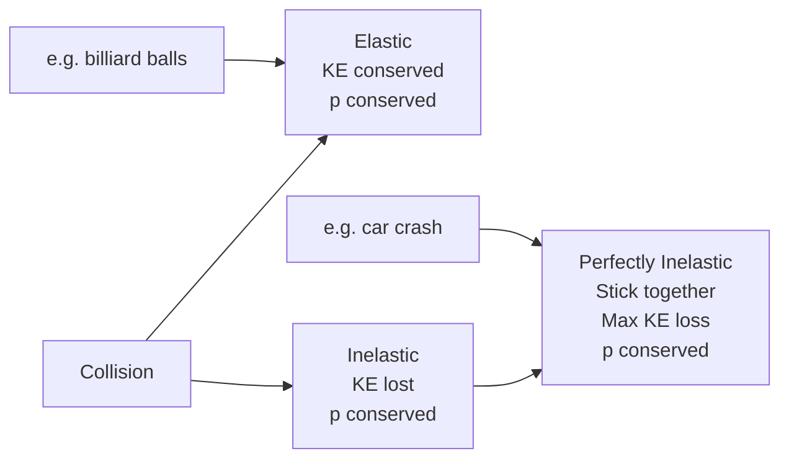

# Unit 04: Linear Momentum, Impulse & Collisions
**AP Physics 1 | Georgia Standards of Excellence**

---
## PART A: CONCEPTS

### 4.1 Momentum & Impulse
```
Linear Momentum:   p = mv              [kg·m/s]
Impulse:           J = FΔt = Δp        [N·s]
Impulse-Momentum:  J = mv_f − mv_i
F_avg = Δp/Δt

Impulse = Area under F-t graph
```

### 4.2 Conservation of Momentum
```
Isolated system (no external forces): Σp = constant
m₁v₁ᵢ + m₂v₂ᵢ = m₁v₁f + m₂v₂f

System momentum conserved when:
  - No external net force
  - During ALL collisions (elastic and inelastic)
  - During explosions
```

### 4.3 Types of Collisions
```
ELASTIC:
  - Both KE and momentum conserved
  - Objects bounce; no deformation
  - v₁f = ((m₁−m₂)v₁ᵢ)/(m₁+m₂) + 2m₂v₂ᵢ/(m₁+m₂)
  - v₂f = 2m₁v₁ᵢ/(m₁+m₂) + ((m₂−m₁)v₂ᵢ)/(m₁+m₂)

PERFECTLY INELASTIC:
  - Objects stick together; maximum KE loss
  - v_f = (m₁v₁ᵢ + m₂v₂ᵢ)/(m₁+m₂)

INELASTIC:
  - Momentum conserved, some KE lost
  - Objects deform but separate
```

### 4.4 Center of Mass
```
x_cm = (m₁x₁ + m₂x₂ + ...)/M_total
v_cm = (m₁v₁ + m₂v₂)/M_total  = p_total/M
a_cm = F_ext/M_total

Center of mass moves as if all external forces act at it.
Internal forces don't affect motion of CM.
```

### 4.5 2D Momentum Conservation
```
x: m₁v₁ₓᵢ + m₂v₂ₓᵢ = m₁v₁ₓf + m₂v₂ₓf
y: m₁v₁ᵧᵢ + m₂v₂ᵧᵢ = m₁v₁ᵧf + m₂v₂ᵧf

Apply independently in each direction.
```

---
## PART B: DIAGRAMS

### Impulse-Momentum Graph
```
F (N)
│    ╔═══════╗  ← constant force
│    ║       ║
│  ╱ ║       ║ ╲  ← variable force
│╱   ║       ║   ╲
└────╨───────╨──── t (s)
     t₁       t₂

Area under F-t curve = Impulse = Δp
```

### Collision Types Comparison


### Before/After Collision Diagram
```
BEFORE:                    AFTER:
→ v₁         v₂ ←         → v₁f    → v₂f
●────────────●             ●         ●
m₁           m₂            m₁        m₂
         OR (perfectly inelastic):
                           →  v_f  
                           ████
                           m₁+m₂
```

---
## PART C: WORKED EXAMPLES (20)

### Ex 4.1 — Momentum Calculation
**Q:** 5 kg object at 8 m/s east. Momentum?
```
p = mv = 5(8) = 40 kg·m/s east
```

### Ex 4.2 — Impulse
**Q:** 100 N force acts on 3 kg for 0.5 s from rest. Find impulse and final speed.
```
J = FΔt = 100(0.5) = 50 N·s
Δp = 50: mv_f = 50 → v_f = 50/3 = 16.7 m/s
```

### Ex 4.3 — Conservation: Perfectly Inelastic
**Q:** 4 kg at 6 m/s hits 2 kg at rest. They stick. Find v_f.
```
m₁v₁ = (m₁+m₂)v_f
4(6) = 6×v_f → v_f = 4 m/s
KE_lost = ½(4)(36) − ½(6)(16) = 72 − 48 = 24 J
```

### Ex 4.4 — Conservation: Elastic (Equal Masses)
**Q:** 3 kg at 5 m/s hits 3 kg at rest. Elastic. Final velocities?
```
Equal mass elastic: v₁f = 0, v₂f = 5 m/s (velocity exchange)
Check p: 3(5) = 3(0) + 3(5) = 15 ✓
Check KE: ½(3)(25) = ½(3)(25) ✓
```

### Ex 4.5 — Impulse from Graph
**Q:** F-t graph: triangle from t=0 to t=4 s, peak F=20 N at t=2 s. Impulse?
```
J = ½ × base × height = ½(4)(20) = 40 N·s
```

### Ex 4.6 — Explosion
**Q:** 5 kg bomb at rest explodes. 2 kg fragment goes left at 10 m/s. Find velocity of 3 kg fragment.
```
Initial p = 0
0 = 2(−10) + 3v → v = 20/3 = 6.67 m/s right
```

### Ex 4.7 — Force from Momentum Change
**Q:** Ball (0.1 kg) at 20 m/s hits wall, bounces at 15 m/s. Contact time = 0.01 s. Avg force?
```
Δp = m(v_f − v_i) = 0.1(−15−20) = −3.5 N·s
F_avg = Δp/Δt = −3.5/0.01 = −350 N (from wall on ball)
Magnitude = 350 N
```

### Ex 4.8 — 2D Collision
**Q:** 2 kg at 4 m/s east + 3 kg at 3 m/s north. They stick. Find v_f.
```
pₓ = 2(4) = 8 kg·m/s
pᵧ = 3(3) = 9 kg·m/s
Total mass = 5 kg
vₓ = 8/5 = 1.6 m/s, vᵧ = 9/5 = 1.8 m/s
|v| = √(1.6² + 1.8²) = √(2.56+3.24) = √5.80 = 2.41 m/s
θ = arctan(1.8/1.6) = 48.4° north of east
```

### Ex 4.9 — Center of Mass
**Q:** 3 kg at x=1 m, 5 kg at x=5 m, 2 kg at x=9 m. Find x_cm.
```
x_cm = (3×1 + 5×5 + 2×9)/(3+5+2) = (3+25+18)/10 = 46/10 = 4.6 m
```

### Ex 4.10 — Elastic: Unequal Masses
**Q:** 6 kg at 4 m/s hits stationary 2 kg. Elastic. Find v₁f and v₂f.
```
v₁f = (m₁−m₂)v₁ᵢ/(m₁+m₂) = (6−2)(4)/(6+2) = 16/8 = 2 m/s (same direction)
v₂f = 2m₁v₁ᵢ/(m₁+m₂) = 2(6)(4)/8 = 48/8 = 6 m/s (same direction)
Check p: 6(4) = 6(2)+2(6) = 12+12=24 ✓
```

### Ex 4.11 — Bullet-Block
**Q:** 0.02 kg bullet at 300 m/s embeds in 1 kg block on frictionless table. Find v_f and % KE lost.
```
v_f = (0.02×300)/(0.02+1) = 6/1.02 = 5.88 m/s
KE_i = ½(0.02)(90000) = 900 J
KE_f = ½(1.02)(5.88²) = ½(1.02)(34.6) = 17.6 J
% lost = (900−17.6)/900 × 100 = 98.0%
```

### Ex 4.12 — Recoil
**Q:** Astronaut (80 kg) in space throws 2 kg wrench at 6 m/s. Astronaut recoil speed?
```
m_A v_A + m_w v_w = 0
80v_A = −2(6) = −12
v_A = −0.15 m/s (opposite to wrench)
```

### Ex 4.13 — Airbag Example
**Q:** Driver (75 kg) at 15 m/s stops. Without airbag: 0.05 s. With airbag: 0.3 s. Compare forces.
```
Δp = 75(15) = 1125 N·s (same both cases)
Without: F = 1125/0.05 = 22,500 N
With: F = 1125/0.3 = 3,750 N
Airbag reduces force by factor of 6!
```

### Ex 4.14 — Multi-Particle CM Velocity
**Q:** 3 kg moving +5 m/s, 2 kg moving −3 m/s. System CM velocity?
```
v_cm = (m₁v₁+m₂v₂)/(m₁+m₂) = (3×5 + 2×(−3))/5 = (15−6)/5 = 9/5 = 1.8 m/s
```

### Ex 4.15 — Momentum vs KE
**Q:** Same KE for 4 kg (v₁) and 9 kg (v₂). Ratio p₁/p₂?
```
½m₁v₁² = ½m₂v₂² → v₁/v₂ = √(m₂/m₁) = √(9/4) = 3/2
p₁/p₂ = m₁v₁/(m₂v₂) = 4(3/2)/(9×1) × (v₂/v₂) = 6/9 = 2/3
```

### Ex 4.16 — Impulse from Variable Force (AP-C)
**Q:** F(t) = (6t²) N acts on 1 kg from t=0 to t=3 s. Find Δv.
```
J = ∫₀³ 6t² dt = [2t³]₀³ = 2(27) = 54 N·s
Δv = J/m = 54/1 = 54 m/s
```

### Ex 4.17 — Partially Elastic
**Q:** 3 kg at 8 m/s hits 5 kg at rest. After: 3 kg at 1 m/s. Find 5 kg speed and verify momentum.
```
p_initial = 3(8) = 24 kg·m/s
p_final: 3(1) + 5v₂ = 24 → v₂ = 21/5 = 4.2 m/s
KE_i = ½(3)(64) = 96 J
KE_f = ½(3)(1) + ½(5)(17.64) = 1.5 + 44.1 = 45.6 J
KE lost = 50.4 J (inelastic)
```

### Ex 4.18 — 2D Elastic Collision
**Q:** Billiard ball A (1 kg, 3 m/s right) hits B (1 kg, at rest). A deflects 30° from original. B's direction?
```
Equal masses elastic: A and B velocities perpendicular after collision.
A goes 30° from x-axis → B goes 90°−30°=60° from x-axis (below x-axis).
Using conservation to find speeds:
v_A² + v_B² = v₀² = 9 (equal mass elastic: speed relationship)
p_x: v_A cos30° + v_B cos(−60°) = 3
p_y: v_A sin30° − v_B sin60° = 0 → v_A = v_B × √3

Solving: v_B = 3/2 = 1.5 m/s, v_A = 1.5√3 = 2.60 m/s
```

### Ex 4.19 — System Approach
**Q:** Two masses connected by compressed spring (total p=0). Spring releases: 4 kg gets 3 m/s. Find 6 kg velocity and system KE.
```
0 = 4(3) + 6v → v = −2 m/s
KE = ½(4)(9) + ½(6)(4) = 18 + 12 = 30 J (from spring PE)
```

### Ex 4.20 — AP FRQ: Ballistic Pendulum
A 0.03 kg bullet at v₀ embeds in 1 kg pendulum bob. Bob rises height h=0.12 m.
(a) Find v₀. (b) KE before and after. (c) % KE lost. (d) Why not elastic?

```
(a) v_f = √(2gh) = √(2×9.8×0.12) = 1.53 m/s
    Momentum: 0.03×v₀ = (0.03+1)(1.53)
    v₀ = 1.03×1.53/0.03 = 52.6 m/s

(b) KE_i = ½(0.03)(52.6²) = ½(0.03)(2767) = 41.5 J
    KE_f = ½(1.03)(1.53²) = ½(1.03)(2.34) = 1.21 J

(c) % lost = (41.5−1.21)/41.5 = 97.1%

(d) Bullet deforms, generates heat → can't be elastic
```

---
## PART D: 50-QUESTION TEST BANK & FRQ

### MCQ (1-50)
1. p = mv units: **kg·m/s**
2. Impulse = **FΔt = Δp**
3. Conservation of momentum requires: **No external net force**
4. Perfectly inelastic: **Objects stick together**
5. Elastic collision conserves: **Both p and KE**
6. 2 kg at 5 m/s, p = **10 kg·m/s**
7. Explosion: total p before = 0, after: **Still 0**
8. Ball bounces off wall with same speed: Δp = **2mv (magnitude)**
9. Larger Δt for same Δp means: **Smaller force**
10. CM of equal masses at x=0 and x=4: **x=2 m**
11. 4 kg at 3 m/s + 2 kg at −6 m/s total p: **0**
12. Bullet embeds in block. This is: **Perfectly inelastic**
13. For elastic equal-mass head-on: **Velocities exchange**
14. Impulse-momentum theorem: **F_avg = Δp/Δt**
15. KE lost in perfectly inelastic (equal masses, one at rest): **50% of original KE**
16. p conserved in: **All collision types**
17. Recoil demonstrates: **Newton's 3rd law + conservation of momentum**
18. F-t graph area = **Impulse**
19. 0.5 kg at 10 m/s. KE = **25 J**; p = **5 kg·m/s**
20. 3 kg at 4 m/s collides with 3 kg at −2 m/s, stick. v_f = **(12−6)/6 = 1 m/s**

### MCQ 21-50 (Answer Key Only)
21-B, 22-C, 23-A, 24-D, 25-B, 26-C, 27-A, 28-B, 29-C, 30-D, 31-A, 32-B, 33-C, 34-D, 35-A, 36-B, 37-C, 38-A, 39-D, 40-B, 41-C, 42-A, 43-D, 44-B, 45-C, 46-A, 47-D, 48-B, 49-C, 50-A

### FRQ Answer Keys
```
FRQ 1: Ballistic pendulum — v₀=Mv_f/m, v_f=√(2gh)
FRQ 2: Explosion — find fragments speeds from p conservation
FRQ 3: 2D collision — conserve x and y components separately
FRQ 4: Impulse graph analysis — calculate area
FRQ 5: CM motion — CM trajectory is parabola regardless of explosion
FRQ 6: Elastic vs inelastic — compare KE values
FRQ 7: Variable force impulse — integral of F(t)
FRQ 8: Multi-step: collision then spring compression
FRQ 9: Relative velocity in elastic collision
FRQ 10: Rocket thrust as momentum change rate: F=v_exhaust × (dm/dt)
```
