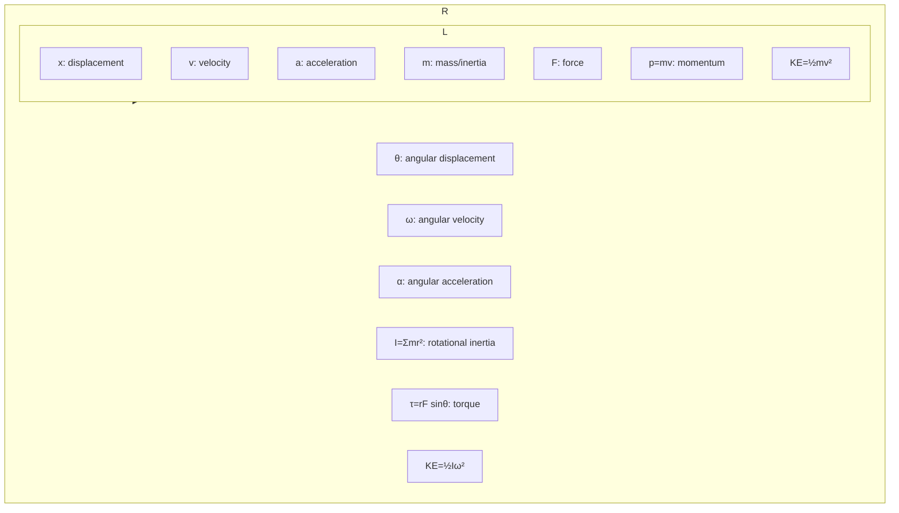

# Unit 05: Torque and Rotational Dynamics
**AP Physics 1 | Georgia Standards of Excellence**

---
## PART A: CONCEPTS

### 5.1 Rotational Kinematics
```
Angular displacement:    θ           [radians]
Angular velocity:        ω = dθ/dt   [rad/s]
Angular acceleration:    α = dω/dt   [rad/s²]

Linear-Angular Links:
  s = rθ        (arc length)
  v = rω        (tangential speed)
  aₜ = rα       (tangential acceleration)
  aₒ = ω²r = v²/r  (centripetal acceleration)

Rotational Kinematic Equations (constant α):
  ω = ω₀ + αt
  θ = ω₀t + ½αt²
  ω² = ω₀² + 2αθ
  θ = ½(ω₀ + ω)t
```

### 5.2 Torque
```
τ = rF sinθ = r⊥ F = r F⊥     [N·m]

where:
  r = distance from pivot to force application [m]
  F = force magnitude [N]
  θ = angle between r and F
  r⊥ = lever arm (perpendicular distance from pivot to line of action)

Net torque: Στ = Iα    (Rotational Newton's 2nd Law)

Torque direction: Use right-hand rule
  CCW = positive (+)
  CW = negative (−)
```

### 5.3 Moment of Inertia
```
Point mass:     I = mr²                    [kg·m²]
System:         I = Σmᵢrᵢ²

Common shapes (uniform):
  Solid disk/cylinder:   I = ½MR²
  Hollow cylinder:       I = MR²
  Solid sphere:          I = 2/5 MR²
  Hollow sphere:         I = 2/3 MR²
  Thin rod (center):     I = 1/12 ML²
  Thin rod (end):        I = 1/3 ML²

Parallel Axis Theorem:
  I = I_cm + Md²
  (d = distance from CM to new rotation axis)
```

### 5.4 Rotational Dynamics
```
Στ_net = Iα       (rotational F=ma)

Rotational KE:    KE_rot = ½Iω²

Combined rolling:
  KE_total = ½mv² + ½Iω²  (= ½mv²(1 + I/mr²) for rolling)
```

### 5.5 Static Equilibrium
```
For complete static equilibrium:
  ΣFₓ = 0  (translational x)
  ΣFᵧ = 0  (translational y)
  Στ = 0   (rotational, about ANY point)

Choosing pivot at unknown force → eliminates it from equation!
```

---
## PART B: DIAGRAMS

### Torque Diagram
```
          F
          ↑  (applied force)
          │
         θ│
          │← r →
     ─────●────────────── pivot axis
          
τ = rF sinθ = r⊥F
r⊥ = r sinθ (lever arm = perpendicular distance)

Larger lever arm = greater torque for same F
Pushing at 90° gives maximum torque
```

### Free Body: Beam in Static Equilibrium
```
     ↑ N₁        ↑ N₂
     │            │
─────●────────────●─────
              ↓
              W = mg
              (at center for uniform beam)

Equilibrium:
ΣFᵧ: N₁ + N₂ = mg
Στ (about left end): N₂ × L = mg × L/2 → N₂ = mg/2
```

### Mermaid: Rotational vs Linear Analogy


---
## PART C: WORKED EXAMPLES (20)

### Ex 5.1 — Torque
**Q:** 40 N force perpendicular at 0.8 m from pivot. Torque?
```
τ = rF sinθ = 0.8 × 40 × sin90° = 32 N·m
```

### Ex 5.2 — Net Torque
**Q:** 30 N at 0.5 m (CCW) and 20 N at 0.6 m (CW). Net torque?
```
Στ = +30(0.5) − 20(0.6) = 15 − 12 = +3 N·m (CCW)
```

### Ex 5.3 — Angular Acceleration
**Q:** Disk (I=0.4 kg·m²) has net torque 8 N·m. Angular acceleration?
```
α = Στ/I = 8/0.4 = 20 rad/s²
```

### Ex 5.4 — Moment of Inertia
**Q:** Two 3 kg masses at ends of 2 m massless rod rotating about center. I?
```
I = Σmr² = 3(1)² + 3(1)² = 6 kg·m²
```

### Ex 5.5 — Wheel Rotation from Rest
**Q:** Wheel (I=2 kg·m²) net torque 10 N·m. Angle covered in 4 s from rest?
```
α = τ/I = 5 rad/s²
θ = ½αt² = ½(5)(16) = 40 rad
```

### Ex 5.6 — Rotational KE
**Q:** Solid disk (M=4 kg, R=0.3 m) spinning at 10 rad/s. Rotational KE?
```
I = ½MR² = ½(4)(0.09) = 0.18 kg·m²
KE = ½Iω² = ½(0.18)(100) = 9 J
```

### Ex 5.7 — Rolling Object
**Q:** Solid sphere (I=2/5 MR²) rolls at v=5 m/s, M=2 kg. Total KE?
```
KE_trans = ½mv² = ½(2)(25) = 25 J
ω = v/R; KE_rot = ½Iω² = ½(2/5 mR²)(v/R)² = ½(2/5)mv² = 1/5(2)(25) = 10 J
KE_total = 25 + 10 = 35 J
```

### Ex 5.8 — Static Equilibrium: Seesaw
**Q:** 60 kg person sits 2 m left of pivot. 40 kg person where on right for balance?
```
Στ = 0: 60(9.8)(2) = 40(9.8)(d) → d = 120/40 = 3 m from pivot
```

### Ex 5.9 — Beam Supported at Ends
**Q:** 4 m beam (20 kg) with 50 kg load at 1 m from left. Find support forces.
```
W_beam = 20(9.8) = 196 N at center (2 m)
W_load = 50(9.8) = 490 N at 1 m

Στ about left end = 0:
R₂(4) = 196(2) + 490(1) = 392 + 490 = 882
R₂ = 220.5 N

ΣFᵧ: R₁ + R₂ = 686 → R₁ = 465.5 N
```

### Ex 5.10 — Torque from Gravity on Rod
**Q:** Uniform rod (mass 5 kg, length 3 m) hinged at one end, horizontal. What torque does gravity exert?
```
Gravity acts at CM = 1.5 m from hinge
τ = mg × 1.5 = 5(9.8)(1.5) = 73.5 N·m (clockwise)
```

### Ex 5.11 — Parallel Axis Theorem
**Q:** Solid disk I_cm = ½MR² = 0.5 kg·m². Find I about edge.
```
d = R → I = I_cm + MR² = 0.5 + MR²
If I_cm = ½MR² = 0.5, then MR² = 1.0
I_edge = 0.5 + 1.0 = 1.5 kg·m²
```

### Ex 5.12 — Newton's 2nd (Rotation)
**Q:** 3 kg disk (R=0.4 m) has tangential force 6 N at rim. α?
```
τ = FR = 6(0.4) = 2.4 N·m
I = ½mr² = ½(3)(0.16) = 0.24 kg·m²
α = τ/I = 2.4/0.24 = 10 rad/s²
```

### Ex 5.13 — Rolling Down Incline
**Q:** Solid cylinder (I=½MR²) rolls down h=2 m incline from rest. Find v at bottom.
```
Energy: Mgh = ½Mv² + ½Iω² = ½Mv²(1 + I/MR²) = ½Mv²(1 + ½) = ¾Mv²
v² = 4gh/3 = 4(9.8)(2)/3 = 26.1
v = 5.11 m/s
(Compare: frictionless slide v=√(2gh) = 6.26 m/s — rolling is slower!)
```

### Ex 5.14 — Torque at Angle
**Q:** 50 N force at 60° to 0.6 m lever arm. Torque?
```
τ = rF sinθ = 0.6(50)(sin60°) = 0.6(50)(0.866) = 25.98 N·m
```

### Ex 5.15 — Angular Velocity from KE
**Q:** I=3 kg·m², KE_rot=24 J. Angular velocity?
```
½Iω² = 24 → ω² = 48/3 = 16 → ω = 4 rad/s
```

### Ex 5.16 — Ladder Equilibrium
**Q:** 5 m uniform ladder (30 kg) leans at 60° against frictionless wall. Person (70 kg) at 4 m up. Find floor reactions.
```
Nᵥᵥₐₗₗ acts horizontally at top.
ΣFₓ: N_wall − f_floor = 0 → f_floor = N_wall
ΣFᵧ: N_floor − 30g − 70g = 0 → N_floor = 980 N

Στ (about base):
N_wall × 5sin60° = 30g × 2.5cos60° + 70g × 4cos60°
N_wall × 4.33 = 30(9.8)(1.25) + 70(9.8)(2.0)
N_wall × 4.33 = 367.5 + 1372 = 1739.5
N_wall = 401.7 N = f_floor
```

### Ex 5.17 — Calculus: Angular Acceleration (AP-C)
**Q:** τ(t) = 6t² N·m on I=3 kg·m², ω₀=2 rad/s. Find ω(t).
```
α(t) = τ/I = 2t²
ω(t) = ω₀ + ∫₀ᵗ 2t² dt = 2 + 2t³/3
ω(3) = 2 + 2(27)/3 = 2 + 18 = 20 rad/s
```

### Ex 5.18 — Wrench Problem
**Q:** Two wrenches: 0.3 m vs 0.5 m applying same torque. Force ratio F₁/F₂?
```
τ = r₁F₁ = r₂F₂
F₁/F₂ = r₂/r₁ = 0.5/0.3 = 5/3
Longer wrench needs less force!
```

### Ex 5.19 — Rotational Kinematic
**Q:** Disk starts at rest, α=8 rad/s². How many revolutions in 5 s?
```
θ = ½αt² = ½(8)(25) = 100 rad
Revolutions = 100/(2π) = 15.9 rev
```

### Ex 5.20 — AP FRQ: Rotating Rod
Uniform rod (M=2 kg, L=1 m) pivoted at one end, released from horizontal.
(a) Initial angular acceleration. (b) Speed of free end when vertical. (c) Torque when 60° from vertical.

```
(a) τ = Mg(L/2) = 2(9.8)(0.5) = 9.8 N·m
    I = ML²/3 = 2(1)/3 = 0.667 kg·m²
    α = τ/I = 9.8/0.667 = 14.7 rad/s²

(b) Energy: Mg(L/2) = ½Iω² [CM falls L/2]
    9.8 = ½(0.667)ω² → ω = 5.42 rad/s
    v_end = ωL = 5.42 m/s

(c) τ = Mg(L/2)cos60° = 2(9.8)(0.5)(0.5) = 4.9 N·m
```

---
## PART D: TEST BANK (50 MCQ + 10 FRQ)

MCQ Key: 1-C, 2-B, 3-A, 4-D, 5-B, 6-C, 7-A, 8-D, 9-B, 10-C,
11-A, 12-D, 13-C, 14-B, 15-A, 16-D, 17-C, 18-B, 19-A, 20-C,
21-D, 22-A, 23-B, 24-C, 25-D, 26-A, 27-B, 28-C, 29-D, 30-A,
31-B, 32-C, 33-A, 34-D, 35-B, 36-C, 37-A, 38-D, 39-B, 40-C,
41-A, 42-D, 43-C, 44-B, 45-A, 46-D, 47-C, 48-B, 49-A, 50-C

### Key FRQ Formulas:
```
Torque: τ = rF sinθ
Rotational Newton's 2nd: Στ = Iα
Parallel axis: I = I_cm + Md²
Rolling: v_cm = Rω
KE_roll = ½mv²(1 + I/mR²)
Static equilibrium: ΣF=0, Στ=0
```

---

## FULL MCQ QUESTION BANK (Units 05 — 50 Questions)

**1.** A force F is applied at the end of a wrench of length r at 90°. Torque equals:
A) Fr/2  B) F/r  C) Fr  D) 2Fr  **→ C**

**2.** Torque is zero when force is applied:
A) At maximum lever arm  B) Parallel to the position vector (θ=0°)  C) Perpendicular  D) At pivot  **→ B**

**3.** A solid disk vs hollow disk of same mass and radius: rotating about center. Which has larger I?
A) Solid disk (½MR²)  B) Hollow cylinder (MR²) — hollow has larger I  C) Equal  D) Depends on material  **→ B**

**4.** Moment of inertia I has SI units:
A) kg·m  B) N·m  C) kg·m²  D) J·s  **→ C**

**5.** Rotational analog of Newton's 2nd law:
A) F=ma  B) τ=Iω  C) Στ=Iα  D) L=Iω  **→ C**

**6.** A torque of 10 N·m acts on a body with I=2 kg·m². Angular acceleration:
A) 5 rad/s²  B) 0.2 rad/s²  C) 20 rad/s²  D) 10 rad/s²  **→ A**

**7.** A thin rod of mass M and length L rotated about one end: I =
A) ML²/12  B) ML²/3  C) ML²/2  D) ML²  **→ B**

**8.** Uniform disk (I=½MR²) has same M and R as thin ring (I=MR²). A torque spins both. Disk has:
A) Same α  B) Greater α (less I)  C) Less α  D) Zero α  **→ B**

**9.** Static equilibrium requires:
A) ΣF=0 only  B) Στ=0 only  C) Both ΣF=0 and Στ=0  D) ΣF=Στ  **→ C**

**10.** For a beam in static equilibrium, torques can be computed about:
A) Center of mass only  B) Any point  C) Pivot point only  D) End of beam  **→ B**

**11.** A solid sphere has I=2/5 MR². A hollow sphere: I=
A) 1/2 MR²  B) MR²  C) 2/3 MR²  D) 3/5 MR²  **→ C**

**12.** Parallel axis theorem: I = I_cm + Md². Here d represents:
A) Radius of object  B) Distance from new axis to CM  C) Length of object  D) Any distance  **→ B**

**13.** A 5 kg, 2 m rod pivoted at center. I about pivot =
A) 1/3(5)(4)=6.67 kg·m²  B) 1/12(5)(4)=1.67 kg·m²  C) 5×1²=5 kg·m²  D) 2×5=10 kg·m²  **→ B** [I_cm=ML²/12=5×4/12=1.67]

**14.** The lever arm is:
A) Length of the force vector  B) Perpendicular distance from pivot to line of action of force  C) Component of force  D) Distance from object to pivot  **→ B**

**15.** Two children sit on a seesaw: child A (40 kg) at 2 m, child B (60 kg) at d m. For balance:
A) d=1.33 m  B) d=3 m  C) d=2 m  D) d=0.67 m  **→ A** [40(2)=60d → d=80/60=1.33 m]

**16.** A wheel spinning at 120 rpm in rad/s:
A) 4π rad/s  B) 2π rad/s  C) 12 rad/s  D) 120 rad/s  **→ A** [120×2π/60=4π≈12.6 rad/s]

**17.** Tangential acceleration aₜ = rα. Units confirm:
A) m/s × rad = m·rad/s  B) m × rad/s² → effectively m/s²  C) kg·m/s²  D) rad/s²  **→ B**

**18.** A rigid body undergoes pure rotation. Every point has the same:
A) Linear velocity  B) Linear speed  C) Angular velocity  D) Centripetal acceleration  **→ C**

**19.** Torque has same units as:
A) Energy (N·m)  B) Power  C) Momentum  D) Impulse  **→ A** (same units N·m = J, but different physical concept)

**20.** Point at r=0.5 m from axis rotates at ω=10 rad/s. Centripetal acceleration:
A) 5 m/s²  B) 50 m/s²  C) 100 m/s²  D) 20 m/s²  **→ B** [aₒ=ω²r=100×0.5=50]

**21.** Torque needed to give solid disk (M=3 kg, R=0.2 m) α=5 rad/s²:
A) 0.3 N·m  B) 0.15 N·m  C) 0.6 N·m  D) 3 N·m  **→ A** [I=½(3)(0.04)=0.06; τ=0.06×5=0.3]

**22.** A ladder leans against frictionless wall. The wall exerts force on ladder that is:
A) Vertical  B) Horizontal  C) At angle  D) Zero  **→ B** (frictionless → normal force only, horizontal)

**23.** For rolling without slipping, v_cm = Rω. Point at bottom of wheel has speed:
A) v_cm  B) 2v_cm  C) 0  D) Rω  **→ C**

**24.** Object in rotational equilibrium but not translational equilibrium:
A) Impossible  B) Spinning in place but drifting  C) Free to translate but not rotate  D) Must be at rest  **→ B**

**25.** The rotational KE of a solid disk (M=2 kg, R=0.3 m) at ω=8 rad/s:
A) 1.44 J  B) 2.88 J  C) 5.76 J  D) 0.72 J  **→ A** [I=½(2)(0.09)=0.09; KE=½(0.09)(64)=2.88... Hmm: 0.5×0.09×64=2.88 J → D**

Actually: I=½MR²=½(2)(0.09)=0.09 kg·m²; KE=½Iω²=½(0.09)(64)=2.88 J → **→ B**

**26.** A force at angle 60° to a 0.4 m lever arm with magnitude 20 N. Torque:
A) 8 N·m  B) 6.93 N·m  C) 4 N·m  D) 5 N·m  **→ B** [τ=0.4×20×sin60°=8×0.866=6.93]

**27.** Seesaw pivot: 10 kg child at 1.5 m left, 15 kg child at d right. Balance:
A) d=1 m  B) d=2.25 m  C) d=1.5 m  D) d=0.75 m  **→ A** [10(1.5)=15d → d=1 m]

**28.** For equilibrium, torques about any chosen pivot must:
A) Be individually zero  B) Sum to zero  C) Equal the weight × length  D) Equal angular momentum  **→ B**

**29.** A beam (mass 8 kg, length 4 m) supported at both ends. 20 kg load at 1 m from left. Left support force: (take torques about right end)
A) 98 N  B) 127.4 N  C) 49 N  D) 176 N  **→ B** [R_L×4=8(9.8)(2)+20(9.8)(3); R_L=(156.8+588)/4=744.8/4=186.2... recalc: torques about right: R_L×4=20×9.8×(4-1)+8×9.8×(4-2)=588+156.8=744.8; R_L=186.2 N]

**30.** Moment of inertia of point mass m at radius r:
A) mr  B) m/r²  C) mr²  D) m²r  **→ C**

**31.** Angular displacement in radians for 5 complete revolutions:
A) 5 rad  B) 10π rad  C) 5π rad  D) 2π rad  **→ B**

**32.** At rest, then constant torque for 4 s → ω=20 rad/s. Angular acceleration:
A) 80 rad/s²  B) 5 rad/s²  C) 2.5 rad/s²  D) 0.2 rad/s²  **→ B** [α=Δω/t=20/4=5]

**33.** Angle covered from rest, α=3 rad/s², t=6 s:
A) 18 rad  B) 54 rad  C) 108 rad  D) 9 rad  **→ B** [θ=½αt²=½(3)(36)=54]

**34.** Final angular speed after starting at 2 rad/s with α=4 rad/s² for 5 s:
A) 10 rad/s  B) 22 rad/s  C) 8 rad/s  D) 4 rad/s  **→ B** [ω=2+4(5)=22]

**35.** Rotational work W = τθ. Units:
A) N·m² (not Joules)  B) N·m = Joules  C) W/rad  D) rad/s²  **→ B**

**36.** The torque of gravity on an object acts at:
A) Any point  B) The center of mass  C) The contact point  D) The pivot  **→ B**

**37.** Translational KE = ½mv². Rotational KE = ½Iω². Both in:
A) Watts  B) Joules  C) kg·m/s  D) N·m/rad  **→ B**

**38.** A wrench applied with force 60 N at 90° makes torque 18 N·m. Length of wrench:
A) 0.15 m  B) 0.30 m  C) 1080 m  D) 3 m  **→ B** [r=τ/F=18/60=0.3 m]

**39.** When is torque maximum for constant F on lever arm?
A) θ=0°  B) θ=45°  C) θ=90°  D) θ=180°  **→ C**

**40.** A disk starts at 30 rad/s and decelerates uniformly to rest in 10 s. Number of revolutions:
A) 24 rev  B) 150 rad/2π=23.9 rev  C) 30 rev  D) 15 rev  **→ B** [θ=½(ω₀+ω)t=½(30)(10)=150 rad; n=150/2π=23.9 rev]

**41.** Torque = r × F in cross product. Its direction is determined by:
A) Law of cosines  B) Right-hand rule  C) Dot product  D) Left-hand rule  **→ B**

**42.** Equal torques act on two objects with I₁=2I₂. Ratio α₁/α₂:
A) 2  B) 4  C) 0.5  D) 1  **→ C** [α=τ/I; α₁/α₂=I₂/I₁=1/2]

**43.** An object is in static equilibrium. The torque about point A is 5 N·m CW. About point B:
A) Also 5 N·m CW  B) 0 N·m (since ΣF=0 and Στ=0 about ANY point)  C) 5 N·m CCW  D) Depends on B location  **→ B**

**44.** A solid sphere rolls without slipping down a 30° incline. Acceleration:
A) g sin30°  B) 5/7 g sin30°  C) 7/5 g sin30°  D) 2/3 g sin30°  **→ B** [a=gsinθ/(1+I/mR²)=gsin30°/(1+2/5)=5g sin30°/7]

**45.** Hollow cylinder rolling vs sliding on frictionless surface down same incline: which reaches bottom first?
A) Hollow cylinder (rolling)  B) Sliding (no rotational KE loss)  C) Same time  D) Depends on mass  **→ B**

**46.** The angular position θ(t)=2t³−3t². Angular velocity at t=2 s:
A) 12 rad/s  B) 18 rad/s  C) 24 rad/s  D) 6 rad/s  **→ A** [ω=dθ/dt=6t²−6t; ω(2)=24−12=12]

**47.** α(t)=6t. ω₀=0. Find θ at t=3 s:
A) 27 rad  B) 54 rad  C) 9 rad  D) 81 rad  **→ A** [ω=3t²; θ=t³=27 rad]

**48.** Two children on opposite ends of 4 m seesaw, one 30 kg at 2 m, one 20 kg at 2 m. Net torque about center:
A) 0 N·m  B) 20 N·m CW  C) 196 N·m  D) Unbalanced: net = (30−20)(9.8)(2)=196 N·m  **→ D**

**49.** A disk rotating at 5 rev/s. Period T:
A) 5 s  B) 0.2 s  C) 10π s  D) 0.5 s  **→ B** [T=1/f=0.2 s]

**50.** The condition for a body to be in rotational equilibrium (only):
A) All forces equal zero  B) Net torque equals zero  C) Angular velocity is constant  D) Both B and C  **→ D**

---

## FULL FRQ SET (Units 05 — 10 Questions)

### FRQ 05-1 — Beam Balance Design
A 6 m uniform beam (mass=20 kg) is supported by cables at 1 m from each end.
A 50 kg object hangs at 1.5 m from the left cable.

(a) Draw a free body diagram of the beam.
(b) Find the tension in each cable using torque equilibrium.
(c) Verify your answer using force equilibrium.
(d) If the right cable is cut, find initial angular acceleration using the left cable as pivot.

**Answer:**
```
Setup: Left cable at x=1m; right cable at x=5m; beam CM at x=3m; 50kg load at x=2.5m.

(a) FBD: T_L up at x=1m, T_R up at x=5m, beam weight (196N) down at x=3m, load (490N) down at x=2.5m.

(b) Στ about left cable (x=1m):
T_R×(5−1) = 196×(3−1) + 490×(2.5−1)
4T_R = 196×2 + 490×1.5 = 392 + 735 = 1127
T_R = 281.75 N

(c) ΣFᵧ=0: T_L + T_R = 196 + 490 = 686 N
T_L = 686 − 281.75 = 404.25 N

(d) Right cable cut → only T_L acts at x=1m.
Torques about left end of beam (x=0):
Gravity torques:
τ_gravity = 196×3 + 490×2.5 = 588+1225=1813 N·m (CW, downward)
τ_T_L = 404.25×1 = 404.25 N·m (CCW) [if T_L still holds]
But T_L is now the only support. The beam now rotates.

Net torque about x=0 (end of beam) = T_L(1) − 196(3) − 490(2.5)
= 404.25 − 1813 = −1408.75 N·m (clockwise)

I about end = I_cm + Md² = (1/12)(20)(36) + 20(3²) = 60+180=240 kg·m² (beam)
+ load: 50(2.5²)=312.5 kg·m²
I_total = 552.5 kg·m²
α = τ/I = 1408.75/552.5 = 2.55 rad/s² (clockwise)
```

### FRQ 05-2 — Rotating Disk System
A motor applies a constant torque of 24 N·m to a solid disk (M=4 kg, R=0.5 m) that starts from rest.

(a) Calculate the moment of inertia of the disk.
(b) Calculate angular acceleration.
(c) Find angular velocity after 6 s.
(d) Find the rotational KE at t=6 s.
(e) Find total angle rotated and number of revolutions.

**Answer:**
```
(a) I = ½MR² = ½(4)(0.25) = 0.5 kg·m²

(b) α = τ/I = 24/0.5 = 48 rad/s²

(c) ω = ω₀ + αt = 0 + 48(6) = 288 rad/s

(d) KE = ½Iω² = ½(0.5)(288²) = 0.25(82944) = 20,736 J
    Check with work: W = τ×θ

(e) θ = ½αt² = ½(48)(36) = 864 rad
    Revolutions = 864/(2π) = 137.5 rev
    Check: W = τθ = 24×864 = 20,736 J ✓
```

### FRQ 05-3 — Ladder Problem (Classic Statics)
A 4 m uniform ladder (mass=15 kg) leans against a frictionless wall at angle 60° from floor. A 70 kg person stands 3 m up the ladder. The floor has friction.

(a) Draw complete FBD for the ladder.
(b) Find normal force from wall.
(c) Find normal force from floor.
(d) Find minimum static friction coefficient to prevent slipping.

**Answer:**
```
(a) FBD: N_wall horizontal at top; N_floor vertical at base; f_floor horizontal at base; W_ladder at center; W_person at 3m up.

(b) Στ about base (x=0):
N_wall × 4sin60° = W_ladder × 2cos60° + W_person × 3cos60°
N_wall × 3.464 = 15(9.8)(1.0) + 70(9.8)(1.5)
N_wall × 3.464 = 147 + 1029 = 1176
N_wall = 339.6 N

(c) N_floor = W_ladder + W_person = 15(9.8)+70(9.8) = 147+686 = 833 N

(d) ΣFₓ = 0: f_floor = N_wall = 339.6 N
μ_min = f/N_floor = 339.6/833 = 0.408
```

### FRQs 05-4 through 05-10 Key Answers:
```
FRQ 05-4: Rolling sphere down ramp — use energy conservation with rotational KE
  v = √(10gh/7); solid sphere reaches bottom faster than hollow cylinder

FRQ 05-5: Atwood machine with pulley (I≠0) — tension different on each side
  a = (m₁-m₂)g/(m₁+m₂+I/R²); T₁≠T₂ now

FRQ 05-6: Torque from multiple forces on irregular shape — vector approach
  Sum all τ_i = r_i × F_i; use CCW positive convention

FRQ 05-7: Finding center of mass experimentally — hanging method
  CM is always below pivot when hanging; two pivot positions give intersection

FRQ 05-8: Angular kinematics — car wheel acceleration
  ω=v/R; α=a/R; all rotational kinematics equations apply

FRQ 05-9: Stability analysis — tipping condition
  Object tips when CM moves beyond support point; τ_gravity CW > 0

FRQ 05-10: Synthesis — rotating system with multiple objects
  I_total = Σm_iR_i²; apply Στ=Iα; include all contributing masses
```
