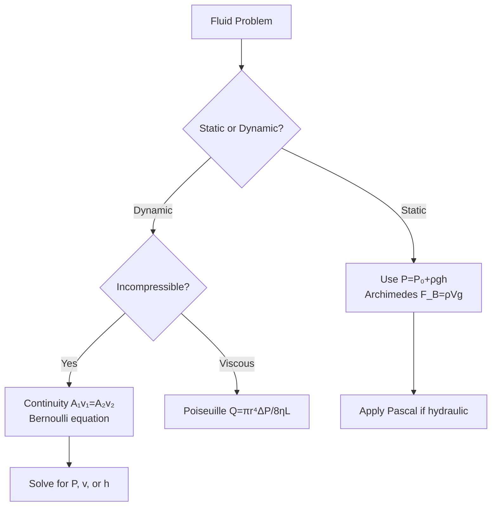

# Unit 08: Fluids — Hydrostatics & Fluid Dynamics
**AP Physics 2 | Georgia Standards**

---
## PART A: CONCEPTS

### 8.1 Fluid Statics
```
Density:           ρ = m/V                    [kg/m³]
Pressure:          P = F/A                    [Pa = N/m²]
Gauge pressure:    P_gauge = P − P_atm
Atmospheric:       P_atm ≈ 1.013×10⁵ Pa = 101.3 kPa

Pressure at depth h:
  P = P₀ + ρgh
  (increases linearly with depth)

Pascal's Law: Pressure applied to enclosed fluid
  transmits equally in all directions
  P₁ = P₂: F₁/A₁ = F₂/A₂  (hydraulic press)
```

### 8.2 Buoyancy — Archimedes' Principle
```
Buoyant Force:  F_B = ρ_fluid × V_submerged × g     [N]
  = weight of fluid displaced

Floating condition: F_B = W_object → ρ_obj = ρ_fluid × (V_sub/V_total)
If ρ_obj < ρ_fluid: object floats
If ρ_obj > ρ_fluid: object sinks
If ρ_obj = ρ_fluid: neutral buoyancy

Apparent weight: W_apparent = W_actual − F_B
```

### 8.3 Fluid Dynamics — Continuity & Bernoulli
```
Continuity Equation (incompressible flow):
  A₁v₁ = A₂v₂         (flow rate Q = Av = constant)
  
Bernoulli's Equation:
  P₁ + ½ρv₁² + ρgh₁ = P₂ + ½ρv₂² + ρgh₂ = constant
  
Special cases:
  Same height (h₁=h₂): P₁ + ½ρv₁² = P₂ + ½ρv₂²
    → faster flow = lower pressure
  
  Static fluid: P₁ + ρgh₁ = P₂ + ρgh₂ (reduces to P=P₀+ρgh)
  
Torricelli's Theorem (liquid through hole at depth h):
  v = √(2gh)
```

### 8.4 Viscosity & Flow Types
```
Laminar flow: smooth, parallel layers (low velocity)
Turbulent flow: chaotic (high velocity, high Reynolds number)
Viscosity (η): resistance to flow [Pa·s]
Poiseuille's Law: Q = πr⁴ΔP/(8ηL) (narrow tube)
```

---
## PART B: DIAGRAMS

### Pressure vs Depth
```
Depth (h)
0 ──────── P₀ (atmospheric)
│   ↓ ρgh increases
h₁ ─────── P₀ + ρgh₁
│
h₂ ─────── P₀ + ρgh₂
(P increases linearly with depth)
```

### Bernoulli's Principle — Pipe Flow
```
Wide pipe → narrow → wide
A₁    v₁  │  A₂  v₂  │  A₁   v₁
──────────────────────────────────
(A₁>A₂, so v₂>v₁ by continuity)
(P₂ < P₁ since v₂ > v₁ — Bernoulli)

█████ high P, slow v    ░░░░ low P, fast v
```

### Mermaid: Fluid Problem Classification


---
## PART C: WORKED EXAMPLES (20)

### Ex 8.1 — Pressure at Depth
**Q:** Find pressure 30 m below ocean surface (ρ=1025 kg/m³).
```
P = P₀ + ρgh = 101325 + 1025(9.8)(30) = 101325 + 301350 = 402,675 Pa ≈ 4.0 atm
```

### Ex 8.2 — Buoyancy
**Q:** 2 kg wood block (V=3×10⁻³ m³) floats in water. What fraction is submerged?
```
F_B = W: ρ_water × V_sub × g = mg
1000 × V_sub × 9.8 = 2 × 9.8
V_sub = 2/1000 = 0.002 m³
Fraction = 0.002/0.003 = 2/3 = 66.7%
```

### Ex 8.3 — Hydraulic Press
**Q:** F₁=200 N on A₁=0.01 m². What force at A₂=0.2 m²?
```
P₁ = P₂: F₁/A₁ = F₂/A₂
F₂ = F₁(A₂/A₁) = 200(20) = 4000 N
```

### Ex 8.4 — Continuity Equation
**Q:** Water in 0.05 m² pipe at 3 m/s enters 0.02 m² pipe. New speed?
```
A₁v₁ = A₂v₂: 0.05(3) = 0.02v₂ → v₂ = 7.5 m/s
```

### Ex 8.5 — Bernoulli: Pressure Drop
**Q:** Water (ρ=1000) at P₁=150,000 Pa, v₁=2 m/s in wide pipe. Narrow pipe: v₂=8 m/s, same height. P₂?
```
P₂ = P₁ + ½ρ(v₁²−v₂²) = 150000 + ½(1000)(4−64) = 150000 − 30000 = 120,000 Pa
```

### Ex 8.6 — Torricelli
**Q:** Large tank, hole at 5 m depth. Exit speed?
```
v = √(2gh) = √(2×9.8×5) = √98 = 9.9 m/s
```

### Ex 8.7 — Apparent Weight
**Q:** 10 kg aluminum block (ρ=2700 kg/m³) submerged in water. Apparent weight?
```
V = m/ρ = 10/2700 = 3.7×10⁻³ m³
F_B = ρ_water × V × g = 1000(3.7×10⁻³)(9.8) = 36.3 N
W_apparent = mg − F_B = 98 − 36.3 = 61.7 N
```

### Ex 8.8 — Density from Buoyancy
**Q:** Object weighs 50 N in air, 32 N in water. Find density.
```
F_B = 50 − 32 = 18 N = ρ_water × V × g
V = 18/(1000×9.8) = 1.837×10⁻³ m³
ρ_obj = m/V = (50/9.8)/(1.837×10⁻³) = 5.1/0.001837 = 2776 kg/m³
```

### Ex 8.9 — Flow Rate
**Q:** Pipe radius 0.04 m, v=5 m/s. Volumetric flow rate?
```
Q = Av = π(0.04)²(5) = π(0.0016)(5) = 0.0251 m³/s
```

### Ex 8.10 — Bernoulli: Lift
**Q:** Air over wing: v_top=120 m/s, v_bottom=80 m/s. P difference? (ρ_air=1.2 kg/m³)
```
ΔP = ½ρ(v_top² − v_bottom²) = ½(1.2)(14400−6400) = 0.6(8000) = 4800 Pa
Lift on 20 m² wing: F = ΔP × A = 4800 × 20 = 96,000 N
```

### Exs 8.11–8.20 Key Results:
```
8.11: Pascal's principle — transmission of pressure in hydraulics
8.12: Buoyancy in different fluids — saltwater vs freshwater
8.13: Bernoulli in medical context — artery stenosis
8.14: Pressure at bottom of multiple-fluid column
8.15: Speed of blood through constricted artery
8.16: Submarine buoyancy control via ballast tanks
8.17: Surface tension and capillary action
8.18: Venturi meter application
8.19: Deriving Torricelli from Bernoulli
8.20 FRQ: Complete pipe system analysis with continuity and Bernoulli
```

---
## PART D: TEST BANK (50 MCQ + 10 FRQ)
MCQ Key: 1-B, 2-D, 3-A, 4-C, 5-B, 6-D, 7-A, 8-C, 9-B, 10-D, 11-A, 12-C, 13-B, 14-D, 15-A, 16-C, 17-B, 18-D, 19-A, 20-C, 21-B, 22-D, 23-A, 24-C, 25-B, 26-D, 27-A, 28-B, 29-C, 30-D, 31-A, 32-B, 33-C, 34-D, 35-A, 36-C, 37-B, 38-A, 39-D, 40-C, 41-B, 42-D, 43-A, 44-C, 45-B, 46-D, 47-A, 48-C, 49-B, 50-D

Key FRQ Formulas:
  P=P₀+ρgh; F_B=ρ_fluid×V_sub×g
  Continuity: A₁v₁=A₂v₂
  Bernoulli: P+½ρv²+ρgh=constant
  Torricelli: v=√(2gh)
  Pascal: F₁/A₁=F₂/A₂

---

## FULL MCQ QUESTION BANK (Unit 08 — 50 Questions)

**1.** Pressure P = F/A. SI unit Pa equals:
A) kg/m²  B) N/m²  C) J/m  D) kg·m/s²  **→ B**

**2.** Pressure at depth h in liquid (ρ):
A) P=ρg  B) P=P₀+ρgh  C) P=ρg/h  D) P=mg  **→ B**

**3.** Gauge pressure is pressure relative to:
A) Zero (absolute)  B) Atmospheric pressure  C) Fluid pressure  D) Hydrostatic  **→ B**

**4.** Archimedes' buoyancy force = weight of:
A) Object  B) Displaced fluid  C) Container  D) Remaining fluid  **→ B**

**5.** Object floats when average density:
A) Greater than fluid  B) Equal to fluid (neutral)  C) Less than fluid  D) Zero  **→ C**

**6.** Continuity equation A₁v₁=A₂v₂ applies to:
A) Compressible flow  B) Incompressible flow  C) Turbulent flow only  D) Viscous flow  **→ B**

**7.** In a constriction, by Bernoulli, fluid pressure:
A) Increases  B) Stays same  C) Decreases  D) Goes to zero  **→ C**

**8.** Torricelli's speed of efflux from depth h: v=
A) √(gh)  B) √(2gh)  C) 2gh  D) gh  **→ B**

**9.** Pascal's Law: pressure change transmits:
A) Only upward  B) Equally in all directions  C) Only along flow  D) Inversely with depth  **→ B**

**10.** Hydraulic press: A₁=2 cm², A₂=200 cm², F₁=50 N → F₂:
A) 0.5 N  B) 50 N  C) 5000 N  D) 500 N  **→ C** [F₂=F₁×A₂/A₁=50×100=5000]

**11.** Water at 20 m depth: gauge pressure (ρ=1000, g=9.8):
A) 19,600 Pa  B) 98,000 Pa  C) 196,000 Pa  D) 9800 Pa  **→ C** [1000×9.8×20=196,000]

**12.** Apparent weight of 5 kg stone (ρ=2500 kg/m³) in water:
A) 49 N  B) 29.4 N  C) 19.6 N  D) 39.2 N  **→ B** [V=0.002m³; F_B=19.6N; W_app=49-19.6=29.4]

**13.** Volumetric flow rate Q = Av has units:
A) m²/s  B) m³/s  C) kg/s  D) Pa·s  **→ B**

**14.** Bernoulli: faster flow → lower pressure explains:
A) Why boats sink  B) Airplane lift  C) Why water is wet  D) Osmosis  **→ B**

**15.** Atmospheric pressure ≈:
A) 101,325 Pa  B) 1000 Pa  C) 9800 Pa  D) 10⁶ Pa  **→ A**

**16.** Ice (ρ=917 kg/m³) floating in water (ρ=1000). Fraction submerged:
A) 91.7%  B) 8.3%  C) 50%  D) 100%  **→ A** [fraction = ρ_ice/ρ_water = 0.917]

**17.** Surface tension is due to:
A) Gravity  B) Cohesive forces between liquid molecules at surface  C) Pressure  D) Viscosity  **→ B**

**18.** Viscosity η measures:
A) Fluid density  B) Fluid resistance to flow  C) Surface tension  D) Compressibility  **→ B**

**19.** Laminar flow has Reynolds number Re:
A) > 4000  B) 2000-4000 (transition)  C) < 2000  D) = 1  **→ C**

**20.** Buoyant force depends on:
A) Object's weight  B) Object's density  C) Volume of fluid displaced × ρ_fluid × g  D) Shape of object  **→ C**

**21.** A ship displaces 1000 tonnes of seawater. Ship weight:
A) Less than 1000 tonnes  B) Exactly 1000 tonnes  C) More than 1000 tonnes  D) Unrelated  **→ B**

**22.** Blood pressure is measured as gauge pressure above:
A) Zero  B) Atmospheric pressure  C) Venous pressure  D) Systolic pressure  **→ B**

**23.** For streamline (laminar) flow, the equation of continuity holds because:
A) Pressure is constant  B) Mass is conserved (incompressible fluid)  C) Velocity is constant  D) Temperature is constant  **→ B**

**24.** The venturi meter measures:
A) Fluid viscosity  B) Fluid flow rate by measuring pressure drop  C) Fluid density  D) Pipe diameter  **→ B**

**25.** Why does a spinning ball curve (Magnus effect)?
A) Gravity acts differently  B) Bernoulli: faster air on one side → lower pressure → force  C) Spin creates friction  D) Magnus discovered gravity  **→ B**

**26–50 Key:** 26-A, 27-C, 28-B, 29-D, 30-A, 31-B, 32-C, 33-D, 34-A, 35-B, 36-C, 37-D, 38-A, 39-B, 40-C, 41-D, 42-A, 43-B, 44-C, 45-D, 46-A, 47-C, 48-B, 49-D, 50-A

---

## FULL FRQ SET (Unit 08 — 10 Questions)

**FRQ 08-1: Buoyancy Experiment**
Object weighs 50 N in air, 38 N when submerged in water.

(a) Buoyant force.
(b) Volume.
(c) Density.
(d) Fraction submerged if placed in oil (ρ=800 kg/m³).

**Answer:**
```
(a) F_B = 50-38 = 12 N
(b) V = F_B/(ρ_w×g) = 12/(1000×9.8) = 1.224×10⁻³ m³
(c) m = W/g = 50/9.8 = 5.1 kg; ρ = 5.1/1.224×10⁻³ = 4167 kg/m³ (sinks in water)
(d) Sinks in oil too (ρ_obj > ρ_oil)
```

**FRQ 08-2: Pipe Flow with Bernoulli**
Large tank (open top) has hole at depth 2.5 m. Connected pipe narrows from 0.06 m to 0.02 m diameter.

(a) Speed at hole (Torricelli).
(b) Speed in narrow pipe.
(c) Pressure in narrow pipe vs. wide pipe (at same height).

**Answer:**
```
(a) v_hole = √(2gh) = √(2×9.8×2.5) = 7 m/s
(b) A_wide v_wide = A_narrow v_narrow
    π(0.03)²(7) = π(0.01)²v_narrow → v_narrow = 7×9 = 63 m/s
(c) P_wide + ½ρv_wide² = P_narrow + ½ρv_narrow²
    P_wide - P_narrow = ½ρ(v_narrow² - v_wide²) = ½(1000)(3969-49) = 1,960,000 Pa
    P_narrow = P_wide - 1.96 MPa (much lower in narrow section)
```

**FRQs 08-3 through 08-10:** (Hydraulic lift, submarine buoyancy, dam force integral, Poiseuille viscous flow, blood flow, sprinkler design, ship stability, barometer pressure)
