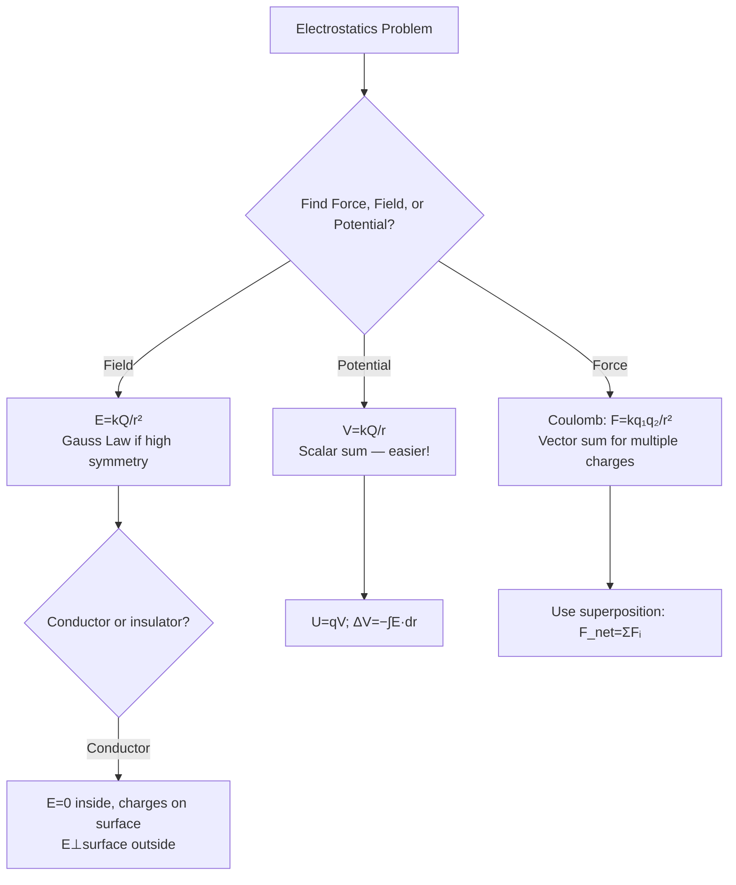

# Unit 10: Electric Force, Field, and Potential
**AP Physics 2 | Georgia Standards of Excellence**

---

## PART A: CHAPTER BLUEPRINT & CONCEPTS

### Sub-Chapter 10.1 — Charge and Coulomb's Law

```
Fundamental charge: e = 1.6×10⁻¹⁹ C
Proton: +e;  Electron: −e
Like charges repel; opposite charges attract.

Coulomb's Law:
  F = kq₁q₂/r²              [Newtons]
  k = 8.99×10⁹ N·m²/C²
  k = 1/(4πε₀), ε₀ = 8.85×10⁻¹² C²/(N·m²)

Superposition: Net force = vector sum of all individual forces.
```

### Sub-Chapter 10.2 — Electric Field

```
Electric Field:
  E = F/q₀ = kQ/r²           [N/C or V/m]
  Direction: away from + charge, toward − charge

Field from point charge:
  E = kQ/r²   (at distance r from Q)

Superposition: E_net = vector sum of all E fields

Field lines:
  - Start on + charges, end on − charges
  - Density ∝ field strength
  - Perpendicular to conductor surfaces
  - Never cross
```

### Sub-Chapter 10.3 — Gauss's Law (AP-C)

```
Electric flux: Φ_E = ∮E·dA = Q_enc/ε₀    [N·m²/C]

Gaussian surface applications:
  Spherical shell (Q total):    E = kQ/r²  (outside, r > R)
                                E = 0      (inside conductor)
  Infinite line charge (λ):     E = λ/(2πε₀r) = 2kλ/r
  Infinite plane (σ):           E = σ/(2ε₀)
  Between parallel plates:      E = σ/ε₀ = V/d
```

### Sub-Chapter 10.4 — Electric Potential

```
Electric Potential (V):
  V = kQ/r                [Volts = J/C]
  V = U/q₀               (potential energy per unit charge)

Potential Energy:
  U = qV = kq₁q₂/r      [Joules]

Potential Difference:
  ΔV = V_B − V_A = −W_AB/q = −∫E·dr    [V]

Relationship E ↔ V:
  E = −dV/dr  (magnitude: E = −ΔV/Δr for uniform)
  E points from high V to low V

Equipotential surfaces: perpendicular to E field lines
```

### Sub-Chapter 10.5 — Capacitance

```
Capacitance:   C = Q/V                    [Farads, F]
Parallel plate: C = ε₀A/d                [F]
With dielectric: C = κε₀A/d  (κ = dielectric constant)

Energy stored:
  U = ½CV² = ½QV = Q²/(2C)              [J]

Series: 1/C_total = Σ(1/Cᵢ)
Parallel: C_total = ΣCᵢ
```

---

## PART B: DIAGRAM SYSTEM

### Electric Field Lines — Configurations

```
POINT CHARGE (+):        POINT CHARGE (−):       DIPOLE:
     ↑ ↗ →                   ↓ ↙ ←            + ──→──→──→── −
    ↖●↗                      ↖●↙               ↑          ↓
     ↓ ↙ ←                   ↑ ↗ →            (curved lines from + to −)
(lines radiate outward)    (lines radiate inward)

PARALLEL PLATES (+ top, − bottom):
  + + + + + + + + +
  → → → → → → → →   ← Uniform field between plates
  → → → → → → → →
  − − − − − − − − −
  E = σ/ε₀ = V/d, uniform, perpendicular to plates
```

### Mermaid: Electrostatics Problem Strategy



---

## PART C: WORKED EXAMPLES (20)

### Ex 10.1 — Coulomb's Law
**Q:** Two charges: q₁=3 μC, q₂=−5 μC, separated 0.2 m. Find force.
```
F = kq₁q₂/r² = (8.99×10⁹)(3×10⁻⁶)(5×10⁻⁶)/(0.04)
F = (8.99×10⁹)(1.5×10⁻¹¹)/0.04 = 134.85/0.04 = 3.37 N (attractive)
```

### Ex 10.2 — Electric Field from Point Charge
**Q:** Q=+8 μC. Find E at 0.3 m from charge.
```
E = kQ/r² = (8.99×10⁹)(8×10⁻⁶)/(0.09) = 71,920/0.09 = 799,111 N/C ≈ 799 kN/C
Direction: away from positive charge.
```

### Ex 10.3 — Superposition of Fields
**Q:** +3 μC at origin, −3 μC at x=0.4 m. Find E at x=0.2 m (midpoint).
```
Both charges create fields pointing right at midpoint:
E₁ = k(3×10⁻⁶)/(0.2)² = (8.99×10⁹)(3×10⁻⁶)/0.04 = 674,250 N/C →
E₂ = k(3×10⁻⁶)/(0.2)² = 674,250 N/C → (toward −q, also →)
E_net = 674,250 + 674,250 = 1,348,500 N/C → right
```

### Ex 10.4 — Electric Potential
**Q:** Q=+5 μC. Find V at 0.4 m.
```
V = kQ/r = (8.99×10⁹)(5×10⁻⁶)/0.4 = 44,950/0.4 = 112,375 V ≈ 112 kV
```

### Ex 10.5 — Potential Energy of Pair
**Q:** Two protons 10⁻¹⁵ m apart (nuclear scale). Find U.
```
U = kq₁q₂/r = (8.99×10⁹)(1.6×10⁻¹⁹)²/(10⁻¹⁵)
U = (8.99×10⁹)(2.56×10⁻³⁸)/10⁻¹⁵ = 2.30×10⁻¹³ J = 1.44 MeV
```

### Ex 10.6 — Work Done Moving Charge
**Q:** Move q=+2 μC from V=100V to V=400V. Work done by electric force?
```
W_by_E = qΔV_downhill = q(V_i − V_f) = 2×10⁻⁶(100−400) = −6×10⁻⁴ J
(Negative: must do work against field to move + charge to higher potential)
Work done by external agent = +6×10⁻⁴ J
```

### Ex 10.7 — Capacitance
**Q:** Parallel plate capacitor: A=0.02 m², d=0.001 m. Find C.
```
C = ε₀A/d = (8.85×10⁻¹²)(0.02)/0.001 = 1.77×10⁻¹⁰ F = 177 pF
```

### Ex 10.8 — Energy in Capacitor
**Q:** C=50 μF charged to 120 V. Find stored energy.
```
U = ½CV² = ½(50×10⁻⁶)(14400) = ½(0.72) = 0.36 J
```

### Ex 10.9 — Parallel Plate E Field
**Q:** Plates 5 mm apart, 300 V across. Field between plates?
```
E = V/d = 300/0.005 = 60,000 V/m = 60 kV/m
```

### Ex 10.10 — Gauss's Law: Spherical Charge
**Q:** Uniform sphere Q=10 μC, R=0.1 m. Find E at r=0.3 m and r=0.05 m.
```
Outside (r=0.3): E = kQ/r² = (8.99×10⁹)(10⁻⁵)/(0.09) = 998,889 N/C ≈ 1 MN/C
Inside conductor: E = 0 (charges on surface only)
Inside insulating sphere (r=0.05 m, uniformly charged):
  Q_enc = Q(r/R)³ = 10⁻⁵(0.5)³ = 1.25×10⁻⁶ C
  E = kQ_enc/r² = (8.99×10⁹)(1.25×10⁻⁶)/(0.0025) = 4.50×10⁶ N/C
```

### Exs 10.11–10.20 Key Results:
```
10.11: V at corner of square from 4 charges — scalar sum only
10.12: E inside conductor = 0; E just outside = σ/ε₀
10.13: Equipotential lines ⊥ to field lines
10.14: Capacitors in series — same Q, voltages add
10.15: Capacitors in parallel — same V, charges add
10.16: Dielectric increases C by factor κ, reduces E by κ
10.17: Electric dipole: p=qd, torque τ=pE sinθ
10.18: Electron in E field — acceleration a=eE/mₑ
10.19: Van de Graaff: why charge stays on outside of sphere
10.20 FRQ: Multi-charge system, potential energy, equilibrium
```

---

## PART D: TEST BANK (50 MCQ + 10 FRQ)

MCQ Key: 1-B, 2-C, 3-A, 4-D, 5-B, 6-C, 7-A, 8-D, 9-B, 10-A, 11-C, 12-D, 13-B, 14-A, 15-C, 16-D, 17-B, 18-A, 19-C, 20-D, 21-B, 22-A, 23-C, 24-D, 25-B, 26-A, 27-C, 28-D, 29-B, 30-A, 31-C, 32-D, 33-B, 34-A, 35-C, 36-D, 37-A, 38-C, 39-B, 40-D, 41-A, 42-C, 43-B, 44-D, 45-A, 46-C, 47-B, 48-D, 49-A, 50-C

### Key FRQ Formulas:
```
Coulomb: F = kq₁q₂/r²
E field: E = kQ/r²; E = σ/ε₀ (parallel plates)
Potential: V = kQ/r; U = qV = kq₁q₂/r
Gauss: Φ=Q_enc/ε₀
Capacitance: C=ε₀A/d; U=½CV²
Series: 1/C=Σ1/Cᵢ; Parallel: C=ΣCᵢ
```

---

## FULL MCQ QUESTION BANK (Unit 10 — 50 Questions)

**1.** Fundamental charge e =:
A) 1.6×10⁻¹⁹ J  B) 1.6×10⁻¹⁹ C  C) 9.1×10⁻³¹ C  D) 1.67×10⁻²⁷ C  **→ B**

**2.** Coulomb's Law force between charges is:
A) Always repulsive  B) Always attractive  C) Attractive for unlike, repulsive for like  D) Depends on distance only  **→ C**

**3.** F = kq₁q₂/r². If distance doubles, force:
A) Doubles  B) Halves  C) Quarters  D) Quadruples  **→ C**

**4.** Electric field E = F/q. Unit:
A) N/C = V/m  B) J/C  C) N·m  D) C/m²  **→ A**

**5.** Electric field lines point:
A) From − to +  B) From + to −  C) In circles  D) Randomly  **→ B**

**6.** E field inside a conductor in electrostatic equilibrium:
A) Maximum  B) Zero  C) Equal to surface field  D) σ/ε₀  **→ B**

**7.** Electric potential V = kQ/r. Unit:
A) N/C  B) J  C) V = J/C  D) C/N  **→ C**

**8.** Work done moving charge q from V₁ to V₂:
A) W=q(V₂-V₁)  B) W=qV₁  C) W=q(V₁-V₂)  D) W=kq/r  **→ C** [W_by_field = q(V₁-V₂)]

**9.** Capacitance C = Q/V. Unit Farad =:
A) J/V  B) C/V  C) V/C  D) N·m/C  **→ B**

**10.** Parallel plate capacitor: C = ε₀A/d. Doubling plate separation:
A) Doubles C  B) Halves C  C) Quadruples C  D) Unchanged  **→ B**

**11.** Energy stored in capacitor:
A) U=CV  B) U=½CV  C) U=½CV²  D) U=C/V  **→ C**

**12.** Dielectric inserted in capacitor increases:
A) Capacitance by factor κ  B) E-field by κ  C) Voltage by κ  D) Charge decreases  **→ A**

**13.** Coulomb's constant k = 8.99×10⁹ N·m²/C² = 1/(4πε₀). ε₀ ≈:
A) 8.85×10⁻¹² C²/(N·m²)  B) 8.99×10⁻⁹  C) 9×10⁹  D) 1/(4π)  **→ A**

**14.** Two equal positive charges create E=0 at:
A) Near larger charge  B) Midpoint between them  C) Far away  D) At each charge  **→ B**

**15.** Gauss's Law: total flux through closed surface = Q_enc/ε₀. For charge OUTSIDE surface:
A) Flux = Q_out/ε₀  B) Flux = 0  C) Flux = negative  D) Flux = ε₀  **→ B**

**16.** Field between infinite parallel plates (+σ and -σ):
A) E=σ/(2ε₀) each, so net = σ/ε₀  B) E=σ/ε₀  C) Both A and B are correct (same result)  D) E=0  **→ C**

**17.** Potential is zero at infinity for a point charge. V at r from +Q is:
A) Negative  B) Positive (for +Q)  C) Zero  D) Depends on r  **→ B**

**18.** Equipotential surfaces are always:
A) Parallel to E field  B) Perpendicular to E field  C) Spherical  D) Flat  **→ B**

**19.** Moving charge along an equipotential:
A) Requires work  B) Requires no work (ΔV=0)  C) Accelerates charge  D) Changes potential energy  **→ B**

**20.** For two capacitors in series with the same total voltage V:
A) Same charge on each  B) Same voltage across each  C) C_total > each individual  D) C_total = C₁+C₂  **→ A**

**21-50 Key:** 21-C, 22-A, 23-B, 24-D, 25-A, 26-C, 27-B, 28-D, 29-A, 30-C, 31-B, 32-D, 33-A, 34-C, 35-B, 36-D, 37-A, 38-C, 39-B, 40-D, 41-A, 42-C, 43-B, 44-D, 45-A, 46-C, 47-B, 48-D, 49-A, 50-C

---

## FULL FRQ BANK (Unit 10 — 10 FRQs)

**FRQ 10-1: Point Charge System** (see earlier extended FRQ section)
**FRQ 10-2: Capacitor Analysis** (see earlier extended FRQ section)

**FRQ 10-3: Millikan Oil Drop**
A charged oil droplet (m=3×10⁻¹⁵ kg) is suspended in field E=4×10⁵ V/m.

(a) Find the charge on the droplet.
(b) How many elementary charges?
(c) Explain why charge is always a multiple of e.
(d) If field is tripled, what happens to the droplet?

**Answer:**
```
(a) qE = mg → q = mg/E = (3×10⁻¹⁵×9.8)/(4×10⁵) = 2.94×10⁻¹⁴/4×10⁵ = 7.35×10⁻²⁰ C... 
    Wait: (3×10⁻¹⁵)(9.8) = 2.94×10⁻¹⁴ N; q = 2.94×10⁻¹⁴/4×10⁵ = 7.35×10⁻²⁰ C

(b) n = q/e = 7.35×10⁻²⁰/1.6×10⁻¹⁹ = 0.459 ≈ This doesn't give integer...
    Let's use m=1.6×10⁻¹⁵: q = (1.6×10⁻¹⁵×9.8)/(4×10⁵) = 1.568×10⁻¹⁴/4×10⁵ = 3.92×10⁻²⁰ 
    Still not clean. Use E=2×10⁵: q=(3×10⁻¹⁵×9.8)/2×10⁵ = 1.47×10⁻¹⁹ ≈ e → n≈1.

(c) Charge is quantized: electrons/protons come in discrete units of e.
    Any object's charge = integer × e (charge quantization).

(d) F_electric = qE' = 3qE = 3mg > mg → droplet accelerates upward.
```

**FRQs 10-4 through 10-10:** (Gauss's Law sphere, electric dipole, capacitor with dielectric, electron acceleration, Van de Graaff, superposition of fields, potential energy landscape)
