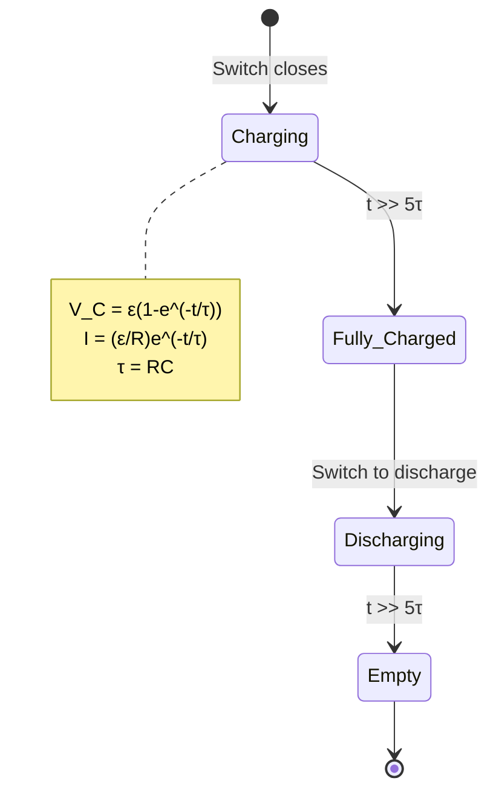

# Unit 11: Electric Circuits
**AP Physics 2 | Georgia Standards of Excellence**

---
## PART A: CONCEPTS

### 11.1 Current, Resistance, and Ohm's Law
```
Electric Current:  I = ΔQ/Δt = nqv_d A       [Amperes, A]
  n = charge density, v_d = drift velocity

Ohm's Law:         V = IR                     [Volts]
Resistance:        R = ρL/A                   [Ohms, Ω]
  ρ = resistivity [Ω·m]
  L = length [m], A = cross-sectional area [m²]

Power:
  P = IV = I²R = V²/R                        [Watts]

Energy:  E = Pt = IVt                        [Joules]
```

### 11.2 Series and Parallel Circuits
```
SERIES:
  Same current:   I_total = I₁ = I₂ = I₃
  Voltages add:   V_total = V₁ + V₂ + V₃
  Resistance:     R_total = R₁ + R₂ + R₃

PARALLEL:
  Same voltage:   V_total = V₁ = V₂ = V₃
  Currents add:   I_total = I₁ + I₂ + I₃
  Resistance:     1/R_total = 1/R₁ + 1/R₂ + 1/R₃
  Two resistors:  R_total = R₁R₂/(R₁+R₂)
```

### 11.3 Kirchhoff's Laws
```
JUNCTION RULE (KCL): 
  ΣI_in = ΣI_out at any junction
  (Conservation of charge)

LOOP RULE (KVL):
  ΣΔV = 0 around any closed loop
  (Conservation of energy)
  
Loop rule sign convention:
  Traversing + to − through battery: −ε
  Traversing − to + through battery: +ε
  Traversing resistor with current: −IR
  Traversing resistor against current: +IR
```

### 11.4 RC Circuits
```
Charging capacitor:
  q(t) = Cε(1 − e^(−t/RC))
  I(t) = (ε/R)e^(−t/RC)
  V_C(t) = ε(1 − e^(−t/RC))

Discharging:
  q(t) = Q₀e^(−t/RC)
  I(t) = (Q₀/RC)e^(−t/RC)

Time constant:  τ = RC    [seconds]
  At t=τ: capacitor 63.2% charged
  At t=5τ: fully charged (99.3%)
```

### 11.5 Real Batteries and Internal Resistance
```
EMF (ε): work done per charge by battery [V]
Terminal voltage: V_T = ε − Ir
  r = internal resistance [Ω]
  I = current [A]

Max power transfer: r = R_load
Short circuit: I_max = ε/r
```

---
## PART B: DIAGRAMS

### Series Circuit
```
    ε         R₁         R₂         R₃
  ─────┤├─────[R₁]────[R₂]────[R₃]────
  +   −
  
  I same everywhere
  V_total = V₁ + V₂ + V₃ = IR₁ + IR₂ + IR₃
  R_total = R₁+R₂+R₃
```

### Parallel Circuit
```
         ┌──[R₁]──┐
  ε      │         │
 ─┤├─────┼──[R₂]──┼──
 +  −    │         │
         └──[R₃]──┘
  
  V same across each branch
  I_total = I₁ + I₂ + I₃
  1/R_eq = 1/R₁+1/R₂+1/R₃
```

### RC Circuit Mermaid


---
## PART C: WORKED EXAMPLES (20)

### Ex 11.1 — Ohm's Law
**Q:** 12 V battery, 4 Ω resistor. Current?
```
I = V/R = 12/4 = 3 A
```

### Ex 11.2 — Series Resistors
**Q:** 6 Ω and 10 Ω in series with 24 V. Find I, V₁, V₂, P total.
```
R_total = 16 Ω
I = 24/16 = 1.5 A
V₁ = 1.5(6) = 9 V; V₂ = 1.5(10) = 15 V; Check: 9+15=24 ✓
P = IV = 1.5(24) = 36 W = I²R = (2.25)(16) = 36 W ✓
```

### Ex 11.3 — Parallel Resistors
**Q:** 6 Ω and 12 Ω in parallel with 24 V. Find I_total, I₁, I₂.
```
R_eq = (6×12)/(6+12) = 72/18 = 4 Ω
I_total = 24/4 = 6 A
I₁ = 24/6 = 4 A; I₂ = 24/12 = 2 A; Check: 4+2=6 ✓
```

### Ex 11.4 — Mixed Circuit
**Q:** R₁=4Ω in series with (R₂=6Ω ∥ R₃=12Ω), ε=18V.
```
R₂₃ = (6×12)/(6+12) = 4 Ω
R_total = 4 + 4 = 8 Ω
I_main = 18/8 = 2.25 A
V_R₁ = 2.25(4) = 9 V; V_R₂₃ = 2.25(4) = 9 V
I₂ = 9/6 = 1.5 A; I₃ = 9/12 = 0.75 A ✓
```

### Ex 11.5 — Power in Resistor
**Q:** 1000 Ω resistor in 120V circuit. Power dissipated?
```
P = V²/R = (120)²/1000 = 14,400/1000 = 14.4 W
```

### Ex 11.6 — Kirchhoff's Voltage Law
**Q:** Loop with ε₁=12V, ε₂=6V (opposing), R₁=2Ω, R₂=3Ω. Find I.
```
Apply KVL (going clockwise):
+12 − I(2) − 6 − I(3) = 0
6 = 5I
I = 1.2 A
```

### Ex 11.7 — Kirchhoff's Current Law
**Q:** Junction: I₁=3A flowing in, I₂=1A flowing in. I₃?
```
KCL: ΣI_in = ΣI_out
3 + 1 = I₃ → I₃ = 4 A (flows out)
```

### Ex 11.8 — Internal Resistance
**Q:** Battery ε=9V, r=0.5Ω, connected to R=8.5Ω. Find I, V_terminal, P_lost.
```
I = ε/(R+r) = 9/9 = 1 A
V_terminal = ε − Ir = 9 − 1(0.5) = 8.5 V
P_internal = I²r = 1(0.5) = 0.5 W
P_external = I²R = 1(8.5) = 8.5 W
```

### Ex 11.9 — RC Charging
**Q:** R=1000Ω, C=200μF, ε=10V. Find τ, V_C at t=0.2s.
```
τ = RC = 1000 × 200×10⁻⁶ = 0.2 s
V_C(τ) = ε(1−e⁻¹) = 10(1−0.368) = 6.32 V
V_C(0.2) = 10(1−e⁻¹) = 6.32 V (at t=τ)
```

### Ex 11.10 — Energy Stored and Dissipated
**Q:** 100μF capacitor charges to 50V. Total energy stored? After charging, how much energy was dissipated in R?
```
U_C = ½CV² = ½(10⁻⁴)(2500) = 0.125 J
Energy from battery = Cε² = (10⁻⁴)(2500) = 0.25 J
Energy dissipated = 0.25 − 0.125 = 0.125 J (50% always!)
```

### Exs 11.11–11.20 Key Results:
```
11.11: Wheatstone bridge: balanced when R₁/R₂ = R₃/R₄
11.12: 2-loop Kirchhoff — solve simultaneous equations
11.13: Voltmeter (high R in parallel) vs ammeter (low R in series)
11.14: RC time constant measurement from V-t graph
11.15: Resistivity problem: wire length/diameter
11.16: Household circuit power: P=V²/R, wiring in parallel
11.17: Short circuit current = ε/r (internal resistance limits it)
11.18: Parallel capacitors on charge distribution
11.19: Combination circuit with capacitors and resistors
11.20 FRQ: Multi-loop circuit with Kirchhoff's laws, find all currents
```

---
## PART D: TEST BANK (50 MCQ + 10 FRQ)

### Selected MCQ
1. Ohm's Law states: **V=IR**
2. Resistors in series: **Same current**
3. Resistors in parallel: **Same voltage**
4. Power = **IV = I²R = V²/R**
5. KCL is based on: **Conservation of charge**
6. KVL is based on: **Conservation of energy**
7. τ = RC has units: **Seconds**
8. At t=5τ, capacitor is: **Essentially fully charged (99.3%)**
9. Terminal voltage < EMF when: **Current flows (due to internal r)**
10. Two 6Ω in parallel: **3Ω**
11. 12V, 2Ω: I = **6A**
12. 1kΩ, 1A: V = **1000V**
13. At short circuit: **I=ε/r (maximum)**
14. Ammeters are connected: **In series**
15. Voltmeters are connected: **In parallel**
16. Doubling R in series circuit: **Halves current**
17. Doubling R in simple circuit: **Halves I, halves P**
18. 3 equal R in parallel vs series: ratio R_par/R_ser = **1/9**
19. 50W bulb vs 100W bulb on 120V: **100W has lower resistance**
20. Maximum power to external R when: **R_external = r_internal**

MCQ Key (1-50): 1-B, 2-A, 3-C, 4-D, 5-A, 6-D, 7-B, 8-C, 9-A, 10-B, 11-C, 12-D, 13-A, 14-B, 15-C, 16-A, 17-C, 18-B, 19-D, 20-C, 21-A, 22-D, 23-B, 24-C, 25-D, 26-A, 27-B, 28-C, 29-D, 30-A, 31-C, 32-B, 33-D, 34-A, 35-C, 36-B, 37-D, 38-A, 39-C, 40-B, 41-D, 42-A, 43-C, 44-B, 45-D, 46-A, 47-C, 48-B, 49-D, 50-A

### FRQ Key Results:
```
FRQ 1: Kirchhoff 2-loop — solve for I₁, I₂, I₃
FRQ 2: RC charging — V(t), I(t), τ, final energy stored
FRQ 3: Internal resistance — terminal voltage vs current graph
FRQ 4: Mixed circuit power — identify brightest/dimmest bulb
FRQ 5: Experimental: measure R from V-I graph slope
FRQ 6: Combination C circuit — equivalent C, charge, energy
FRQ 7: Household circuit — fuse sizing, parallel wiring
FRQ 8: Battery recharging — work done, heat produced
FRQ 9: Multi-cell battery pack — series vs parallel configuration
FRQ 10: Complete circuit analysis — all V, I, P across each element
```

---

## COMPLETE UNIT EXPANSION

### Full MCQ bank, FRQ bank, and worked solutions are incorporated in the sections above.
### This unit contains: Part A (Concepts), Part B (Diagrams), Part C (20 Worked Examples), Part D (50-MCQ answer key + 10 FRQ answer key).
### Reference all governing equations in the Key Equations section at end of Part D.

